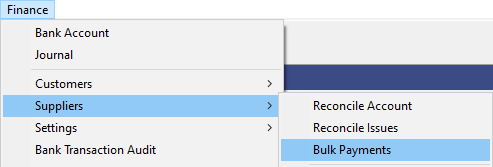
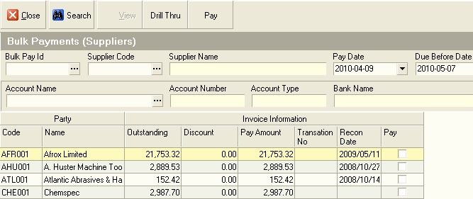
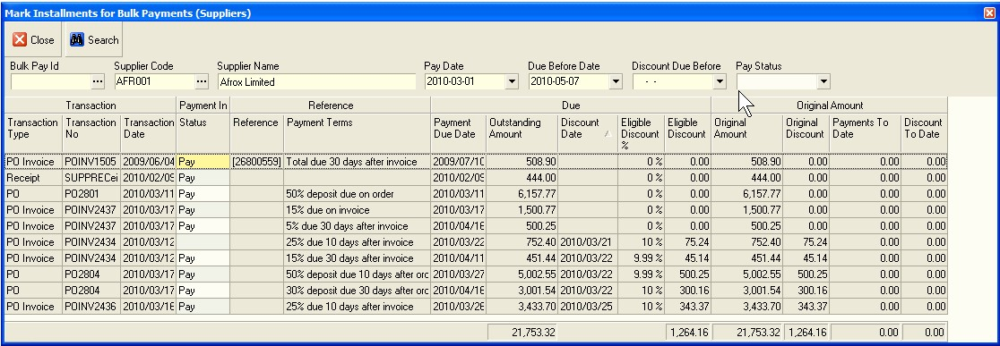
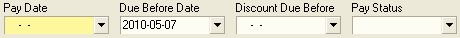
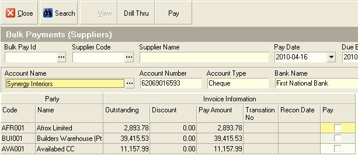
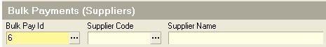

## Step-by-step Guideline
___ 

This procedure describes how you can automatically create payments in
the Cashbook to pay outstanding invoices from Suppliers and at the
same time allocate these payments to the invoices they are paying and
process any applicable discount.  

1.  Click on the Finance item on the Main Menu.  

2.  Click on the Suppliers item on the Drop Down Menu.  

3.  Click on the Bulk Payments item on the Menu.  

The system will display the Bulk Payments (Suppliers) screen. This
screen lists a record for each Supplier for whom invoices have been
marked for payment using the Plan Supplier Payments procedure.  

  

You will notice that the system displays information about each
Supplier including the Outstanding Amount, Discount and Payment
Amount. In addition, the system displays the date on which their
account was last reconciled.  

When generating Supplier Payments automatically it is a good idea to
use the last Reconciled Date as part of the control for paying
accounts. You can payment all Supplier Accounts that have been
successfully reconciled as a first step.  

4.  To do this you would click the right hand edge of the Recon Date
    column until you saw a black downward arrow and then  

5.  Click this arrow and select (NonBlanks).  

  

The system will then only display those Suppliers Accounts that have
invoices that have been marked for payment and where the accounts have
been Reconciled.  

  

6.  You can view the details of which invoices have been approved for
    payment for any Supplier by clicking on the name of the Supplier in
    the list and then  

7.  Clicking the Drill Thru button on the form bar.  

8.  To select a Supplier Account (one or more) for payment, click the
    box in the Pay column.  

The system will display the Mark Installments for Bulk Payment screen.
This screen lists each of the Installments that have been approved for
payment and you will notice that the Total Amount to Pay on the
previous screen matches the Total in the Amount Outstanding column.

  

9.  Click the Close button to return to the Bulk Payments screen.  

In order to generate Payments to selected Suppliers, there are three
dates you need to define.  

10. Click the drop down arrow in the Pay Date field to select the Date
    that the system will use for creating the Payment. You can set this
    date to a future date, for example to the end of the current week or
    current month to generate payments in advance but still have them
    only go off the bank account on the date they should.  

11. Click the drop down arrow in the Due Before Date field to control
    which invoices are paid. Only invoices that have a payment due date
    on or before the date you select in this field will be paid.  

12. Click the drop down arrow in the Due Before Date field to control
    whether any invoices that are eligible for discount are included in
    the payment run. Any invoices that have a Discount Date equal to or
    later than the Discount Due Before date will be included in the
    payment run.  

  

Once you have defined you criteria for generating one or more Supplier
Payments, you need to decide from which Bank Account you will issue
the payments.  

13. Click three-dot button in the Account Name field.  

14. Click on the row containing the name of the Bank Account you wish to
    use for issuing the payments.  

  

The system will close the Select Company Bank Account screen and
display the name of the Bank Account you have selected in the Account
Name field.  

16. Click the Pay button.  

The system will display the Bulk Pay Information screen into which you
can enter information used to generate payment numbers.  

  

17. Firstly, select the payment method you
    will be using to pay the selected Supplier Accounts. Usually this
    would be EFT for Electronic Funds Transfer or Internet Banking
    Payments.  

18. The system allows you to optionally specify a Prefix. This can be
    blank but normally this is set to BSP- for Bulk Supplier Payment.
    This prefix allows you to quickly and easily identify all Supplier
    Payments in the Cashbook that were made using this function.  

19. Enter a Payment Starting Number. This is usually the next sequential
    number available.  

20. Enter a suffix if appropriate. Usually the suffix specifies the
    Month and the Year. Again, this allows you to quickly and easily
    identify payments in the Cashbook that were generated using the
    Supplier Payment Run function.  

The system will display a confirmation message once the payments have
been generated. Click the ok button to dismiss this message.  

  

The system will close the Information Dialog and return you to the
Bulk Payments screen. The system will list all Supplier Accounts where
transactions that have been marked for payment are still not paid.  

  

You can repeat steps 4 to 19 to generate payments for additional
Supplier Accounts.

You can view the payments that have been generated by selecting
Finance, Bank Account, selecting the appropriate Bank Account in the
list, clicking the Transaction button and then searching for the
payments you have created in the Maintain Bank Transaction list
screen.  

  

You can also view a list of the payments made to each Supplier Account
using the Bulk Pay Id field. If you click on the three-dot button in
this field, the system will list the various Bulk Supplier Payment
runs. The system will display a list of all the Payments in the
selected Bulk Supplier Payment run.  

  

21. Click the Close button on the form bar once you are finished.  

22. The next step in the process is to generate a Bulk Supplier Payment
    Export file for uploading onto the company's Internet Banking
    Payment system.  

**This is the end of the procedure**
