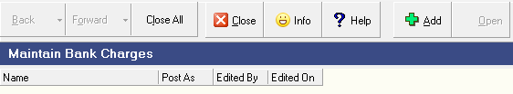

## Step-by-step Guideline
___  

The SEMS System allows you to define a set of standard recurring
bank charge and interest items that appear regularly on your bank
statement and to link these charges to a General Ledger account in
order to simplify and speed up their capture in your cashbooks.  

1.  Click on **Finance** on the main menu.  

2.  Then click the **Settings** menu item on the drop down menu.

3.  Then select the **Bank Charge Items** menu option.

  

The system will open a screen titled "**Maintain Bank Charge Items.**"
This screen allows you to define a list of standard items you will
capture in your various bank accounts each month. The list of bank
charge items is shared across all your various bank accounts.  

  

### Add Bank Charge Item  

1.  To add a new Bank Charge Item, click the **Add** button on the form bar.

The system will open a screen titled "**Add New Bank Charges.**"  
This screen allows you to define a **Name** that **describes the Bank Charge**,
usually this is the same as the wording appearing on the Bank
Statements you receive and the system allows you to link the Bank
Charge Item to a specific account in the General Ledger.  

  

2.  Type in the **Name** that **describes the bank charge**.  
	For example, **Bank Charges**, **Service Fees**, **Account Fees**,
    **Internet Bank Fee** and so on.  
	
3.  You need to specify whether the Bank Charge Item you are adding is
    normally a **Debit** or a **Credit** in the Cashbook.  
	Select the appropriate option from the drop down list underneath
	the **Post in GL as** field.

4.  Click **Save** and then **Close**.

5.  The system will return you to the **Maintain Bank Charges** list
    screen and display the record you have created in the screen.

6.  Repeat the above steps for each Bank Charge Item you wish to add to
    the system.

### Edit Bank Charge - Select GL Account  
1.	Select the specific Bank Charge Item from the list.  

2.	Click on the Add Items button.

3.	...  

4.  Click on the **three-dot button** in the **General Ledger Account**
    field and select an **Account** from the General Ledger to which you
    wish to post the bank charge.  

5.  Click the **Select** button on the **Chart of Accounts** lookup form.  

6.  The system will return you to the **Edit Bank Charge Item** screen.  

### Capture Bank Charges  

:::note
The **Employee Time log** screen is a good example of a
screen suited to quick data entry.  
:::

**To capture a Bank Charge item in the cashbook;**

1.  Select **Add**, then **Bank Charge** from the **Maintain Bank Transaction** screen.  

  

2.  The system will open the **Add Bank Charge / Interest Item** screen and
    place the cursor in the **Effective Date** field.

  

3.  Click on the drop down arrow in the **Effective Date** field to select a
    date on which the Bank Charge appeared on your bank statement.

4.  Select a **_predefined_ Bank Charge Item** from the drop down list of
    defined Bank Charge Items.  
	You can use predictive text to auto filter this list.

5.  The system will display the **Account Number** and the **Account Name** of
    the linked account from your General Ledger in the Account Number
    and Account Name field.

6.  Enter the currency **value** of the Bank Charge Item in the
	**Transaction Amount** field.

:::warning 7.  
The system will display the **default posting rule** for the bank charge
    item in the **Sense** field, if you wish to change this, click on the
    drop down arrow and select the desired posting.  
	This sign indicates how the transaction amount will be posted in the cashbook.  
	The transaction amount will be posted to the linked General Ledger
    account using the opposite sign.  
:::

8.  You can then **Cancel**, click **Next Item** or **Save** and **Close**.  

:::note
If you click **Next** item the system will keep the same date as the previous
entry.  
:::  

**This is the end of this procedure.**  

