## Product Classification Overview
___ 

Information about Products is stored at **four levels of detail** in the Sense-i System.  

At the top level, **Resources** are
assigned to **"Categories"** such as Products, Materials, Machines,
Facilities and so on.

Each Category is broken down into **"Groups"**.  

Each Group is further broken down into **"Types"**.

Each Type consists of actual **"Product Profiles"** or instances of
specific Products.

The Categories, Groups and Types are simply ways of arranging and
storing information in the Sense-i database to make it easier to
search for specific items from the entire list of everything that the
company buys and sells.  

:::note  
The process of defining **Product Groups**, **Product Types** and **Item Types _(Instances)_** within the relevant Resource Category _(Products)_, is detailed in the **Define Product Groups & Types** document.  
:::  

The actual Products that your company sells to its customers are called **Product Profiles**.  

The Product Profiles are **instances of specific products** that appear in
the **Product Catalogue** _(also known as Price Lists)_ and are used on **Sales Orders**, **Sales Delivery Notes**, **Sales Tax Invoices** and so on.

The following diagram illustrates these classification levels.
	
  

## Procedure Guideline

In this procedure we will explain how to search for specific **Products** in the company's **Product Catalogue** and how to add new Products to the Sense-i database.

### Product Search  

1.  Select **Customer** from the main navigation menu, then  

2.  Select **Customer Catalogue** from the drop-down menu.  
	
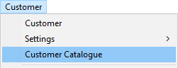  

3.  The system will display a screen titled **Maintain Customer Catalogue**.  

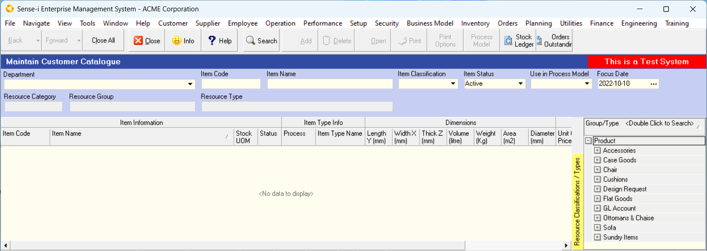  

4.  This screen consists of;
    -   a Panel at the top called the **Search Criteria Panel**  
    -   a List at the bottom right displaying the **Product Group/Type Panel**  
    -   a Grid at the bottom left called the **Product Catalogue Grid**  

The **Search Criteria Panel** enables you to enter information to search for specific products (this information is called "filters") so that you can reduce the list of Products you see displayed on the screen.  

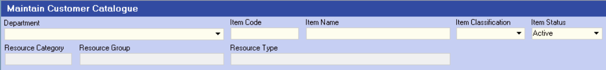  

This is useful because Product Catalogues often run into the thousands and finding the specific Product you want to include on a Sales Quote or Sales Order can be time consuming.  

On the right of the screen you will notice
a panel that lists all the **Product Groups** and **Product Types** _(defined for the specific Department you have selected)_ displayed as a tree structure.  
	
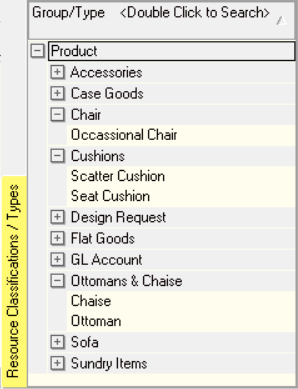  

This panel is very useful because at a single glance it enables you to
see the entire Product Architecture for all the Products your company
buys, makes and sells.  

:::important  
5.  You must ensure that you select a **Department** or **Company** before you search for any products.
	
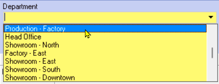  
:::  

You can filter the list of Products that are displayed on the screen by any of the **Product Types** or **Groups** in the Product Architecture Panel on the right of the screen.  

:::note  
If you double click on any of these records the system will display all matching Products in the Catalogue.  
:::  

6.  To search for a **specific product**, simply double-click on the record in
**Product Group/Type tree** that best describes the Product Group or Product Type in which the specific product you want to work with will be saved.  

For example you could select "Ottomans & Chaise", and under this select "Ottoman."  

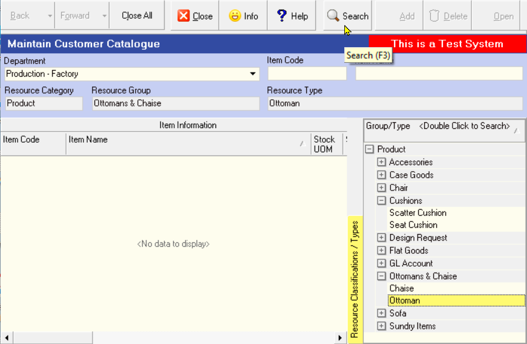  

7.  Once you have entered the basic Search Criteria, click on the **Search**
    button on the form bar.  

8.  The system will now display a list of all Products that match the
    **"filters"** you have entered in the Search Criteria panel.  

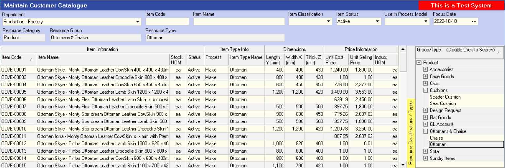  

To make the list of items easier to read, **right click** anywhere in the
grid and select the **Grid Layout** and then set the option for
**Compact Rows** to off.  
	
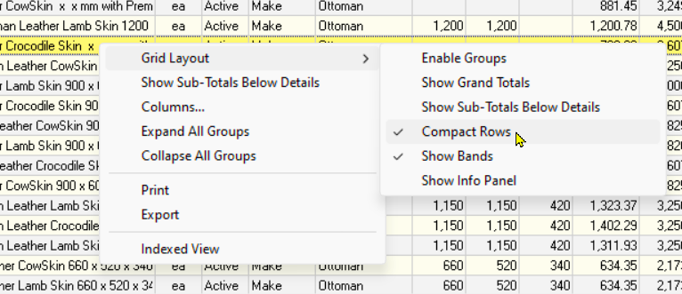  

This will change the way Product Names are displayed in the grid by
wrapping the names and increasing the height of each row so that you
can read the full product name.  
	
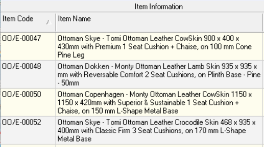  

9.  This makes it very quick and easy to search through long and
    complicated Product Catalogues to find the items you wish to
    include in your Sales Quotes and Sales Orders.  

10. You can also search for specific Products by typing the **% symbol** and
    then **part of a word** that is contained in the Product Name in the
    **Item Name** field. Then click **Search**.
	
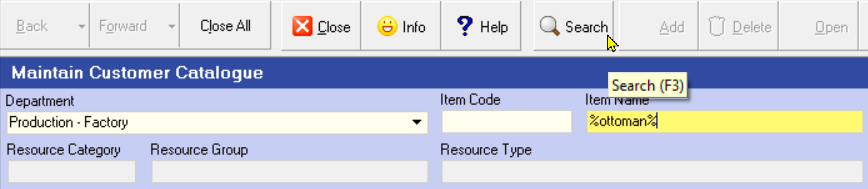  

11. Finally, as far as searching is concerned, you can use the **Quick Filter controls** at the top of each column heading.  
    
    Refer to the document titled **["Working with List Information"](https://sense-i.co/docs/LST003)**.  

12. This allows you to quickly find any product and display the list
    according to the information a user has entered about the **Length**,
    **Width** or **Height** a product.

### Add New Products to the Catalogue  

1.  To add a new item to the Product Catalogue click the **Add** button.  

2.  The program will display the **Add New Item** screen.  

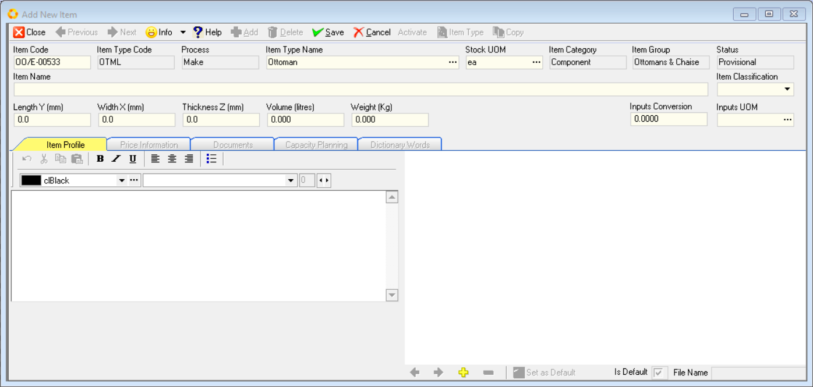  

The system will display the **Product Type Name** you used in the Search before you opened this screen.  

3.  You can change it by clicking on the **drop down arrow** in the **Item Type Name** field and selecting the correct **Product Type** name for which you wish to add a new product to the system.  	

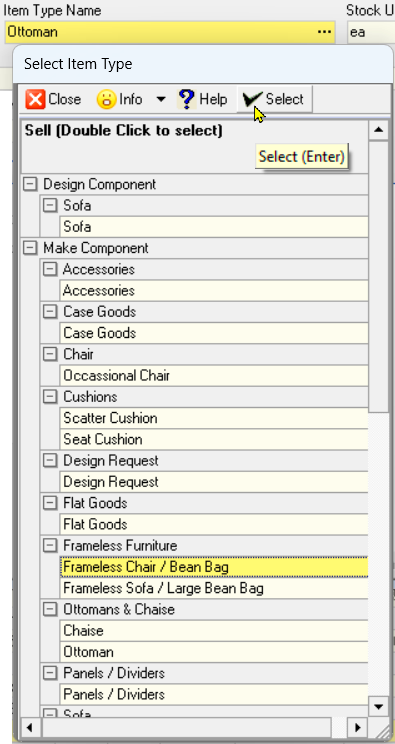  

This screen enables you to enter a **code**, a **name**, enter the **physical dimensions** and create a **description** for the Product you want to add into the catalogue.  
	
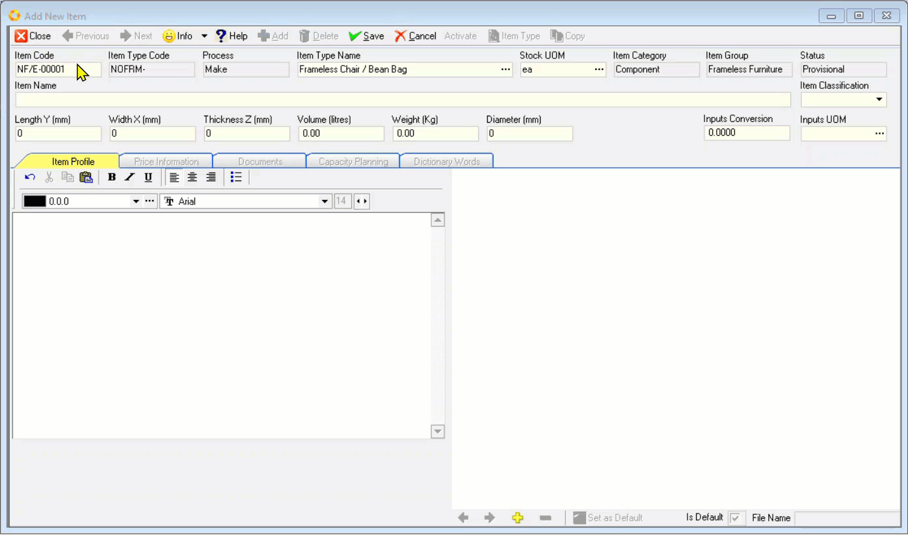  

4. The system will automatically define a code in the **Item Code** field.  
    The Item Code can be changed.

5. Type the name of the product you wish to add to the database in the
    **Item Name** field.  

:::note  
If your company is using **Dictionaries** to define Products and a
**Name Format** has been defined for the **Product Type**
the system will open a window titled **Define Product Name**.  
:::  

6.  Select the relevant **Item Classification** option from the drop-down list in the Item Classification field.

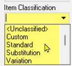  

:::tip  
It is a good idea to mark the item as a **Standard**, **Variation** or **Custom**
Item.  
This makes it easier to search for specific products in the
catalogue in future.  
:::

-   A **Standard item** is an item that is sold to the customer as is,
    without any modifications.  

-   A **Variation item** is a Standard Item that has been changed in someway
    for a customer. The customer might want different sizes, colour,
    finish, trims and so on.

-   A **Custom item** is a unique item that is unlikely to be repeated
    often.

6.  If the item is a standard product, select the **Standard** category.  
    If the item is a **variation** of a Standard Product or a **Customised**
    Product, you can select these options from the **Category drop down** list.
    This makes searching for products easier in the future.  

7.  If the system requires physical dimensions for the product, enter
    these in the **physical dimension** fields that are displayed
    underneath the Item Name field.  

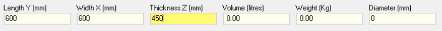  

8. You can add **Rich Text description** for the item you are creating.  
    
    Rich Text description is text that has **different font styles**,
    **sizes**, **formatting** and **colour**.  
    
    To do this, capture the relevant text in the **Item description** field, under the **Item Profile** TAB.  
	
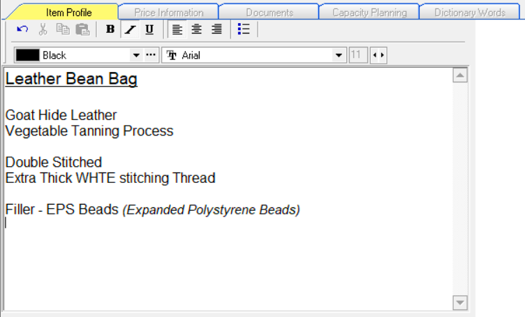  

9. You can optionally choose to include these Rich Text Descriptions in
    the **Sales documents** you print and can also print these descriptions in
    the **Company Price List** and **Catalogue** if you choose.  

### Add Images to Product Information

You can store one or more images against a product record. Again these
can be used when printing Sales Quotes, Delivery Notes, Price Lists or
instruction forms.  

1. To do this, click the **yellow + _(PLUS)_** button at the bottom of the screen
    under the Image Display panel.  
    	
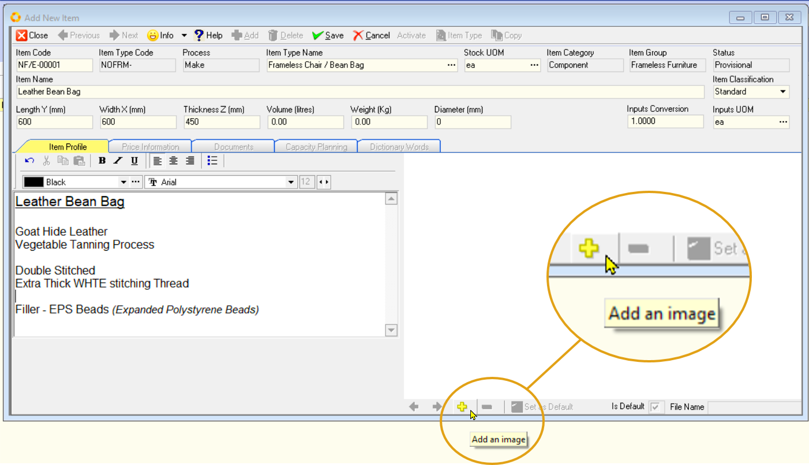  

2. The program will open the **Windows Explorer** screen. This allows you
    to browse to any file on your computer or network.  

3. You might need to change the **File Type** settings at the bottom of the
    screen to find the correct kind of file.  
	
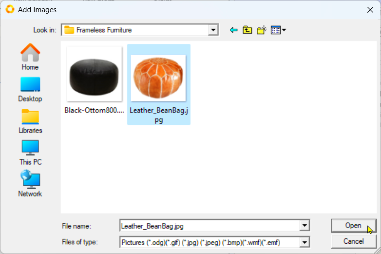  

4. Once you have found the correct file you wish to use as an Image for
    the Product, select it and then click the **Open** button.  

5. The program will close the Windows Explorer screen and will display
    the image you have selected in the **Product Image panel**.  
	
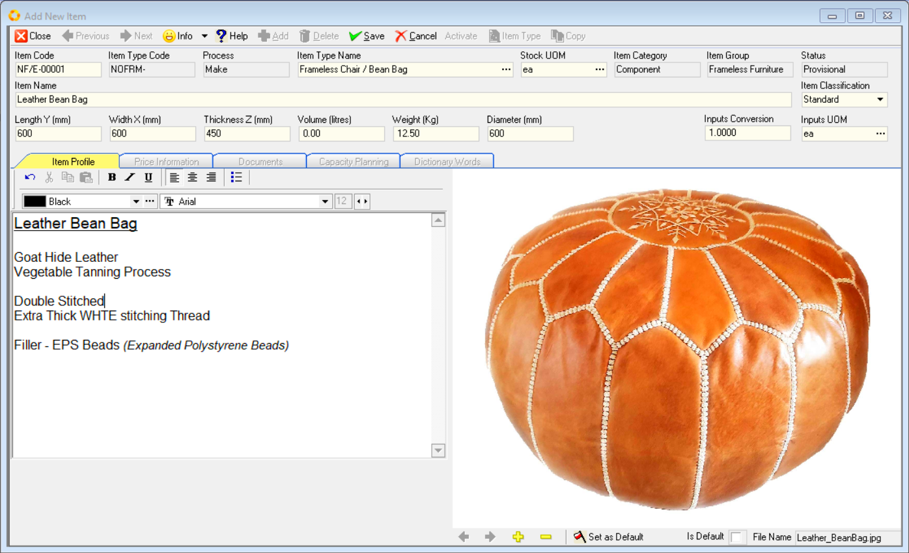  

6. You can add as many images as you wish to the Product you are adding
    to the Product Catalogue.  

7. To remove an image, use the left and right arrows to scroll to the
    image you wish to remove and then click the **yellow - _(minus)_** button.  

8.  Click the **Save** button on the Form Bar navigation once you have captured all the relevant Item Profile information.  

### Add Cost Price and Selling Price Information

Once you have entered the Product Name in the Catalogue you will need
to enter information about the **Cost Price**, **Lead Time**, **Quality**, **Rates**
and **Selling Prices** for the item you are adding to the system.  

1. Click on the **Price Information** tab to enter pricing information
    about the product.
	
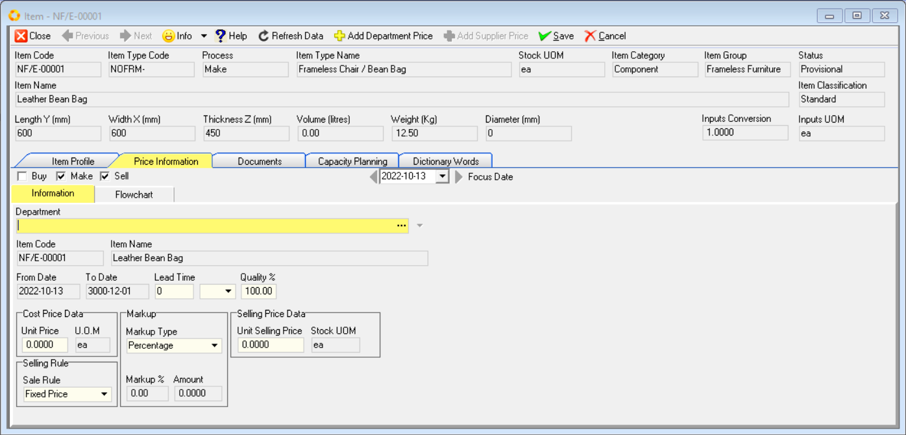  

2. Click on the **three dot button** to select the name of the **Department**
that makes or sells the Product you are adding to the database.  
	
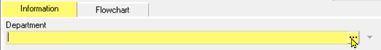  

3. Choose the name of the correct Department and then click the **Select**
button.  
	
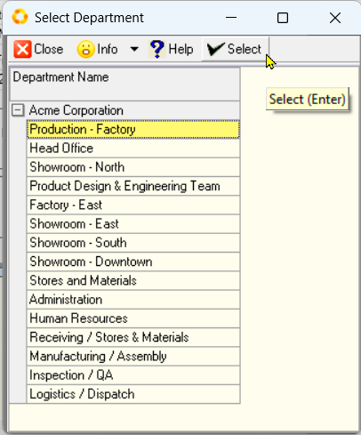  

4. Enter the number of days it takes from when the customer orders the
product until it can be delivered.  

5. Select **"Days"** from the drop down list.  

6. Enter the **quality** as "**100%**".  
	
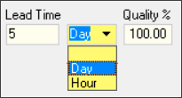  

:::tip  
Press **[ TAB ]** on your keyboard to move from one field to the next.  
:::  
	
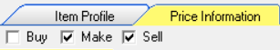  

-   If your company buys the item from an **external Supplier** you will
    need to enter **Cost Price** information in the Supplier Name screen.  

-   If your company **makes the item** internally, you will need to enter
Cost Price information in the **Department** screen.  

-   If your company **sells** the item to its **customers**, you will need to
enter **Selling Prices**.  
	
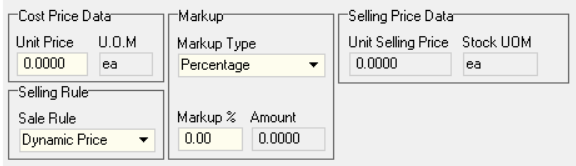  

7. Enter the **Cost price** in the **Unit Price** field.

8. Select a **selling rule**. This is either **"Do Not Sell"**, **"Fixed Price"** or **"Dynamic Price"**.  

9. Enter the **Markup Type** as either a "**Percentage**" or an "**Amount**".  

10. Enter the **Markup** if the Selling Rule is **Dynamic Price** or enter the **Selling Price** if the Selling Rule is **Fixed**.  

:::tip  
The system calculates the variable you have not entered.  
:::
	
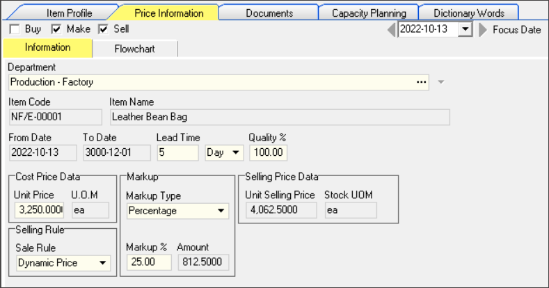  

11. When you have completed entering price information, click the **Save** button.  

### Add Documents to a Product Profile

The system enables you to link one or more documents, pictures and
videos to the record in the database.  

1.  Click on the **Documents** TAB.

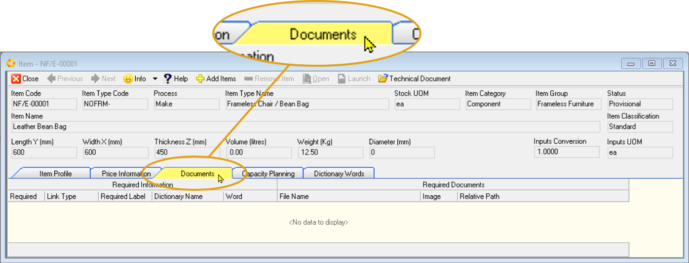  

2.  Click the **yellow +** button at the top of the form to
Add a New Document.  

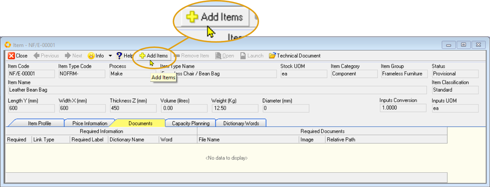  

3.  The program will open the Windows Explorer screen. This allows you
    to browse to any file on your computer or network.  
	
  

4.  Once you have found the correct file(s) you wish to link to the Product
    Name, select it/them and then click the **Open** button.  

5.  The program will close the Windows Explorer screen and will display
    the name of the file you have linked in the Document File Name list.  
	
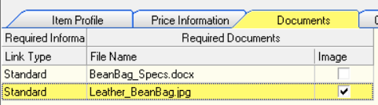  

6. You can add as many documents of as many different types as you wish
    to the Product you are adding to the Product Catalogue.  

7. To remove a file, click on the name of the file you wish to remove
    from the list of Documents and then click the **yellow - _(minus)_ Remove Item** button.  

### Activate a New Product Record

The program only allows you to edit Inactive records.

1. To prevent users from changing a record for which all the
    information has been finalised, click the **Item Profile** tab.

2.  Then click the **Activate** button.
	
  

3.  The program will mark the record as Active.  

   This allows it to be selected for all Sales Quotes and Sales Orders
   and prevents users from making changes to it without approval.

**This is the end of this procedure.**
