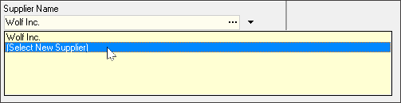
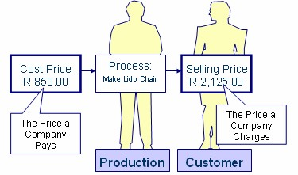
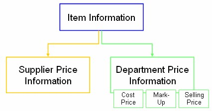
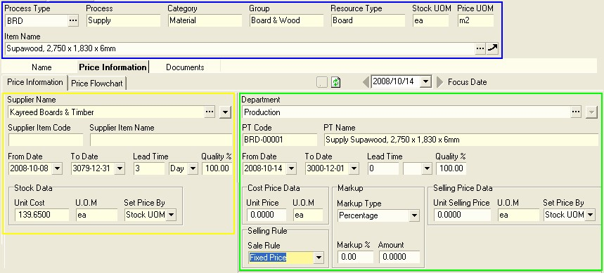

## Procedure Guideline
___  

This procedure describes how to add the names of new materials and update prices for all the **items purchased** from the company's **suppliers**.  

## Introduction    

1.  Select **Supplier** from the main navigation menu.  

2.  Then click the **Supplier Catalogue** option.  
	
  

The system will display a screen titled **Maintain Supplier Catalogue**.  

  

This screen consists of;  
-   a panel at the top called the **Search Criteria Panel**  
-   a **Selection Panel** at the bottom-right called the **Group / Type Selection Panel**, and  
-   a Grid at the bottom called the **Supplier Catalogue Grid**  

The **Search Criteria Panel** enables you to enter information to search for **specific Materials** and to reduce the length of the list of Materials you see displayed on the screen.  

  

This is useful because Material Catalogues often contain hundreds and even thousands of records and finding a specific Material can be time consuming.  

On the right of the screen is a **Selection Panel** that lists all the Material Groups and Material Types displayed as a tree structure.  

This panel is very useful because at a single glance it enables you to see the entire **Material Architecture** for all the materials your company buys, and use to make & sell products.  

Information about the Materials your company purchases from Suppliers is stored at three levels of detail in the system.  

These levels make it much easier for you to filter long lists of information to quickly find the exact material you need.  

  

At the highest level, Materials are arranged into **Groups**. Material Groups are then broken down into **Material Types** and finally Types consist of **Specific Instances**.  

  

The **Supplier Catalogue Grid** underneath the Search Criteria Panel
consists of a set of columns that display specific information about
each product, such as its **Code, Name, Unit of Measure, physical Dimensions, Cost Price, Supplier Name** and so on.  

## Search for Material Information  

### Material / Item search  

:::important  
1.  A company consumes and produces Resources. Because you are working in the Supplier Catalogue, ensure the **Materials** option _(Resource Category)_ is selected in the **Selection Panel** (right-hand side of the screen).  

  

:::  

You can search for Materials by selecting any of the **Material Groups** in the Selection Panel on the right of the screen.  

2.  Click on the **[+]** button of the selected **Material Group** to display the list of **Material Types**.

  

:::note  
If you double click on any of the **Group** or **Type** records the system will display all matching Materials in the Catalogue.  
:::  

3.  To search for a **specific item**, simply double-click on the record in **Material Group/Type tree** that best describes the Material Group or Material Type of the specific item you want to work with.  

For example, you could select "**Upholstery**", and under this select "**Fabric**".  

  

4.  Once you have entered the basic Search Criteria, click on the **Search** button on the form bar.  

5.  The system will now display a list of all Items that match the **"filters"** you have selectd in the **Material Group/Type Selection** panel.  

:::tip  
To make the list of items easier to read, **right click** anywhere in the grid and select the **Grid Layout** and then set the option for **Compact Rows** to off.  
	
  

This will change the way Material Names are displayed in the grid by wrapping the names and increasing the height of each row so that you can read the full material item name.  
:::  

6.  This makes it very quick and easy to search through long and complicated **Material Catalogues** to find the items you wish to include in your **Purchase Orders** and **Process Models**.  

  

7.  If you know the code for the specific Item you are looking for, type the **Item Code** in the Item Code field in the **Search Criteria panel**, then click on the **Search** button on the Form Action bar.  

  

8. You can also search for specific Materials by typing the **% symbol** and then **part of a word** that is contained in the Material Name in the **Item Name** field. Then click **Search**.  
	
  

11. Finally, as far as searching is concerned, you can use the **Quick Filter controls** at the top of each column heading.  
Refer to the document titled **["Customising Information Display"](https://sense-i.co/docs/LST004)**.  

12. This allows you to quickly find any materials and display the list according to the information captured about the items.  

### Materials - Specific Supplier 

1.  If you wish to see a list of Materials provided by a specific Supplier, you can select the Supplier by clicking on the **Three-Dot** button in the **Supplier field**. If you do this you will see a list of all Suppliers and you can then search for, and select a specific supplier.  
	
  

:::note  
Refer to the **["Supplier Search"](https://sense-i.co/docs/1203#supplier-search)** section in the **["Supplier Information"](https://sense-i.co/docs/1203)** document to use this feature effectively.  
:::  

2.  The system will display a list of all of the **Material Items _(Specific Instances)_** that have been captured for the Supplier.  
	
  

3.  You can also filter the list to show only those records for a specific **Material Type**. To do this click the right mouse button anywhere on the grid and select "**Indexed View**".  
	
  

4.   The **Type** selection panel is displayed on the right-hand side of the grid list.
	
  

5.  Click on any one of the options to view, and select, the items listed under that specific type.  
	
  

## Add New Materials to the Catalogue  

:::important  
Before you can add the details of any specific Material to the system, you need to **select the Material Type** so that the system knows which rules to apply and what kind of product code to use.  
:::  

1.  Using the **Group / Type Selection Panel**, click on the **Material Group**, and then double-click the **Material Type** for which you wish to add specific **item information**.  
	
  

2. Click the **Add** button of the form action bar.  
	
  

The system will display a screen titled **Add New Item**.  
	
  

The system will display the **Material Type Name** you used in the Search before you opened this screen.  

3.  If needed, you can change it by clicking on the **drop down arrow** in the **Item Type Name** field and selecting the correct **Material Type** name for which you wish to add a new item to the system.  	

  

This screen enables you to enter a **name**, enter the **physical dimensions** and create a **description** for the item you want to add into the catalogue.  
	
  

4. The system generates a **unique code** for the new material in the **Item Code** field.  

:::note  
If you want to give the item a specific code, say to match an existing code in your current stock system, simply place the cursor in the **Item Code** field, delete the existing code, and type in a new code.

  
:::  

5. If a **Name Format** has been defined for the Material Type the system
    will open a window titled **Define Item Name and Description**.  

:::note  
If you need to work with **Dictionaries** you should read the document titled "**Understanding Material Name Formats**" as this will provide you with useful
information about how the system uses **drop down dictionaries** to build Material Names.  
:::  

If no Name Formats have been set up, then simply type the **name of the new material** you wish to store in the database in the **Item Name** field.

  

6.  Select the relevant **Item Classification** option from the drop-down list in the Item Classification field.

  

:::tip  
It is a good idea to mark the item as a **Standard**, **Variation** or **Custom**
Item.  
This makes it easier to search for specific materials in the catalogue in future.  
:::

-   A **Standard item** is an item that is bought from the supplier as is,
    without any modifications.  

-   A **Variation item** is a Standard Item that has been changed in someway.
    This could include different sizes, colour, finish, trims and so on.

-   A **Custom item** is a unique item that is unlikely to be repeated
    often.  

A **Standard item** is an item that you either purchase regularly and use in many different products, or it could be an item that you use simply to store a base price.  

:::info  
A sheet of chipboard is normally a Standard item, as would be a sheet of glass 1m x 1m square.  

However, you are unlikely to order a sheet of glass 1m x 1m square and instead are more likely to purchase sheets of glass according to specific dimensions for each customer order.  
A sheet of glass 0.46 x 0.87 could be a **Variation** of the Standard item for a specific job.  
:::  

A **custom item**, is an item that is normally **unique and highly specific**.
For example, a sheet of glass with a unique sandblasted pattern could be a Custom item.

:::note  
Over time, items can change from being Custom and Variation to Standard.  

This would happen if the company made a product that was unique for one customer, but then found that the same product was popular among other customers and then decided to promote that product more extensively.  
:::  

6.  If the item is a standard material, select the **Standard** category.  
    If the item is a **variation** of a Standard material or a **Customised**
    material, you can select these options from the **Category drop down** list.
    This makes searching for materials easier in the future.  

7.  If the system requires physical dimensions for the material, enter these in the **physical dimension** fields that are displayed underneath the Item Name field.  

  

8. You can add **Rich Text description** for the item you are creating.  
    
    Rich Text description is text that has **different font styles**,
    **sizes**, **formatting** and **colour**.  
    
    To do this, capture the relevant text in the **Item description** field, under the **Item Profile** TAB.  
	
  

9. You can optionally choose to include these Rich Text Descriptions in
    the **Purchase documents** you print and can also print these descriptions in
    the **Supplier Price List** and **Catalogue** if you choose.  

### Add Images to Material Information

You can store one or more images against a material record. Again these
can be used when printing Purchase Orders, Price Lists or
instruction forms.  

1. To do this, click the **yellow + _(PLUS)_** button at the bottom of the screen
    under the Image Display panel.  
    	
  

2. The program will open the **Windows Explorer** screen. This allows you
    to browse to any file on your computer or network.  

  

:::tip  
It is a good idea to store all images on a separate
shared drive on the network that has the same drive letter for each
user. This enables every user in the company to access the same
images, documents and technical details for each Material.  
:::

3. Browse the network to find the file or files you wish to link to the record you are capturing. Once you have found the correct file, click on the file name or image, and then click the **Open** button.    

4. The program will close the Windows Explorer screen and will display the image you have selected in the **Image panel**.  

5. The system also allows you to set one image file as the **default image** that is used when printing specification sheets and can be printed on order forms. To set a file as the default image, click the **Set As Default** button.  

  

6. You can add as many images as you wish to the Material Item you are adding
    to the Catalogue.  

7. To remove an image, use the left and right arrows to scroll to the
    image you wish to remove and then click the **yellow - _(minus)_** button.  

8.  Click the **Save** button on the Form Bar navigation once you have captured all the relevant Item Profile information.  

## Add Cost Price and Selling Price Information  

Once you have entered the Item Profile in the Catalogue you will need
to enter information about the **Supplier**, **Supplier Item Name/Code**, **Lead Time**, **Quality**, and **Purchase Prices** for the item you are adding to the system.  

:::tip  
For detailed information on Cost & Selling Price principles, refer to the **["Understanding Cost Price and Selling Price Information"](https://sense-i.co/docs/442#understanding-cost-price-and-selling-price-information)** section.  
:::  

You will notice a set of **tabs** on the **Add Material** screen. These tabs
make it easier to group information in different screens so that you
see only the information you need to at any time.  

### Add Sourcing and Cost Price Information  

1. Click on the **Price Information** tab to enter pricing information
    about the supplier item.
	
  

2. Click on the **three dot button** to select the name of the **Supplier**
that sells the Item you are adding to the database.  
	
  

3. Choose the name of the correct Supplier and then click the **Select**
button.  
	
  

:::tip  
Refer to the **["Supplier Search"](https://sense-i.co/docs/1203#supplier-search)** section in the **["Supplier Information"](https://sense-i.co/docs/1203)** document to use this feature effectively.  
:::  

The system will display the selected Supplier's Name in the Supplier Name field.

  

4.  Enter the **Supplier Item Code** and **Supplier Item Name**.  

:::note  
If your Supplier has their own unique code and item name for the Material, you should enter this information in the Supplier Item Code * Supplier Item Name fields. The system will then print this on all Purchase Orders which will ensure that Suppliers deliver the correct item.  
:::  

The **Lead Time** is the shortest time normally taken by the Supplier to deliver the item.  

If you do not have this information you should contact the Supplier to ask them to quote you a Standard Lead Time. The system uses this information when planning Material Purchases.  

5. Enter the **number of days** it takes from when the material item is ordered, until it can be delivered.  

6. Select **"Day"** from the drop down list.  

  

You need to enter a Quality %. This is the number of times that a supplied item meets your company's quality standards.

7. Enter the **quality** as a percentage.  

:::tip  
The Quality **%** provides for adding the cost of waste onto the net cost when calculating the cost price of a manufactured item.  

If for example, you know that when the company uses solid timber, 20% of the timber is wasted due to planning and cutting operations and you want to build this waste into your product costs, then enter 80% in this field.  
:::  

  

8. Enter the **Cost price** in the **Unit Price** field.

9. Select the **Set Price By** option using the **Drop-down** arrow.  

This is either;  
-   **"Stock UOM"**, 
-   **"Packlot"** or 
-   **"Dynamic Price"**.  

If the Cost Price is simply based on the Quantity Purchased, then leave this as **Stock UOM**.  

If the Cost Price is based on a **Packlot**, then go to **relevant step below**.  

:::tip Packlot Price  
Select Packlot from the list and enter the Packlot Price and Packlot Quantity.

  

For example, the Supplier might sell 24 Brackets in a Box and charge R 72 per Box. This would then equate to R 3-00 per bracket. You would enter the packlot quantity and UOM in the **Qty / Packlot** & **Packlot UOM** fields, and the Packlot price in the **Total Price** field.  The system calculates the **Unit Cost**.  
:::

10. When you have completed entering Supplier price information, click the **Save** button.  

If your company purchases the item from more than one supplier, then simply click the drop down arrow next to the Supplier Name field and click on the [**Select New Supplier**] option, then repeat steps 3 to 10 above.  

  

### Add Selling Price Information  

If your company sells the item to its customers, you will need to enter Selling Prices.

  

1. Click on the **three dot** button to select the name of the **Department**
    that sells the Itemt you are adding.  

2. Click on the name of the **Department** to which you wish to link the Selling Price.  

3. Then click the **Select** button.  

4. The system will display the name of the department you have chosen in the **Department Name** field.  

  

:::tip  
You can press the **[Tab]** key on your keyboard to quickly move from one
field to the next.  
:::  

5. Enter the **number of days** it takes from when the customer orders the product until it can be delivered.  

6. Select **"Days"** from the drop down list.  

7. Enter the quality as **"100%"**.  

8. Enter the **actual** or **target cost price** in the **Unit Price** field.  

9. Select a **selling rule**. This is either;
-   **"Do Not Sell"**, 
-   **"Fixed Price"** or 
-   **"Dynamic Price"**.  

:::note  
A **Fixed Price Rule** means that the Selling Price you enter is remains fixed until you change it. Any changes in the Cost Price do not ripple through to the Selling Price, but rather change your Markup.  

A **Dynamic Price** means that your Markup Percentage remains constant and changes in the Cost Price automatically ripple through to change the Selling Price.  
:::  

10. Enter the **Markup Type** as either a **"Percentage"** or an **"Amount"**.

:::important  
If you set the Selling Rule to be **Dynamic Price** you will need to enter the **Markup Amount**.  

If you set the Selling Rule to be **Fixed** you need to enter the **Selling Price**.  

The system works out the variable you have not entered.  
:::  

11. When you have completed entering price information, click the **Save** button.  

12. Then click the **Close** button and the system will return you to the
    Material Catalogue.  

## Add Documents to a Material Item Profile

The system enables you to link one or more documents, pictures and videos to the record in the database.  

1.  Click on the **Documents** TAB.

  

2.  Click the **yellow +** button at the top of the form to
Add a New Document.  

  

3.  The program will open the Windows Explorer screen. This allows you
    to browse to any file on your computer or network.  
	
  

4.  Once you have found the correct file(s) you wish to link to the Product
    Name, select it/them and then click the **Open** button.  

5.  The program will close the Windows Explorer screen and will display
    the name of the file you have linked in the Document File Name list.  
	
  

6. You can add as many documents of as many different types as you wish
    to the Item you are adding to the Supplier Catalogue.  

7. To remove a file, click on the name of the file you wish to remove
    from the list of Documents and then click the **yellow - _(minus)_ Remove Item** button.  

### Activate a New Supplier Item Record

The program only allows you to edit Inactive records.

1. To prevent users from changing a record for which all the
    information has been finalised, click the **Item Profile** tab.

2.  Then click the **Activate** button.
	
  

3.  The program will mark the record as Active.  

   This allows it to be selected for all Purchase Orders, Process Orders and related documents and reports.  

   Active records prevents users from making changes without approval.
___

## Understanding Cost Price and Selling Price Information  

The SEMS System is focused on helping companies improve their productivity and profitability.  

The system stores price information about any **resource** (that is any **Material, Component, Machine** and **Product**) in two ways. The first is the COST PRICE and the second is the SELLING PRICE.  

The COST PRICE is the price that a company pays to **buy an item** from a
Supplier or to **make an item** in one of its Departments.  

The SELLING PRICE is the price that a company **charges its Customers**
for the item.  

  

There are several scenarios for capturing PRICE INFORMATION in the SEMS
system. And these scenarios are dependent on two aspects.

-   Buy or Make

-   Use and / or Sell

### Buy or Make  

If the company BUYS an item from another company or person, then the item needs to be given a SUPPLIER COST PRICE. This is stored in the SUPPLIER PRICE section of the PRICE INFORMATION screen.  

If the company MAKES an item in one of its own Departments, then the item needs to be given a DEPARTMENT COST PRICE. This is stored in the DEPARTMENT PRICE section of the PRICE NFORMATION screen.  

### Use and / or Sell

If the company only USES an item as part of its OVERHEADS or uses an item in its MANUFACTURING or INSTALLATION PROCESS then the item DOES NOT NEED A SELLING PRICE.  

If the company SELLS an item to its Customers, regardless of whether it Buys it or Makes it, then you must capture a SELLING PRICE for the item.  

The following diagram illustrates the relationship between the price information of an item.  

  

This structure is then mirrored in the **Price Information** screen in the
SEMS System.

The PRICE INFORMATION screen provides you with a single screen on which you can view all of the information. The screen consists of several components.  

### The Item Information section.  

This contains the **Item Code**, **Item Name**, and its **Units of Measure**.  

### The Supplier Price Information section.  

This contains the **Supplier's Cost Price** information for the selected item.  

### The Department Price Information section.  

This contains the name of the **Department** that either makes or sells the item, its **Cost Price**, the **Mark-up** and the **Selling Price**.

  

## Summary - Price Information  

So then to recap...  

If your company **purchases** the item **from** one of its **Suppliers**, then the **cost price** could be the **Purchased Cost** as supplied by a Supplier.   
The **Cost Price** must then be captured in the **Supplier Price Information**
section of the screen.  

If you company **makes the item** in one of its **Departments** you will need to calculate and specify the **COST PRICE** of the item using the **Process Model Module**.  

This is either the **combined cost** of all of the **Inputs** (that is the **Materials and Components** used in the item) AND the **Manufacture Cost** (that is the **time** it takes to make multiplied by the **Labour, Machine** and **Overhead Cost** per minute).  

If the **item is sold** to a **Customer**, then the **Selling Price** is the price that you will **charge the Customer for the item** and must be captured in the **Department Selling Price** section of the screen.  

The **Selling Price** record displays this price and shows the **Gross Profit** the company makes on this Selling Price.  

Remember that this Gross Profit is used to pay for the rental of the company's premises, the machinery and vehicles, the salaries of all people working in the company and the interest charged on the loans and leases that the company has.  

In addition, the Gross Profit is used to pay for all running costs such as Telephones, Computers, Software, Stationery, Insurance and Taxes to name just a few.  

In some cases a company will make an item in one of its departments and at the same time buy the item from an external supplier. In this scenario the system will show two cost price records.  

-   One the cost price of the item based on its **internal manufacture cost** and,  
-   the second for the **cost price paid to the supplier** for providing the item.  

Please keep in mind that it is ABSOLUTELY ESSENTIAL that PRICE INFORMATION for all items in the system is COMPLETE, ACCURATE and UP-TO-DATE.  

All the reports and the management decisions that are made from the information presented in these reports relies on accurate information.  

Inaccurate price information leads to spending too much money, incorrect prices being charged, lost profits and sometimes lost sales. These are mistakes that few companies can afford to make.  

**This is the end of this procedure.**
