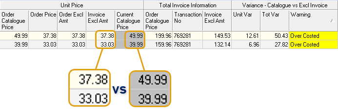
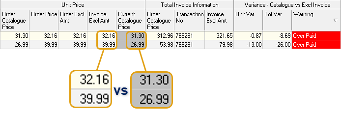

## Step-By-Step Guideline
___  

## Navigate to Purchases Report  

1.  Click on **Supplier** in the Main Navigation Menu.

2.  Then click the **Purchases Report** option on the drop-down Menu.  

  

The system will open a screen titled **"Purchases Report."**  

:::note  
You can change the information displayed in this list by changing the dates and other information in the Search Criteria Panel.  

  

Then click the **Search** button to update the list.  
:::  

This screen lists all of the Purchases as received from Suppliers, _(where the Purchase Order Receipts have already been captured in the system)_, within the **From** and **To Date** specified in the Search Panel.  

  

## View records with Warnings  

1.  Use the Horizontal scroll bar to view the **Warning** column under the **Variance - Catalogue vs Excl Invoice** Information Band.

:::tip  
You can sort the information in the list using the **Column Sort** or **Quick Filter** functions.  
:::  

2.  Click the Quick Filter option _(down-arrow)_ in the **Warning** column heading to select **Over Costed** and **Over Paid**.  

  

The system will automatically update the list to show those records that are tagged with warnings.  

### Warning - Over Costed  

:::important  
**Over Costed** means that the price in the Supplier Catalogue is higher than the price on the Purchase Order.  

  

This implies that the the Purchase Order price is too low, OR that the price in the Catalogue is too high.  

As you can see in the image above, the _"Unit Price"_ under the **Invoice Excl Amt** column is lower than that of the **Current Catalogue Price** column.  
:::  

3.  The steps required to resolve the issue of items tagged as Over Costed include:  
-   Determine whether price is to be rectified on the Purchase Order OR in the Supplier Catalogue.  
-   Communicate with the Supplier to reach a mutual agreement on the actioning of the solution.  

In this example, we will rectify the price in the Supplier Catalogue.  Refer to the document titled **["Capture Material Names and Prices in the Supplier Catalogue"](https://sense-i.co/docs/442)**.  

### Warning - Over Paid  

:::important  
**Over Paid** means that the price in the Supplier Catalogue is lower than the price on the Purchase Order.  

  

This implies that the the Purchase Order price is too high, OR that the price in the Catalogue is too low.  

As you can see in the image above, the _"Unit Price"_ under the **Invoice Excl Amt** column is higher than that of the **Current Catalogue Price** column.  
:::  

4.  The steps required to resolve the issue of items tagged as Over Paid include:  
-   Determine whether price is to be rectified on the Purchase Order OR in the Supplier Catalogue.  
-   Communicate with the Supplier to reach a mutual agreement on the actioning of the solution.  

In this example, we will request a Credit Note from the Supplier.  Refer to the document titled **["Purchase Order Credit Note"](https://sense-i.co/docs/153)**.  

## Identify records that require Invoice  

:::tip  
Remove and apply filters as necessary.  In this example we remove the quick filters in the the Warning column as applied previously.  
:::  

1.  Click the Quick Filter option _(down-arrow)_ in the **Transaction No** column heading to select the **(Blanks)** option.  

  

The system will automatically update the list to show those records that have been delivered by the Supplier, Receipts issued, but where the Purchase Order Invoice(s) haven't yet been captured.  

2.  Check that you have received the relevant Invoice from the Supplier.  

3.  Click on the record row for which you want to issue an invoice.  

4.  You can now click on the **New Invoice** button to capture the Purchase Order Invoice.  

For further information on the Purchase Order Invoicing process, refer to the document titled **["Purchase Order Invoice"](https://sense-i.co/docs/152)**.

___

**This is the end of this procedure.**
