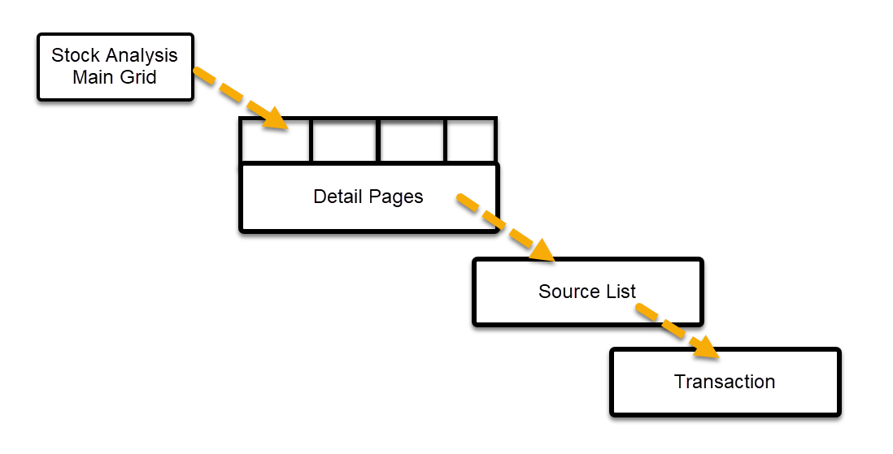

import DocCardList from '@theme/DocCardList';

Stock Analysis is a collection of inter-related screens that gives one the ability 
to **analyze Stock across time** and drill through to various detail level to **reveal 
the source of the data**. 

From the main menu, navigate to Inventory \> Stock Analysis.

:::note
The various types of stock and what transactions cause it to change 
are discussed in [**Stock Overview**](../docs/STC-000.mdx).
:::

## Stock Analysis Screen navigation

 

The **Main** (initial) screen displays the summary data for a chosen [Stock Type](#stock-types). 

From the Main screen one can drill into the **Detail** screen. This screen shows the stock details
for the **_specific row/item currently selected_** on the main screen. It has 4 pages
showing different data. Any and all stock detail data can be viewed from this screen regardless of the [Stock Types](#stock-types) selected 
on the main screen. 

:::tip
One would generally choose the Detail Page that correlates with the chosen Stock Type.

Most comprehensive Detail page is the Consolidated with Provisional Supply.
:::

A further drill through from the Detail page on a **_specific cell_** will 
show a **List of Source** transactions
summing up to the value in the selected cell. 

Finally, one can drill through from the Source list to the corresponding 
**Transaction**.

## Search Parameters

 

A Standard Search Panel allows one to choose the department you are analyzing.
The Item search is standard and a specific item can be queried although generally
one would double click the Item Type in the panel on the right.

### Date Range and Type

The date columns run across the top of the grid. This is limited to a maximum of 31 periods.
Clicking the drop-down button on the Date Type control lists the available Date Types.
If one wants to see the data per month then the corresponding date range could span
2 and a half years. (12 months x 2.5 = 30).  

### Stock Type

The Stock Type is the flavour of data you want to analyze. For the full list of
stock types and how best to interpret the data, check out the various 
[stock types listed below](#stock-types) 

## Stock Analysis Main Screen

Once the search criteria have been set, click the `Search` button to populate the
grid.

:::note
- The headings in the Quantity columns show the Starting and Ending dates for 
each period which are derived from the chosen date type and range. 
- The period columns are shaded according to the legend shown in the top right corner. 
:::

 

In order to drill through to the detail screen, select a row and then click 
the `Open` button.

## Stock Analysis Detail Screen

The detail screen has 5 pages/tabs.

- Actual 
- Projected
- Consolidated
- Consolidated with Provisional Supply
- Summary

:::note
If you click on a quantity period column the corresponding cost column will be
highlighed. Equally if you click on a cost column the corresponding quantity column
will be highlighed.
:::

Select a cell and click `Open` to display the source list screen.

## Stock Analysis Source List Screen

The Stock Quantity column and Stock Cost column total to the value in the previous
Source list screen.

A final drill through, by selecting a row and clicking `Open` displays the 
Transaction.

## Stock Analysis Transaction Screen

As a transaction typically has many line items, the particular item you are 
querying will be shaded in orange.

## Stock Types
The various stock types can be analysed across time. 

<DocCardList />