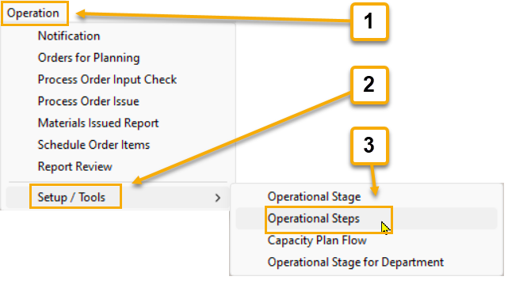
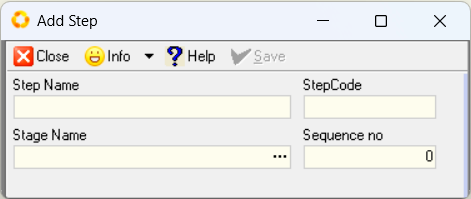

## Step-By-Step Guideline
___ 

The purpose of this procedure is to set-up the STEPS (or activities)
that can be performed in each stage of your Production Process.

STAGES store capacity information while STEPS describe the actions
performed in a Stage.  

You might for example have two stages in your
process, one called Sanding and the other Spray. The SANDING STAGE
might have STEPS or ACTIVITIES such as First Sand, Second Sand, Denib
and Final Sand and the SPRAY STAGE might have STEPS such as Base Coat,
First Coat, Final Coat.

You need to define the Steps that are performed within each Stage. To
do so...

1.  Select the **Operation** menu item on the main menu.

2.  Then click **Setup / Tools** at the bottom of the drop down menu.

3.  Then click **Operational Steps** from the side menu.

  

The system will open a screen titled **"Maintain Steps"**.  

  

This screen lists all of the Production Steps that you have
defined in the system and the Stages to which each Step has been
assigned.

At the top of the screen is a Search Panel in which you can enter
information such as the **Stage Name**, **Step Name** or a **Status** and then use
this information to find all Steps stored in the database that match
the **Search Criteria** you have entered.  

The bottom of the screen is a grid or worksheet that lists all of the
defined **Production Steps** and displays information about each
Production Step.  

4.  When you initially enter the Operational Steps screen the list will be empty.  
    
    To define the Production Steps that exist for your company, click the **Add** button at the top of the form.  

The system will display the **"Add Step"** screen.

  

5.  Enter the Name of the Production Step you wish to define in the
    **Step Name** field.

6.  Enter a Code that you can use to identify the stage on labels and
    other printed documents in the **Step Code** field. Use any format that
    makes sense in your business.

7.  Select the **Production Stage** in which this Step is performed from the
    list of Production Stages in the **Stage Name** field.  

    **This links the Step to a specific Stage.**

8.  You can control the sequence in which the Steps are displayed and
    used for scheduling. To set a sequence number enter this in the
    **Sequence Number** field.

9.  Once you have completed entering the Step Profile information,
    click the **Save** Button.

10. To add another Production Step to the database repeat the process as described above.

11. When you have completed defining the Operational Steps, click
    the **Close** button.

12. The system will save and close the Maintain Steps screen.

**This is the end of the procedure.**
