## Step-By-Step Guideline
___ 

The Production Schedule function in the Sense-i system enables you to
create Production Batches for **Scheduling purposes**, and enables linking items that have been ordered by customers that need to be manufactured.  

The **Production Scheduling Batch** determines **when** these batches should be manufactured and shows how this impacts the **available capacity** in the production department.  

To create a Production Schedule in SEMS you need to perform the
following steps;  

1.  On the SEMS main menu, select **Operation**.  

2.  Then click on the **Schedule Order Items** menu option.  

  

3.  The program will open a screen titled **"Schedule Items"**.  

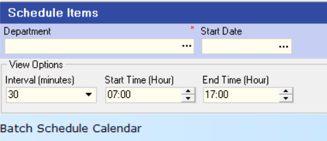  

## View Schedule Calendar  

1.  Click the **three-dot button** in the **Department** field and **Select** the relevant Department from the list.  

2.  Click the **three-dot button** in the **Start Date** field and then click on the required date from the pop-up date control displayed under the Start Date field.  

:::note  
You can adjust the **View Options** of the Batch Schedule Calendar by chosing a suitable **Interval**, and production **Start & End Time**.  
:::  

3.  Click the **Search** button on the Form Menu Bar.  

This screen displays all the jobs that have been scheduled to start within a     selected department for the different days chosen in the Search panel.  

  

##  Add Items to the production Schedule

1.  Click the **Add Items** button at the top of the form.  

2.  The program will open the **Schedule Items** form.  

  

3.  You need to click the **Search** button at the top of the form and the
    system will then display a list of all the products (order items)
    that have been ordered by customers and captured as Sales Orders in
    the program.  

  

:::note  
The program will only show those order items that HAVE NOT YET
BEEN INCLUDED IN ANY SCHEDULE / PRODUCTION BATCH.  
:::  

4.  It is a good idea to firstly group the list by **Due Week**, and then
    sort these items by **Due Date**.  

  

:::note  
If you want to batch items according to similarity in terms of
style, then click on the **Item Name** column to sort the list by style.  
:::

You can then select all the items due in that week that are of the
same style (even though the colour and fabric may differ), and then
click the **Select** button at the top of the screen.  

  

5.  At the top of the screen, you will see three fields with the
    captions:  

**Total Selected**, (this will show you the total Net Selling Price
Excluding VAT of all the items you have chosen to start on a specific
day)  

**Daily Target**, (this will show you the total Net Selling Price
Excluding VAT that should be started in production every day)  

**Variance**. (this will show you the difference between to two values).  

  

:::important  
The date you have selected in the underlying calendar screen (which will be marked in Yellow at the top of the date column), is the date on which the items you select will be scheduled to start in production.  

  

Take care that when you select items, that you have the correct date selected on the underlying screen.  
:::

6. The program will add the selected items to the calendar and display a dialog confirming that the items have been added to the schedule.  

  

7.  Click the **OK** button to close the screen.  

8.  The program will display the items you have chosen on the **Calendar**.  

  

:::note  
You can always drag items from one date and drop them onto another if you need to change these after you have selected them.  
:::

9.  You can continue to select items from the list of unscheduled items to any day on the calendar.  
    
To add items to a different date, simply click on the appropriate **date column** in the calendar, then click on the **Add Items** button and select the **item** you want to include.    

10. Keep an eye on the bottom row underneath each date. The system will display the items you have selected to start on each date as a **percentage** of the **total daily target**.  

  

Ideally you want this to be as close to 100% as you can.  

11. Once you have selected all the items you want to schedule, click the **Close** button on the _select_ **Schedule Items** screen.

12. To save your planned schedule, click the **Save** button at the top of the screen.  

13. The program will display a dialog confirming that the items in the plan have been saved.  

  

## Production Batch

1.  You will see that the screen is split into two sections.  

On the left is the **calendar** viewing showing all the items that have been scheduled to start on each date.  

On the right, is a grid that shows the **details** of each **of the items** on the calendar.  

If you click on a bar in the calendar, you will see that
the item you have selected is highlighted in yellow in the grid.  

  

2.  Each of the items you have selected will be included in a
    **Production Batch**.  
    The program assigns a **Production Batch number** to each batch automatically.
 
  
   
This batch numbers begins with the letter **B**, followed by the **year**, **month** and **start date**.  

3. If you are using Job Costing and booking tasks and materials to each Job, you will need to generate **Process Orders** accordingly.  

4.  Click the item in the grid on the right-hand side of the screen...  

5.  Then look in the **Process Order / Batch** column and find all the items that do not yet have a **Process Order Number**.  

6.  Click on one of these items and click the **Production Batch** button at the top of the screen.  

7.  The program will open the **Production Batch detail screen** and show ALL THE ITEMS INCLUDED IN THE SELECTED BATCH.  
 
  
   
8.  You can **multi-select items** in the list (hold down the **control** or **shift key** on the your keyboard and click the rows for each item for which you want to generate a Process Order.)  
 
  
   
9.  Then click the **Generate Process Order** button at the top of the screen.  

10. The program will confirm that Process Orders have been created for
    the items you selected.  
 
  
   
11. You need to set the **status** of the Production Batch to **Planned**
    so that it shows up on the Capacity Planning screen.  
    
    Click the **Batch State** button on the top of the screen, and from the drop-down arrow, select the "**Planned**" status option.  

  
  
12. Then you need to set the status for each product to **Track Item** so
    that the tasks that must be completed in order to manufacture the
    item are displayed on the **Step Progress** screens.  

    To do this click on the **Item Actions** button at the top of the
    screen, and from the dropdown arrow select the **Track Items** option.  

  
 
13. Repeat this for each item in the Production Batch.  

:::note  
You can **multi-select items** in the list (hold down the **control** or **shift key** on the your keyboard and click the rows for each item that you want to track.)  
:::  

14. Click on **Save**, and then click on the **Close** button.  

15. If you click the **Search** button on the calendar screen, you will see
    the numbers for the Process Order that have been generated are
    displayed in the **Process / Batch No** column.  

  

With all this in place, the manufacturing team can get cracking...  

---

## Factory Floor Terminal (Sphere-Mini)  

When you open the **Scheduler** module and open the **Schedule Plan** screen, you will see how much production capacity has been used up in each Stage for each day.  

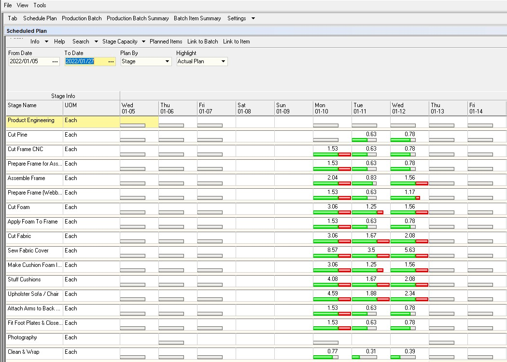  

1.  To view the **details** of what has been scheduled for **each stage**
    for **each day**, click the **Production Batch** button at the top of the screen.  

2.  On the Schedule Plan screen, click the **Planned Items** button and the
    program will then show you the **list of tasks** scheduled to be
    completed at each Stage on each Day.

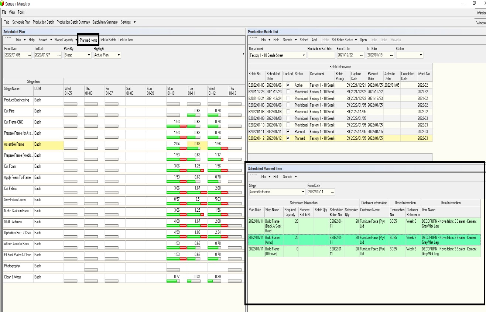  

### The Process...

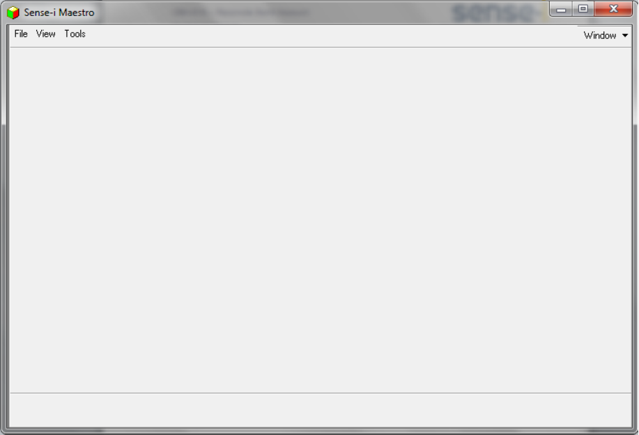  

1. Click the **File** menu item and then the **Log In** menu item.  

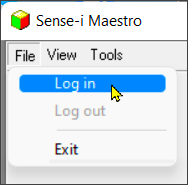  

2. Once you have logged in you need to open the Scheduler system. To do
    this click **Scheduler** at the bottom of the screen.  

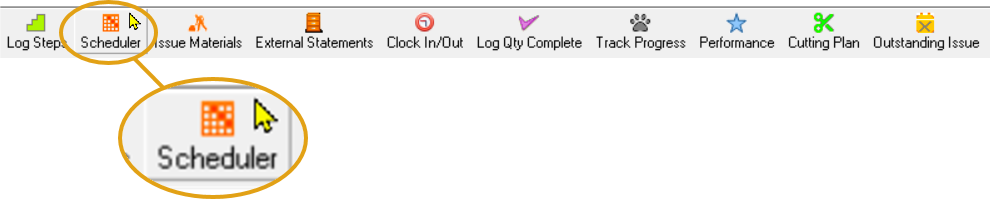  

3. The application will the open the **Production Scheduler** system.  

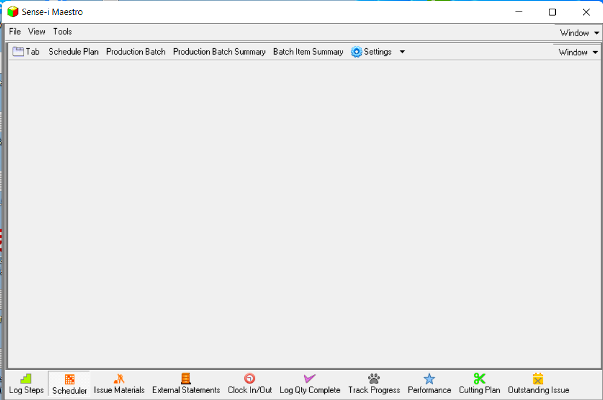  

4. The first thing you need to do is to arrange
    **multiple window positions** on the **Scheduling** system screen.  

5. To do that click the **Tab** button at the top of the screen...  

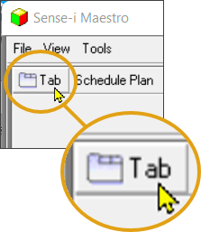  

The program displays a floating window titled **Empty**...

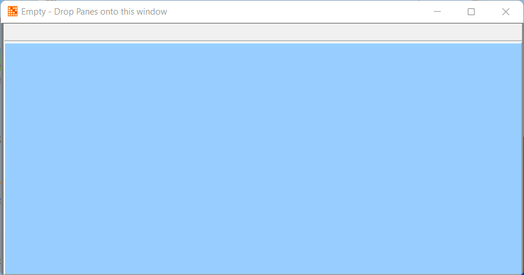  

6. Drag the _floating window_ into the **Sense-i Maestro** application screen.  

:::note 
This process is known as **Docking**.  After clicking on the **Tab** button, the floating window(s) can be **Docked** and arranged to suit your preference.  
:::

7.  Then repeat steps 5 and 6 twice more to create a screen layout that looks like the one in the image below.  

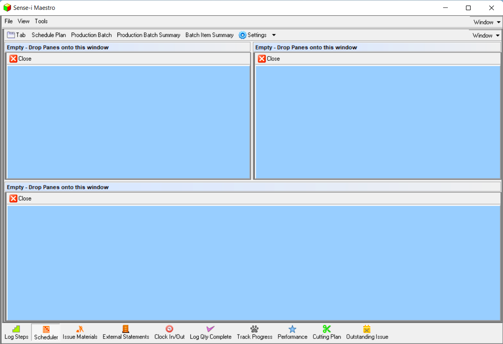  

8. Next, you need to open the main **Production Scheduling** screen.  
To do this click the **Schedule Plan** button.  

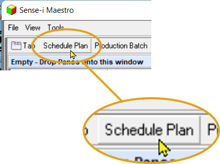  

9. The system will open the main **Production Scheduling** screen - you will
    see that this is called the **Plan by Stage** screen.  
    
    Drag this screen into position in the top left panel.

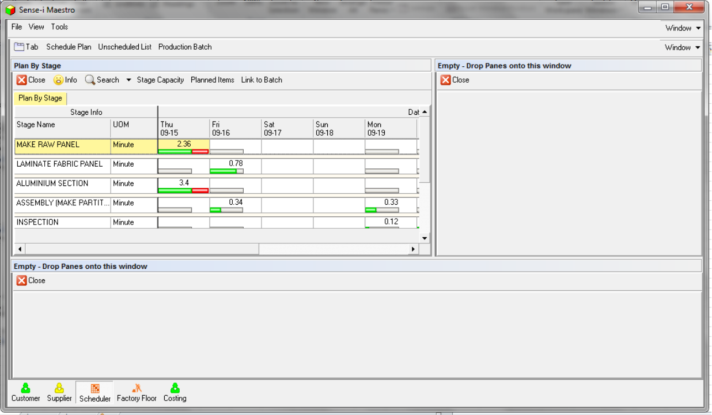  

10. Next, open the screen that enables you to set the
    **Available Production Capacity** for each Stage.  
    
    To do this, click the **Stage Capacity** button.  

11. The system will open a screen titled **Stage Capacity Available**.  

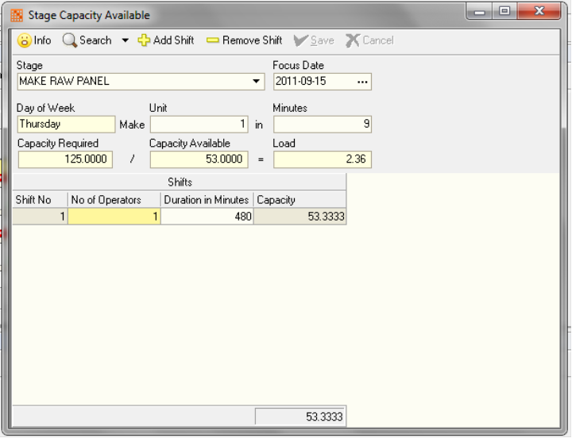  

12. **Dock** the **Stage Capacity Available** screen in the
    top right panel so that you screen now looks like the one in the image below.  
    
    Click the **Link To Batch** button.  

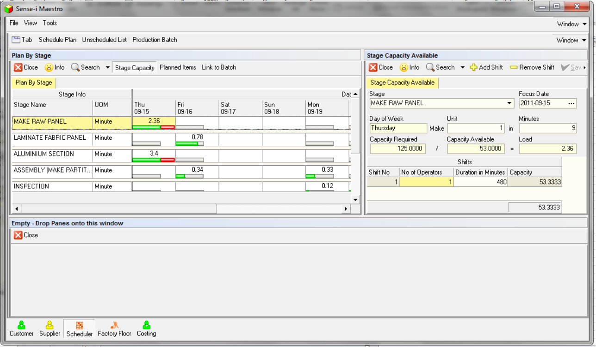  

13. Next, you need to view a list of the items that have been ordered by
    customers that have not yet been scheduled.  
    
    To do this, click the **Unscheduled List**.  

14. The system will open a screen titled **Unscheduled Process Orders**.  
    
    This screen lists all the Process Orders that you have created via
    the **Replenishment** function.

:::note  
If you have items on Sales Orders in the system and you have
not yet used the Replenish function to create Process Orders they will
NOT APPEAR IN THIS LIST.  
:::

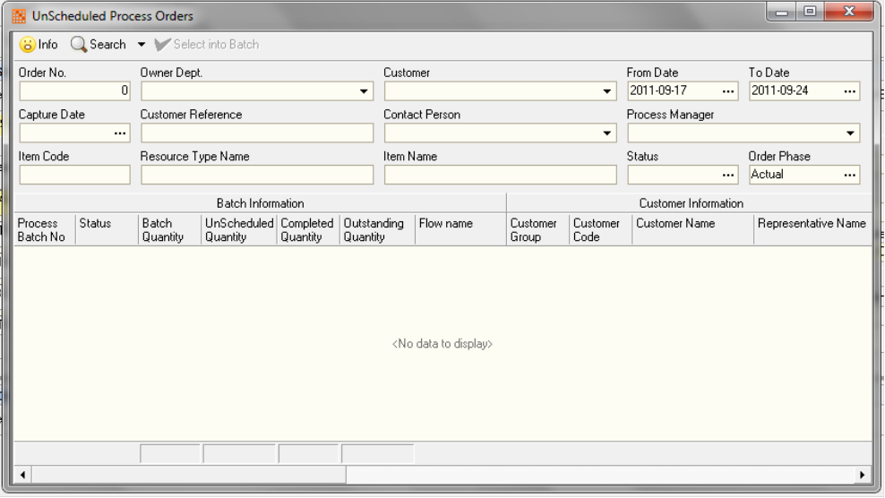  

15. **Dock** the **Unscheduled Process Orders** window in the
    **horizontal bottom pane**.  

16. Next, you need to open a window that shows you what Production
    Scheduling Batches exist in the system.  
    
    To do this, click the **Production Batch** button at the top of the screen.  

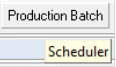  

17. The system will open a screen titled **Production Batch List**.  

    **Dock** this screen **on top** of the **Unscheduled Process Orders** screen.  
    
    :::note  
    The system creates two tabs from these screens. One on top of
    and to the right of the other.  
    :::

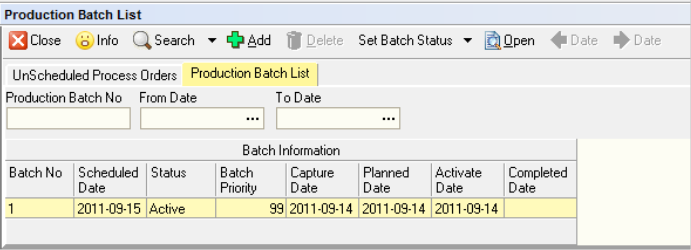  

18. To view the details of the items in each Production Batch, click the
    **Add** button to open the **Production Batch View** screen.  

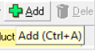  

19. The system will open the **Production Batch View** screen.  

    This screens shows you the details of each product or item that have been included in a Production Batch.  

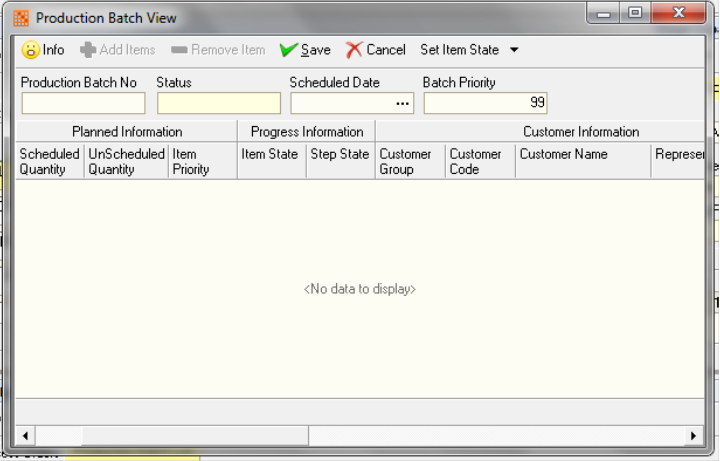  

20. **Dock** the **Production Batch View** screen in the
    **bottom horizontal panel** as a third tab.  

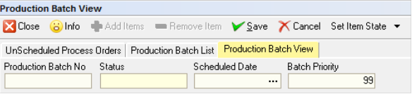  

21. Finally, open a screen that enables you to view the **Steps** or
    **Activities** that need to be performed in each Stage for the work that you have scheduled.  
    
    To do this, click the **Planned Items** button.  

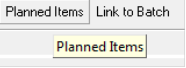  

22. The system will open a screen titled **Scheduled Planned Items**.  

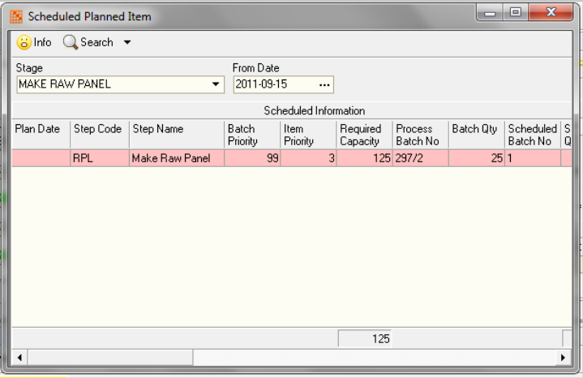  

23. **Dock** this screen as a **fourth tab** in the
**bottom horizontal panel**.  

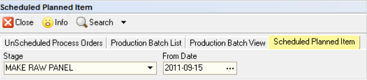  

24. You scheduling system should now have the following layout...  

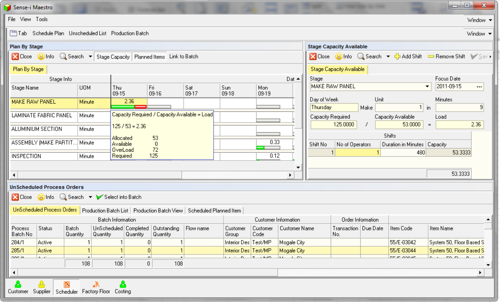  

25. The first step in actually scheduling items that have been ordered
    is to **select order items** from the **Unscheduled Process Orders** screen and include them in a Production Batch.  
    
    To do this, click on the **Unscheduled Process Order** tab...  

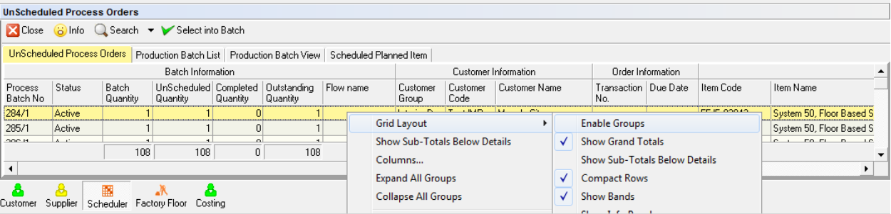  

26. Next, decide on how you want to batch items, you can do this by
    selecting or grouping items...  

-   By Sales Order  

-   By Due Week, then Product Type  

-   By Due Date  

-   By Flow Name  

27. Then create a Production Batch.  
    To do this, click the Production Batch List tab, and  
    
28. then click the **Add** button.

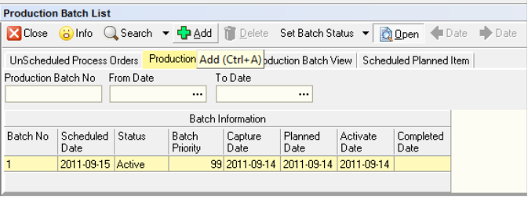  

29. The system will open the **Product Batch View** Screen.  

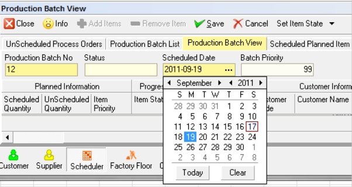  

30. Enter a **Production Batch No**.  

31. Select a **Scheduled Start Date**, this is the date on which production
    will start on this batch.  

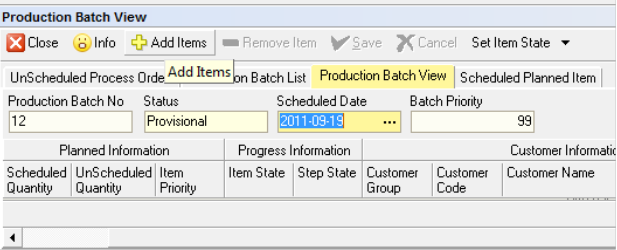  

32. Enter a **Batch Priority**.  

If there is more than one Production Batch starting on the same date the **Batch Priority** will **control the sequence** in which these start.  

1 is the highest priority, i.e. it will start first and 99 is the lowest priority.  
    
33. Click **Save**.  

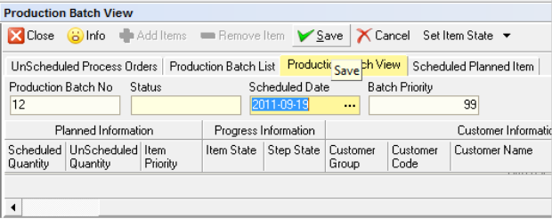  

34. The system will take you back to the **Unscheduled Process Orders**
    screen so that you can select which items you want to include in a
    Production Batch.  

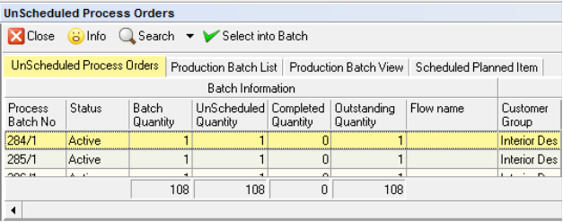  

35. Click on the **items** you want to **include** in the
    **Production Scheduling Batch** you are creating.  
    
    Remember to use the **Quick Filter** to select items according to the most appropriate set of criteria for your company. These could be...

    -   By Sales Order  

    -   By Due Week, then Product Type 

    -   By Due Date  

    -   By Flow Name  

36. Then click the **Select Into Batch** button.  

37. The system will return you to the **Production Batch View** screen.  

38. Click the **Production Batch List** screen.  

39. Click the **Set Batch Status** and set the status to "**Planned**".  

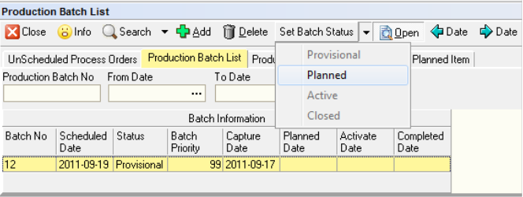  

40. Click the **Production Batch View** to view the list of items that are
    included in the batch.  

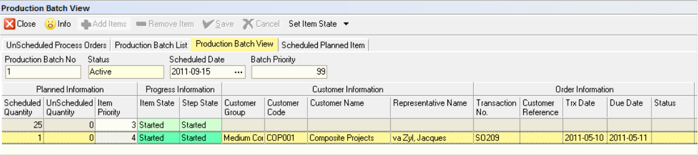  

41. Once you have selected items into a Production Scheduling Batch you
    can view the activities or steps for a particular stage by clicking
    on the **Scheduled Planned Items** screen.  

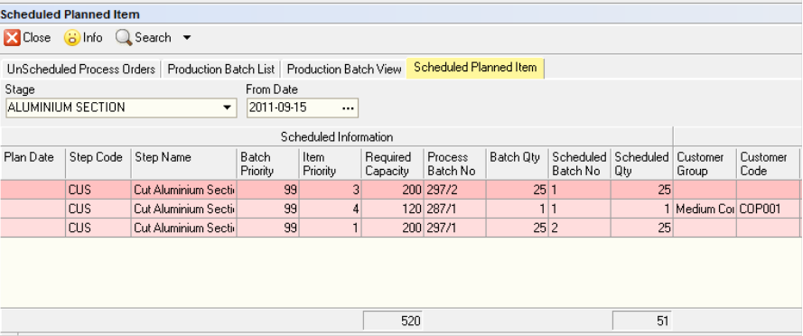  

42. Then note that if you have clicked the **Link to Batch** button...  

43. As you click on different **Stage Names** and **Dates** in the
    **Plan By Stage** matrix both the **Stage Capacity Available** and the **Scheduled Planned Items** screens show you the details of the items that are used to calculate the **Loading for each Stage and day**.  

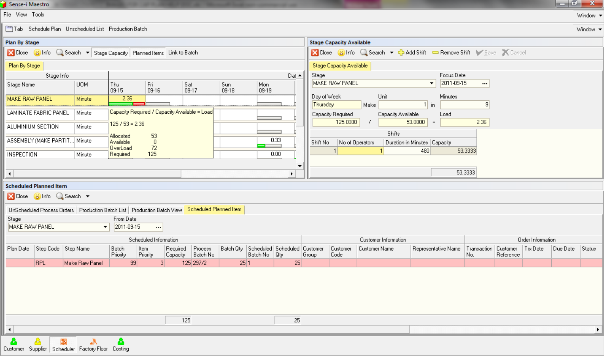  

44. All that remains now is for you to try to **optimize** the
    **Production Schedule** so that the Loading for each day is
    **as close to 1** as you can practically achieve.  
    
    You can do this by changing the **inputs to the Production Schedule**, i.e.

45. **Adjust Stage Capacity Available** within reasonable constraints by
    changing the  

    -   Number of Operators in a Shift  

    -   The Duration of a Shift, i.e. work some overtime  

    -   Adding a New Shift  

    -   Or Changing the Production Rate.  

46. Once you have reached the limit of the Available Capacity ...

    -   remove items from the production batch  

    -   or change the quantity of an item you will make in a batch  

47. Once you have done all you can to optimise your Production Schedule
    you can then move on to **Tracking the Progress** of the items in a
    Production Schedule through the factory.  

**This is the end of the procedure.**  

