## Procedure Guideline
___ 

The Production Schedule function in the Sense-i system enables you to
create Production Batches for **Scheduling purposes**, and enables linking items that have been ordered by customers that need to be manufactured.  

The **Production Scheduling Batch** determines **when** these batches should be manufactured and shows how this impacts the **available capacity** in the production department.  

To create a Production Schedule in SEMS you need to perform the
following steps;  

1.  On the SEMS main menu, select **Operation**.  

2.  Then click on the **Schedule Order Items** menu option.  

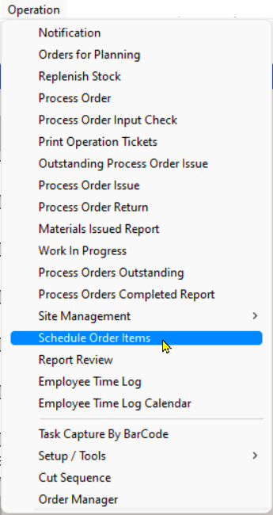  

3.  The program will open a screen titled **"Schedule Items"**.  

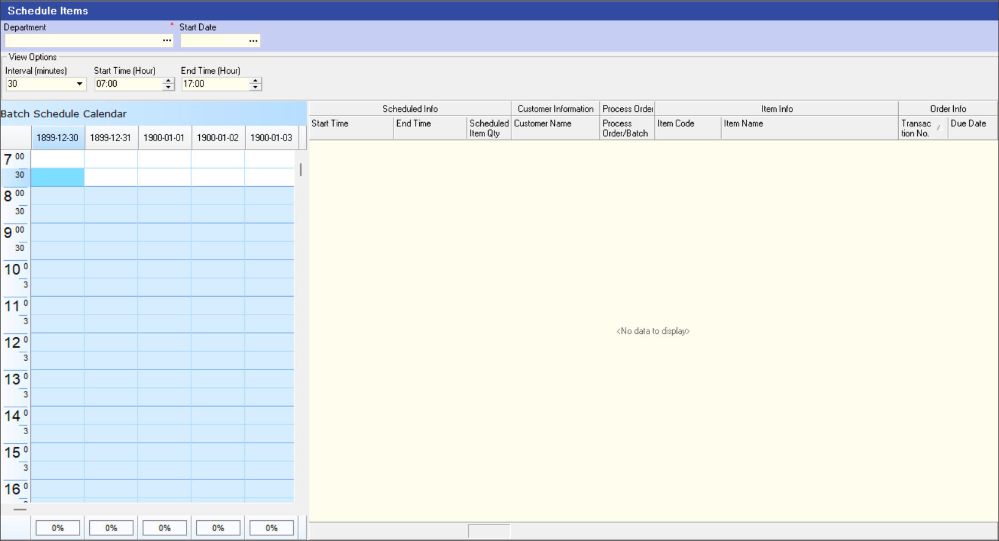  

The following steps will detail the process to populate the Calendar with the relevant Dates, Time and associated Items scheduled for Production.  

To view what has been scheduled on the calendar for the department you need to enter search parameters as follows...

### View Schedule Calendar  

1.  Click the **three-dot button** in the **Department** field and **Select** the relevant Department from the list.  

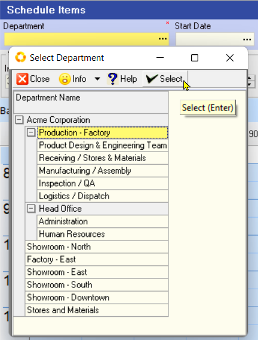  

2.  Click the **three-dot button** in the **Start Date** field and then click on the required date from the pop-up date control displayed under the **Start Date** field.  

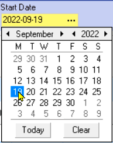  

:::note  
You can adjust the **View Options** of the Batch Schedule Calendar by chosing a suitable **Interval**, and production **Start & End Time**.  
:::  

3.  Click the **Search** button on the Form Menu Bar.  

This screen displays all the jobs that have been scheduled to start within a selected department for the different days chosen in the Search panel.  

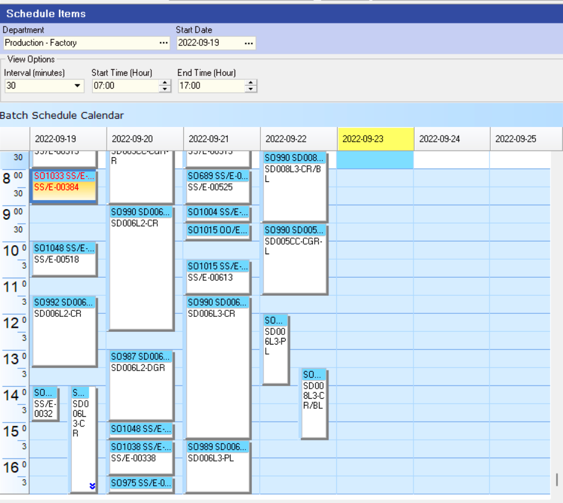  

###  Add Items to the Production Schedule

1.  Click the **Add Items** button at the top of the form.  

2.  The program will open the **Schedule Items** form.  

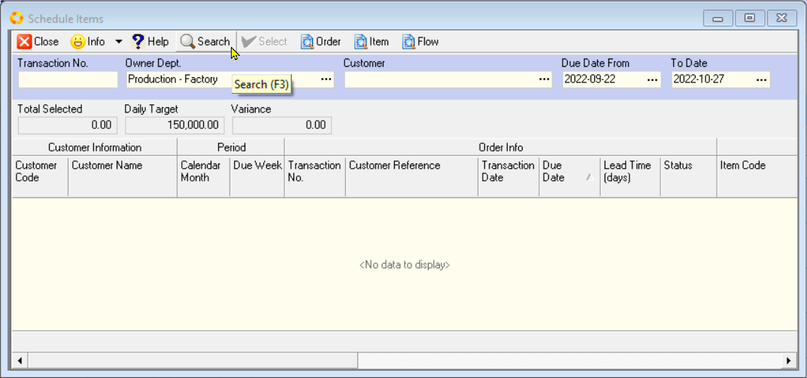  

3.  You need to click the **Search** button at the top of the form and the
    system will then display a list of all the products (order items)
    that have been ordered by customers and captured as Sales Orders in
    the program.  

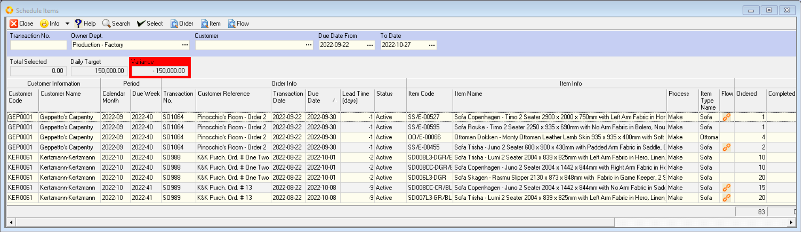  

:::note  
The program will only show those order items that HAVE NOT YET
BEEN INCLUDED IN ANY SCHEDULE / PRODUCTION BATCH.  
:::  

4.  It is a good idea to firstly group the list by **Due Week**, and then
    sort these items by **Due Date**.  

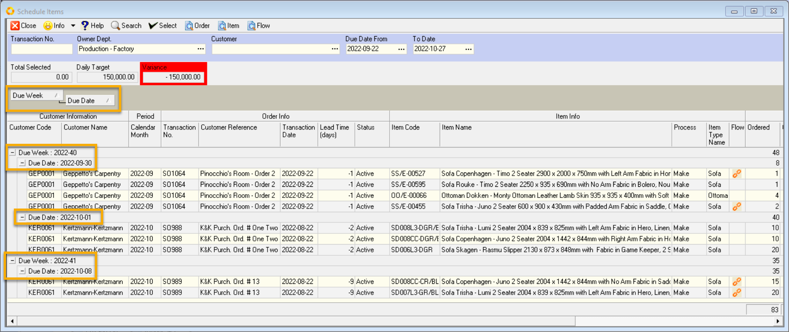  

:::note  
If you want to batch items according to similarity in terms of
style, then click on the **Item Name** column to sort the list by style.  
:::

You can then select all the items due in that week that are of the
same style (even though the colour and fabric may differ), and then
click the **Select** button at the top of the screen.  

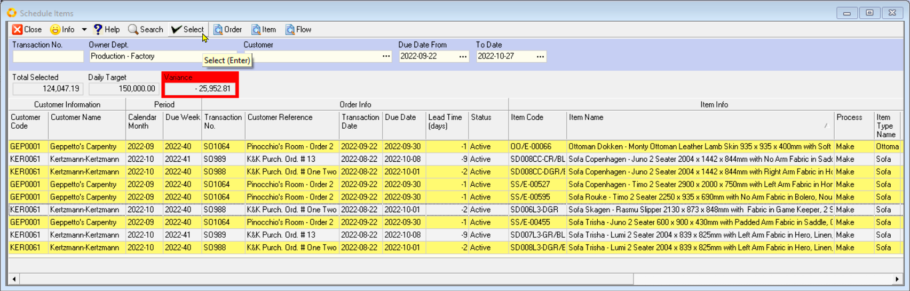  

5.  At the top of the screen, you will see three fields with the
    captions:  

**Total Selected**, (this will show you the total Net Selling Price
Excluding VAT of all the items you have chosen to start on a specific
day)  

**Daily Target**, (this will show you the total Net Selling Price
Excluding VAT that should be started in production every day)  

**Variance**. (this will show you the difference between to two values).  

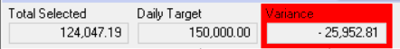  

:::important  
The date you have selected in the underlying calendar screen (which will be marked in Yellow at the top of the date column), is the date on which the items you select will be scheduled to start in production.  

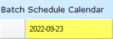  

Take care that when you select items, that you have the correct date selected on the underlying screen.  
:::

6. The program will add the selected items to the calendar and display a dialog confirming that the items have been added to the schedule.  

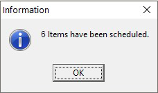  

7.  Click the **OK** button to close the screen.  

8.  The program will display the items you have chosen on the **Calendar**.  

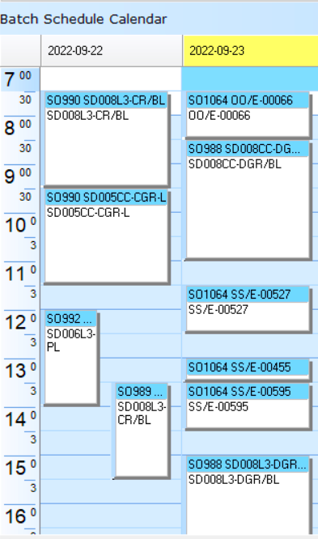  

:::note  
You can always drag items from one date and drop them onto another if you need to change these after you have selected them.  
:::

9.  You can continue to select items from the list of unscheduled items to any day on the calendar.  
    
To add items to a different date, simply click on the appropriate **date column** in the calendar, then click on the **Add Items** button and select the **item** you want to include.    

10. Keep an eye on the bottom row underneath each date. The system will display the items you have selected to start on each date as a **percentage** of the **total daily target**.  

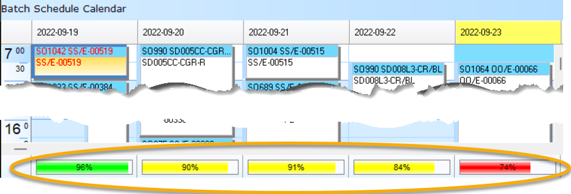  

Ideally you want this to be as close to 100% as you can.  

11. Once you have selected all the items you want to schedule, click the **Close** button on the _select_ **Schedule Items** screen.

12. To save your planned schedule, click the **Save** button at the top of the screen.  

13. The program will display a dialog confirming that the items in the plan have been saved.  

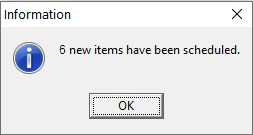  

### Production Batch

1.  You will see that the screen is split into two sections.  

On the left is the **calendar** viewing showing all the items that have been scheduled to start on each date.  

On the right, is a grid that shows the **details** of each **of the items** on the calendar.  

If you click on a bar in the calendar, you will see that
the item you have selected is highlighted in yellow in the grid.  

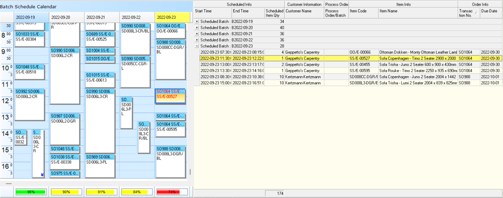  

2.  Each of the items you have selected will be included in a
    **Production Batch**.  
    The program assigns a **Production Batch number** to each batch automatically.
 
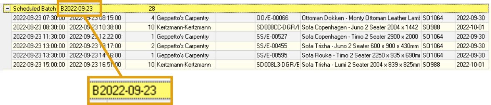  
   
This batch numbers begins with the letter **B**, followed by the **year**, **month** and **start date**.  

3. If you are using Job Costing and booking tasks and materials to each Job, you will need to generate **Process Orders** accordingly.  

4.  Click the item in the grid on the right-hand side of the screen...  

5.  Then look in the **Process Order / Batch** column and find all the items that do not yet have a **Process Order Number**.  

6.  Click on one of these items and click the **Production Batch** button at the top of the screen.  

7.  The program will open the **Production Batch detail screen** and show ALL THE ITEMS INCLUDED IN THE SELECTED BATCH.  
 
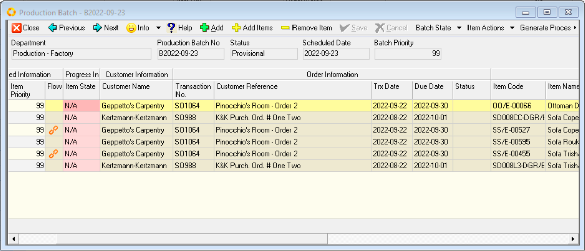  
   
8.  You can **multi-select items** in the list (hold down the **control** or **shift key** on the your keyboard and click the rows for each item for which you want to generate a Process Order.)  
 
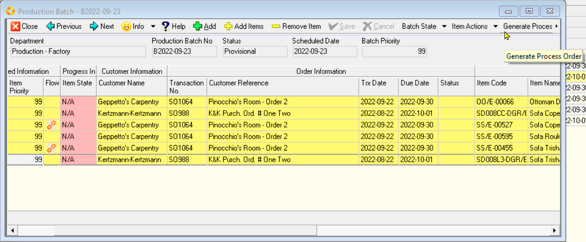  
   
9.  Then click the **Generate Process Order** button at the top of the screen.  

10. The program will confirm that Process Orders have been created for
    the items you selected.  
 
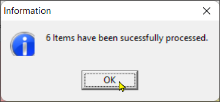  
   
11. You need to set the **status** of the Production Batch to **Planned**
    so that it shows up on the Capacity Planning screen.  
    
    Click the **Batch State** button on the top of the screen, and from the drop-down arrow, select the "**Planned**" status option.  

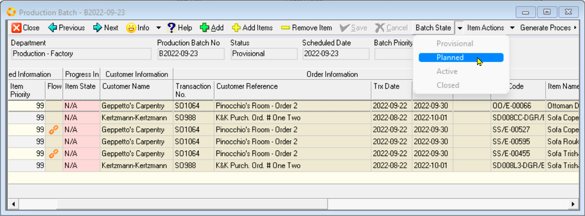  
  
12. Then you need to set the status for each product to **Track Item** so
    that the tasks that must be completed in order to manufacture the
    item are displayed on the **Step Progress** screens.  

    To do this click on the **Item Actions** button at the top of the
    screen, and from the dropdown arrow select the **Track Items** option.  

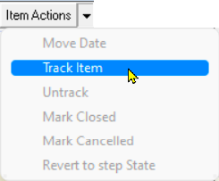  
 
13. Repeat this for each item in the Production Batch.  

:::note  
You can **multi-select items** in the list (hold down the **control** or **shift key** on the your keyboard and click the rows for each item that you want to track.)  
:::  

14. Click on **Save**, and then click on the **Close** button.  

15. If you click the **Search** button on the calendar screen, you will see
    the numbers for the Process Order that have been generated are
    displayed in the **Process / Batch No** column.  

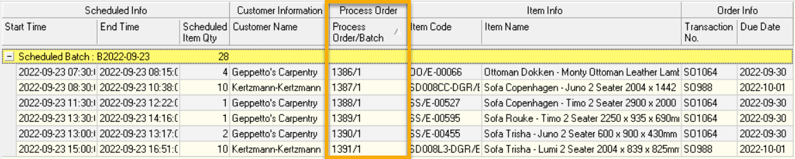  

With all this in place, the manufacturing team can get cracking...  

Once you have done all you can to optimise your Production Schedule you can then move on to the **[Manage Schedule Capacity](SMS001)** procedure.  

This is the end of the **Create a Production Schedule** procedure.  
___

## Related Procedures  

- **[Manage Schedule Capacity](SMS001)**

- **Defining Available Capacity**  

- **Tracking Order Progress**  

- **Logging Step Progress on Factory Floor**

