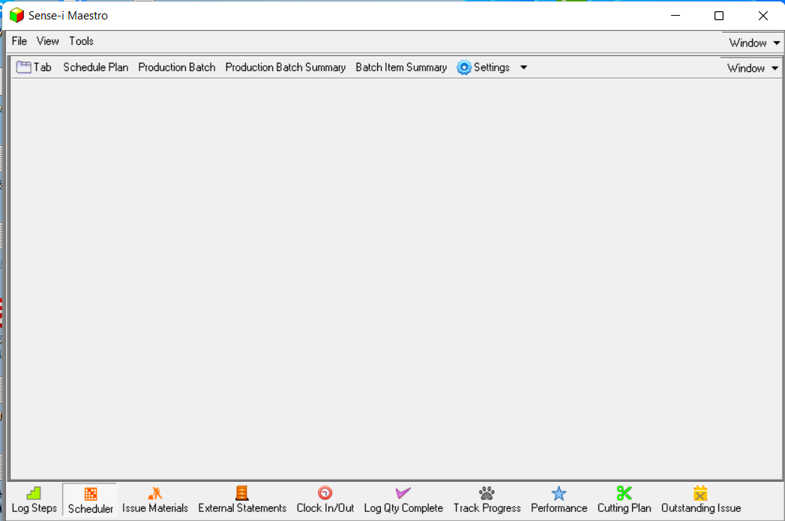
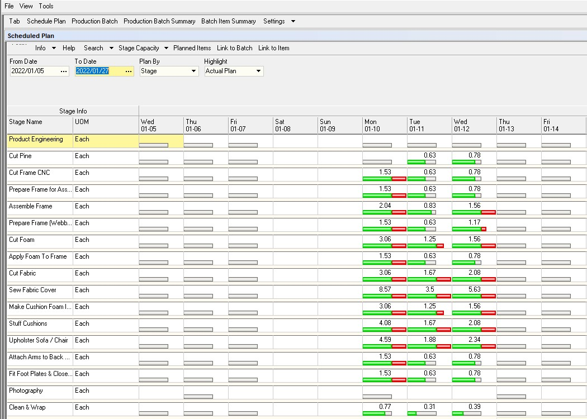
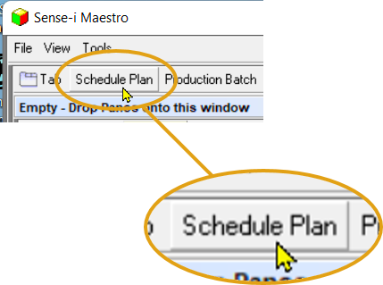
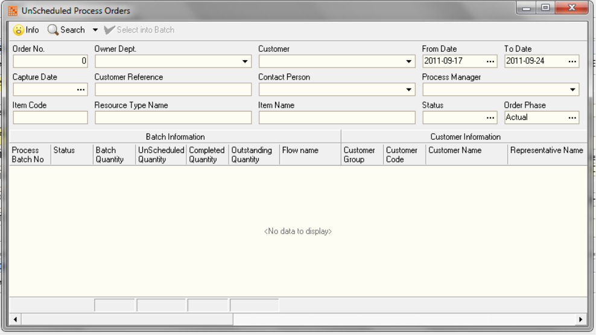
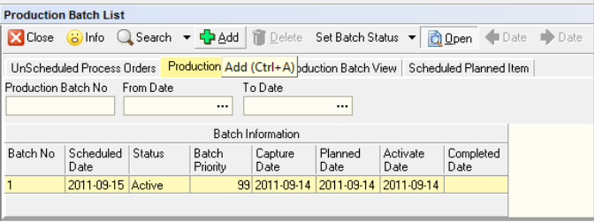
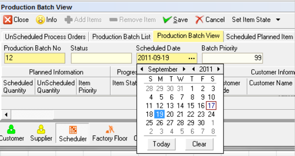
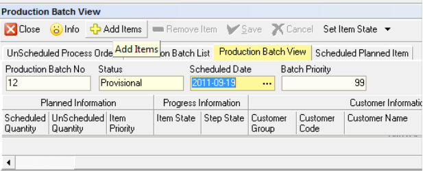
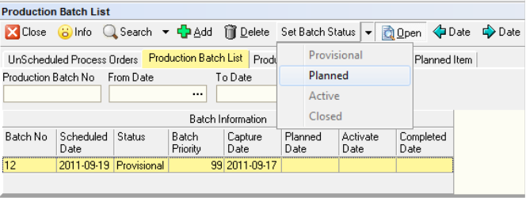
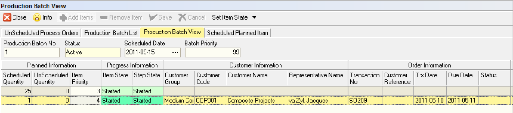

## Procedure Guideline
___ 

The Production Schedule function in the Sense-i system enables you to
manage Production Batches for **Scheduling purposes**, and enables linking items that have been ordered by customers that need to be manufactured.  

The **Production Scheduling Batch** determines **when** these batches should be manufactured and shows how this impacts the **available capacity** in the production department.  

To manage and maintain a Production Schedule in the Sense-i Maestro system, you need to perform the following steps;   

### Step-by-Step Guideline  

  

1. Click the **File** menu item and then the **Log In** menu item.  

  

2. Once you have logged in you need to open the Scheduler system. To do
    this click **Scheduler** at the bottom of the screen.  

  

3. The application will the open the **Production Scheduler** system.  

  

### The Goal

When you open the **Scheduler** module and open the **Schedule Plan** screen, you will see how much production capacity has been used up in each Stage for each day.  

  

1.  To view the **details** of what has been scheduled for **each stage**
    for **each day**, click the **Production Batch** button at the top of the screen.  

2.  On the Schedule Plan screen, click the **Planned Items** button and the
    program will then show you the **list of tasks** scheduled to be
    completed at each Stage on each Day.

  

:::tip Achieving the Goal  
The following steps will detail the process to achieve the goal as outlined above.  
:::  

### Production Scheduler Screen Layout

1. The first thing you need to do is to arrange
    **multiple window positions** on the **Scheduling** system screen.  

2. To do that click the **Tab** button at the top of the screen...  

  

The program displays a floating window titled **Empty**...

  

3. Drag the _floating window_ into the **Sense-i Maestro** application screen.  

:::note 
This process is known as **Docking**.  After clicking on the **Tab** button, the floating window(s) can be **Docked** and arranged to suit your preference.  
:::

4.  Then repeat steps 2 and 3 twice more to create a screen layout that looks like the one in the image below.  

  

### Production Scheduling

1. Next, you need to open the main **Production Scheduling** screen.  
To do this click the **Schedule Plan** button.  

  

2. The system will open the main **Scheduler** screen - you will
    see that this is called the **Scheduled Plan** screen.  
    
    Drag this screen into position in the **top left** panel.

  

3.  Next, open the screen that enables you to set the
    **Available Production Capacity** for each Stage.  
    
    To do this, click the **Stage Capacity** button, and then click on **Capacity By Stage** (**_Scheduled Plan_** screen, **_Form Navigation bar_**).  

  

4.  The system will open a screen titled **Stage Capacity Available**.  

  

5.  **Dock** the **Stage Capacity Available** screen in the **top right** panel so that you screen now looks like the one in the image below.  
    
6.  Click the **Link To Batch** button in the **Scheduled Plan, Form Navigation bar** .  

  

### Production Batch

1.  Next, you need to open a window that shows you what Production Scheduling Batches exist in the system.  
    
To do this, click the **Production Batch** button at the top of the screen.  

  

2.  The system will open a screen titled **Production Batch List**.  

3. **Dock** the **Production Batch List** window in the **horizontal bottom pane**.  

  

4.  To view the details of the items in each Production Batch, select the relevant batch row in the Production Batch List, then click the **Open** button to open the **Production Batch View** screen.  

5.  The system will open the **Production Batch View** screen.  

  

This screens shows you the **details of each product or item** that have been included in a Production Batch.  

6.  **Dock** the **Production Batch View** screen in the **bottom horizontal panel** - on top of the **Production Batch List** Screen.   

  

:::note  
The system creates **two Tabs** from these screens - one on top of and to the right of the other.  
:::  

### View Scheduled Planned Items  

Finally, open a screen that enables you to view the **Steps** or **Activities** that need to be performed in each Stage for the work that you have scheduled.  

  

1.  To do this, click the **Planned Items** button.  

2.  The system will open a screen titled **Scheduled Planned Item**.  

  

3.  **Dock** this screen as a **third tab** in the **bottom horizontal panel**.  

  

4.  The scheduling system should now have the following layout...  

  
___
### Unscheduled Process Orders (REVIEW Required)

1.  Next, you need to view a list of the items that have been ordered by
    customers that have not yet been scheduled.  
    
    To do this, click the **Unscheduled List**.  

2.  The system will open a screen titled **Unscheduled Process Orders**.  
    
    This screen lists all the Process Orders that you have created via
    the **Replenishment** function.

:::note  
If you have items on Sales Orders in the system and you have not yet used the Replenish function to create Process Orders they will NOT APPEAR IN THIS LIST.  
:::

  

3. **Dock** the **Unscheduled Process Orders** window in the
    **horizontal bottom pane**.  

### Scheduling Items

The first step in actually scheduling items that have been ordered is to create a Production Batch and then **select order items** from the **Unscheduled Process Orders** list and include them in the Production Batch.  

1.  To do this, click the **Production Batch List** Tab, and  
    
2.  then click the **Add** button.

  

3.  The system will open the **Add New Production Batch** Screen.  

4.  Click on the **three-dot button** in the Department field and then select the relevant **Department**. 

5.  Enter a **Production Batch No**.  

6.  Select a **Scheduled Start Date**, this is the date on which production
    will start on this batch.  

  

7.  Enter a **Batch Priority**.  

:::note  
If there is more than one Production Batch starting on the same date the **Batch Priority** will **control the sequence** in which these start.  

1 is the highest priority, i.e. it will start first and 99 is the lowest priority.  
:::  
    
8.  Click **Save**.  

  
    
The next step is to add items from the **Unscheduled Process Order** list.  
To do this, click on the **Add Items** button  

  

9.  Next, decide on how you want to batch items, you can do this by
    selecting or grouping items...  

-   By Sales Order  

-   By Due Week, then Product Type  

-   By Due Date  

-   By Flow Name  

10.  The system will take you back to the **Unscheduled Process Orders** screen so that you can select which items you want to include in a Production Batch.  

  

11.  Click on the **items** you want to **include** in the **Production Scheduling Batch** you are creating.  
    
Remember to use the **Quick Filter** to select items according to the most appropriate set of criteria for your company. These could be...

-   By Sales Order  

-   By Due Week, then Product Type 

-   By Due Date  

-   By Flow Name  

12.  Then click the **Select Into Batch** button.  

13.  The system will return you to the **Production Batch View** screen.  

14.  Click the **Production Batch List** screen.  

15. Click the **Set Batch Status** and set the status to "**Planned**".  

  

16. Click the **Production Batch View** to view the list of items that are included in the batch.  

  

17. Once you have selected items into a Production Scheduling Batch you can view the activities or steps for a particular stage by clicking on the **Scheduled Planned Items** screen.  

  

18. Then note that if you have clicked the **Link to Batch** button...  

19. As you click on different **Stage Names** and **Dates** in the **Plan By Stage** matrix both the **Stage Capacity Available** and the **Scheduled Planned Items** screens show you the details of the items that are used to calculate the **Loading for each Stage and day**.  

  

### Production Schedule Optimisation

1. All that remains now is for you to try to **optimise** the **Production Schedule** so that the Loading for each day is **as close to 1** as you can practically achieve.  
    
You can do this by changing the **Inputs to the Production Schedule**, i.e.

2.  **Adjust Stage Capacity Available** within reasonable constraints by changing the;  

    -   Number of Operators in a Shift  

    -   The Duration of a Shift, i.e. work some overtime  

    -   Adding a New Shift  

    -   Or Changing the Production Rate.  

3.  Once you have reached the limit of the Available Capacity ...

    -   remove items from the production batch  

    -   or change the quantity of an item you will make in a batch  

4.  Once you have done all you can to optimise your Production Schedule you can then move on to **Tracking the Progress** of the items in a Production Schedule through the factory.  

**This is the end of the procedure.**  

