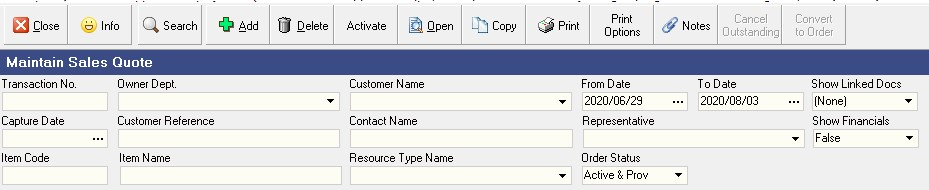
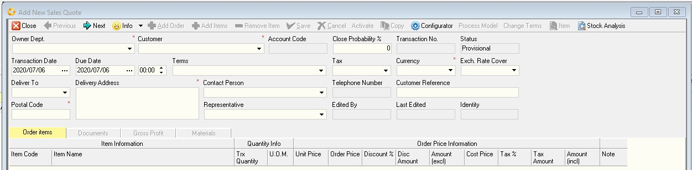
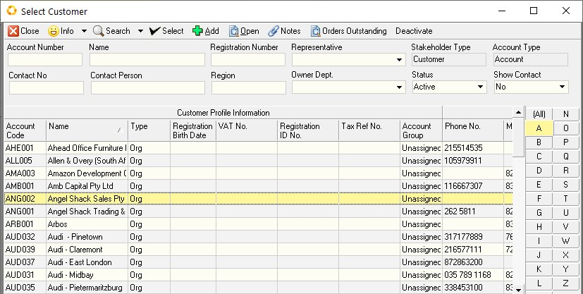
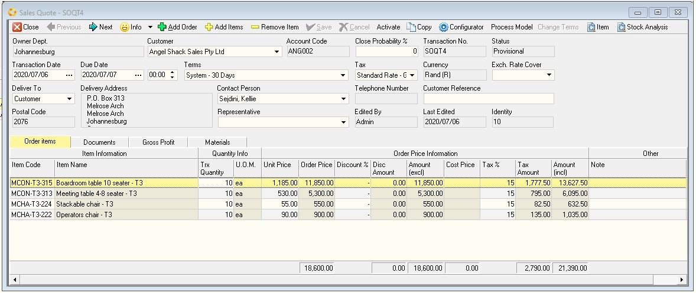
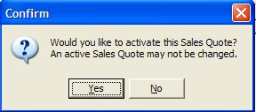

## Capture Sales Quote (SOE-002)
### Procedure Guideline
___
1.  Click on the **Customer** bar on the Main Navigation Menu at the top of the screen.

2.  Then select **Sales Quote** option from the drop-down Menu.

| NB! Image as converted\...         | Screen capture from MS Word (with relevant info boxes) and then saved as a new image.    |
| ---------------------------------- | :--------------------------------------------------------------------------------------: |
|  |                                                       |

3.  The system will open a screen titled **"Maintain Sales Quote".**  

This screen lists all the Sales Quotes that have already been captured in the system within the ***From Date*** and ***To Date*** specified in the Search Criteria Panel.  
Note that you can change the information displayed in this list by changing the dates and other information in the Search Criteria Panel above the list of orders.                    

4.  Click on the [**Add**] button on the Form Bar to open an **Add New Sales Quote** form.

**Add New Sales Quote**

You will first need to decide which department makes the products that you want to include in the Sales Quote you are preparing.  
This is the department or branch for whom you are capturing the Sales Quote.

5.  Use the **drop-down button** in the "**Owner Dept.**" field.

6.  The system will open a screen just below the department field called **Select Department**.  
This screen enables you to select a specific department or branch from a list of all the departments / branches defined for the company.

 

7.  Click on the **name of the department** you wish to use, (usually this is __*Production*__).

8.  Click the **Select** button on the form menu bar.

9.  The system will return to the **Add New Sales Quote** screen and display the name of the department you have chosen on the screen.  
Next you will need to select the customer for whom you are preparing or capturing the Sales Quote.

10. Use the **drop-down button** in the **Customer** field.

11. The system will open a screen titled **Select Customer** that enables you to select a specific customer from a list of all the customers that have been captured in the system.  
If the customer you wish to use is not on this list you can add their details directly from here. Use the procedure titled **CUP-004 Capture Customer Profile** to do this.

12. You can search a long list of customers to find a specific customer by typing in the " **%** " symbol and a few letters from the customer's name in **Name** field.  

13. You can search by physical location, **Region**, or any of the other Search fields in the top of the screen.

14. You can also narrow down the list of customers on the screen by using the **Alphabetical Divider** on the right of the screen to select the letter that matches the first letter of the customer name you wish to use for the Sales Quote you are creating.  

15. Alternatively, you can click in the customer **Name** column and simply begin typing the name of the customer and the program will find the row that matches the letters you have typed on your keyboard.  

    Once you can see the name of the customer you wish to use for this Sales Quote on the screen, click on this name in the list.  

16. Then click the **Select** button at the top of the form.  
    The program will return to the **Add Sales Quote** screen

17. The program will display the name of the customer you have chosen in the **Customer** field.

{ width=90% }  
Next you need to press the **[TAB]** key on the keyboard to enter the remaining information about the Quote before you select the specific products that the customer is ordering.

You need to enter information such as the;

18. **Due Date**,

19. Payment **Terms**,

20. **Delivery Address**,

21. **Customer Contact**, and a

22. **Customer Reference** or Order Number (in the Customer Reference) field. Once you have entered the "Header" information about the transaction you need to save this and then begin selecting products from the company's product catalogue.  

23. Click the **[✓ Save]** button on the form Menu bar.  
The system will save the information about the Quote and enable the **[+ Add] Items** button.

24. Click the  button to open the company's product catalogue.  

25. The system will display a screen titled **Item List**.

26. You can search the Item List for specific items by typing in the **%** symbol and part of the product name in the **Item Name** field.

27. Click the **[Search]** Button on the form bar.

28. You can narrow the list of Items displayed on the screen by clicking
    one of the **Product Types** on the right of the screen.

    The program will then filter the list of Items displayed in the grid and show only those items or products that match the one you have clicked on in the **Product Type Panel** on the right of the screen.  

29. You can click in the **Item Name** column and simply begin typing the name of the item and the program will find the row that matches the letters you have typed on your keyboard.  

30. Click on the name of the product you wish to include in the Sales Quote.

31. You can hold down the **[SHIFT]** key and select a group of adjacent products from the list or,

32. you can hold down the control key **[CTRL]** on the keyboard and then select various products from the list that are not grouped together.  

:::important
If you are unable to find the product you are looking for, or if the customer wants you to initiate a change to an existing product, use the procedure titled **SOE-003** to capture this information as a new item request. You can then continue with step _**24**_.
:::

33. Then click the **[✓ Select]** button on the form Menu bar.

34. The program will display a dialog informing you of how many products you have added to the Sales Quote you are creating.  

35. Click **[OK]**.

36. The program will leave the **Item List** screen open so that you can continue searching for and selecting other products you wish to add to the Sales Quote you are creating.  

37. Once you have selected all the products you need for your Sales Quote, click the **[X Close]** button at the top left of the screen.

38. The program will return you to the **Sales Quote** screen and display the products you have selected in the detail of the Sales Quote.

39. Enter the Quantity of the item that you are quoting to the customer in the **Trx Quantity** field. You can press the up and down arrow keys to enter the quantities for each item.  

40. The system will display the Selling Price for the item in the **Unit Price** column.
    The price is based on the Price set by the company that applies for the due date you entered in step _**16**_ above.  
    If you have permission, you can change the Selling Price for the item in the relevant **Unit Price** box.

41. You can enter a discount percentage that you wish to give to the customer on this item in the **Discount %** column.

42. The system will display the default tax rate applicable to the customer and the item being ordered in the **Tax Rate** column. You can override this if you need to change it.  

43. You can enter any specific notes about the item in the **Notes** column.

44. You can press the **TAB** key on the keyboard to create space for another product to be included on the order or you can click the **Add Items** button to view and select from the Catalogue.  
    The program automatically saves each of the changes to the order as you make them without you having to click any buttons.  

45. Repeat the above steps until you have captured all the items you need to include on the Sales Quote for the customer.  

46. Once you have completed entering all the details on the Quote, click the  **[✓ Save]** button on the Form Menu Bar to save the information you have entered to the database.  

47. Then to confirm and post the Sales Quote to the database and prevent any further changes, click the **Activate** button at the top of the form.  
    Depending on the settings in the program, the program may display a message asking you if you wish to Activate the Sales Quote.  

48. If you are sure that the details on the Quote are correct and that you have finalised the details of the Quote, click the **[Yes]** button.  

49. If you choose **[No]** you are in effect saying that the Quote is still in draft mode and that you will edit the details in future.  

50. The program will return you to the **Maintain Sales Quote** screen.  

51. This is the screen that lists all of the Sales Quotes in the database that match you're the criteria you have entered in the Search Panel at the top of the screen.  

52. Click the **Search** button and make sure that the End Date (**To Date**) in the screen is later than the **Due Date** of the order you have just entered.  

53. Once you have completed entering all the Sales Quotes you need to capture in the system, click the **[X Close]** button on the Form Menu Bar.  

**This is the end of this procedure.**