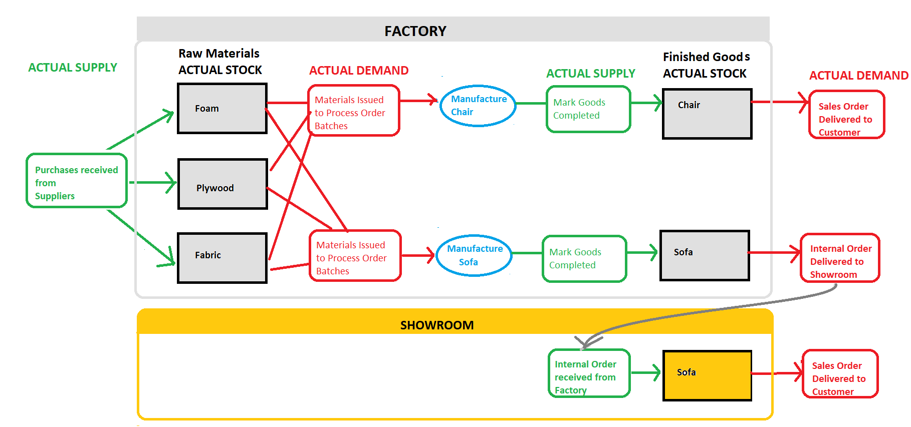
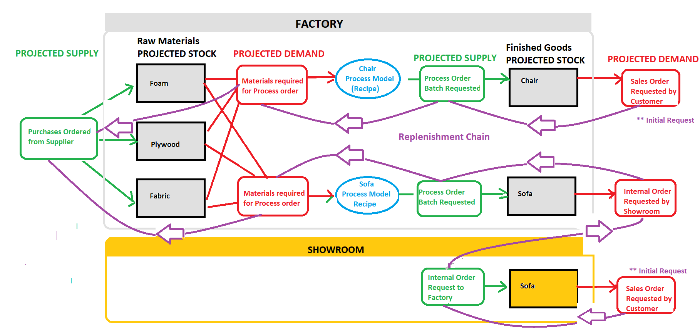
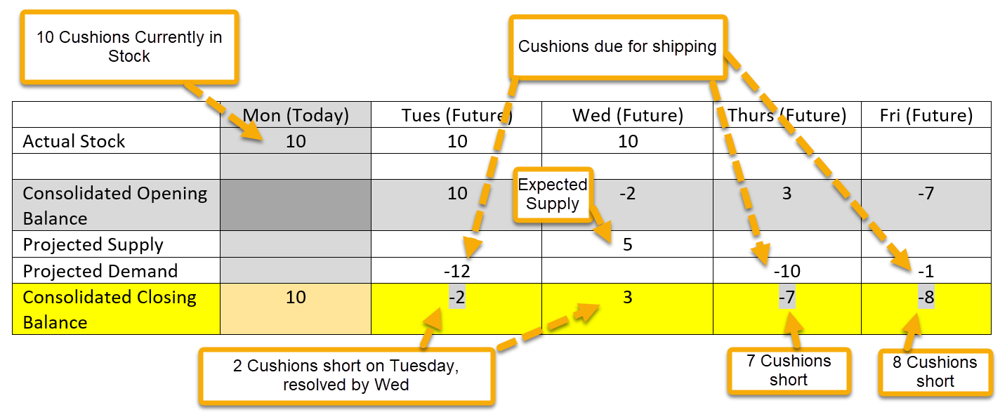
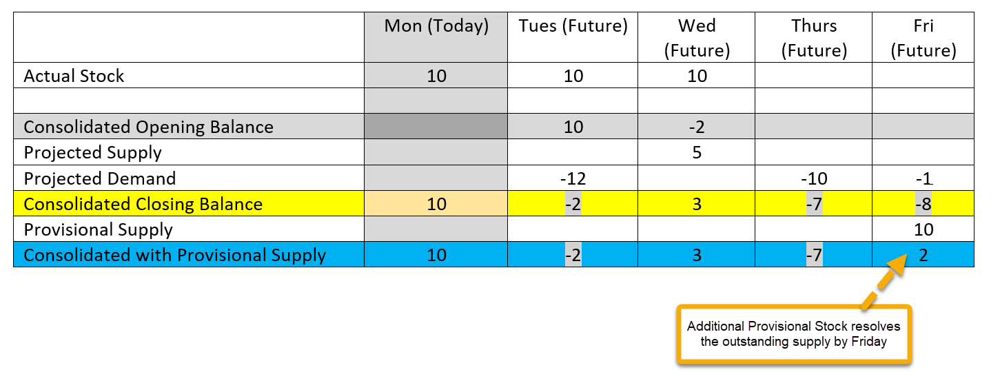
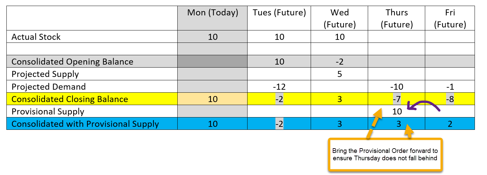

export const Highlight = ({children, color}) => (
  
    {children}
  
);

Stock-on-hand is the amount of stock available.

**Supply** increases stock and **Demand** depletes it. Stock can also be manually **adjusted**.

> **Stock** = <Highlight color="#25c2a0">∑Supply</Highlight> - <Highlight color="#F98192">∑Demand</Highlight> (+ <Highlight color="#81c2f9">Adjustments</Highlight>)

## Actual Stock.

Actual <Highlight color="#25c2a0">Supply</Highlight> refers to the acquisition of physical Stock.

- Purchase Orders received from Suppliers
- Internal Orders received from another Department
- Completion of manufactured/finished goods.

Actual <Highlight color="#F98192">Demand</Highlight> refers to the depletion of Physical Stock.

- Sales Orders Delivered
- Internal Orders Delivered
- Materials Issued to a job (process order) for manufacturing.

Stock Take allows one to <Highlight color="#81c2f9">Adjust</Highlight> the Stock Quantity in the system to reflect the quantity in the store.

- Stock Adjustment.

**Typical movement of Actual Stock in a manufacturing company.**

- Purchase order received <Highlight color="#25c2a0">supply</Highlight> the raw materials.
- The raw materials are issued to the process order jobs (Actual <Highlight color="#F98192">demand</Highlight>)
- The raw materials are used to manufacture the finished goods which on completion increases the Actual <Highlight color="#25c2a0">supply</Highlight> of the finished goods.
- The Finished goods are then Shipped/delivered (Actual <Highlight color="#F98192">demand</Highlight>) to the customer

 

## Projected Stock and the Replenishment Chain

Prior to **Actual Stock** changing hands we have the **Request for Stock** and the chain of replenishment requests that consequently follow.

**Typical ordering chain**

- A <Highlight color="#F98192">Sales order</Highlight> is requested for finished goods. This is Projected <Highlight color="#F98192">Demand</Highlight>.

In order to satisfy this demand we replenish/ create Projected <Highlight color="#25c2a0">Supply</Highlight>.
 Either

- <Highlight color="#25c2a0">Internal Order to a supplying department</Highlight> to provide/manufacture the finished goods.
- <Highlight color="#25c2a0">Process Order</Highlight> (if this department is a factory, for items we make) or
- <Highlight color="#25c2a0">Purchase Order</Highlight> to a supplier for an item that is pure "buy-out" (something not made, just bought and sold)

- An <Highlight color="#F98192">Internal order from the requesting department</Highlight> will, in turn, require a <Highlight color="#25c2a0">Process order</Highlight> to satisfy it.
- A Process order requires materials.
 The <Highlight color="#F98192">Process Order Batch Input Requirement</Highlight> are the Projected Demand for the raw materials.
- A <Highlight color="#25c2a0">Purchase Order</Highlight> is placed in order to fulfil/supply the demand for the raw materials.

 

Projected Demand represents the request for Stock

- Sales Order from Customer
- Internal Order from Customer/Requesting Department
- Materials requirement for a Process Order

Projected Supply represents the anticipated arrival of ordered Stock

- Purchase Order to Supplier
- Internal Order to Supplying Department
- Process Order planned to manufacture stock

## Consolidated Stock

Consolidated stock looks at the **cumulative** values of both the Actual and the Projected Stock. This, in essence, lets us see what we expect to have in stock at a given time.

>__Example.__
>
>>10 cushions in stock today (Monday).   
>>12 are due to be shipped on Tuesday.   
>>5 are expected to be supplied on Wednesday.   
>>A further 10 to be shipped on Thursday and another 1 on Friday
>
>The consolidated stock view alerts us to the fact that we will be 2 cushions short on Tuesday. They can be shipped on Wednesday when the extra supply arrives.
>
>By Thursday we will be 7 short, and 8 short by Friday.

 

Consolidated Stock allows us to view future stock needs and be **timeously alerted to future stock shortages**. It does, however, rely on the fact that your data is being kept up-to-date.

## Consolidated Stock with Provisional Supply.

This view **includes the Provisional Supply** with the Consolidated Balance and is especially useful for Replenishment.

The Actual, Projected and Consolidated data rely on transactions/records which are **Active**. 
For Replenishment, (particularly material replenishment and items with the replenishment policy of STOCK), 
we may prefer to keep adding to a potential order (eg. A Purchase Order) 
for a couple of days BEFORE we activate and send it to the supplier. 
This means we can send fewer purchase orders for larger quantities as opposed to more piecemeal orders.

The Transactions which are included in the Provisional Supply refer to 
**Provisional Projected Supply**. These are:

- Purchase Orders
- Internal orders from Supplying Department
- Process Orders

Using the same example shown above, we now also include the Provisional Supply. 

>We have a provisional Purchase order ear-marked for Friday with an Additional 10 items

 

Looking at this view we see that Friday will not be a problem and **if we bring the due date
of the provisional order forward** to Thursday (bearing in mind the Supplier's Lead days) we 
will ensure that Thursday's orders are not late. This the beauty of the provisional state of 
the order we can **change the Due Date** before sending to a supplier.

 

> Having now moved the order to earlier, we can see that the resulting stock 
will be sufficient on Thursday.

