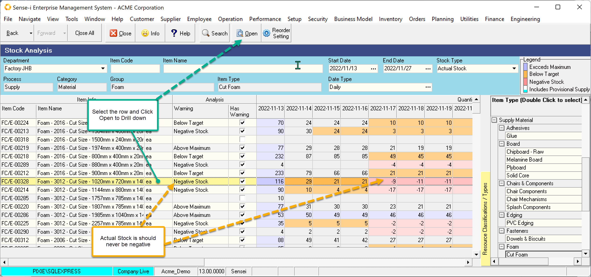
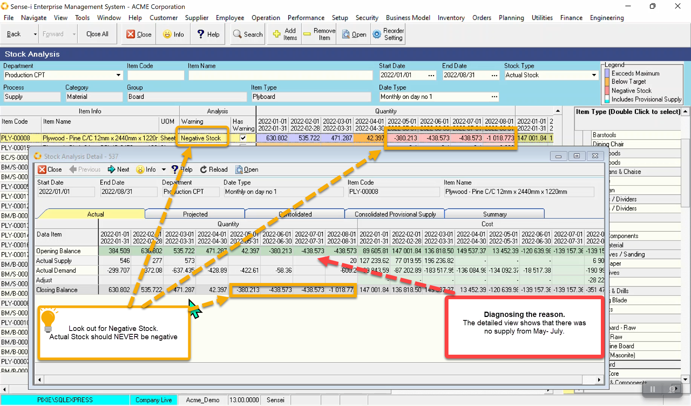
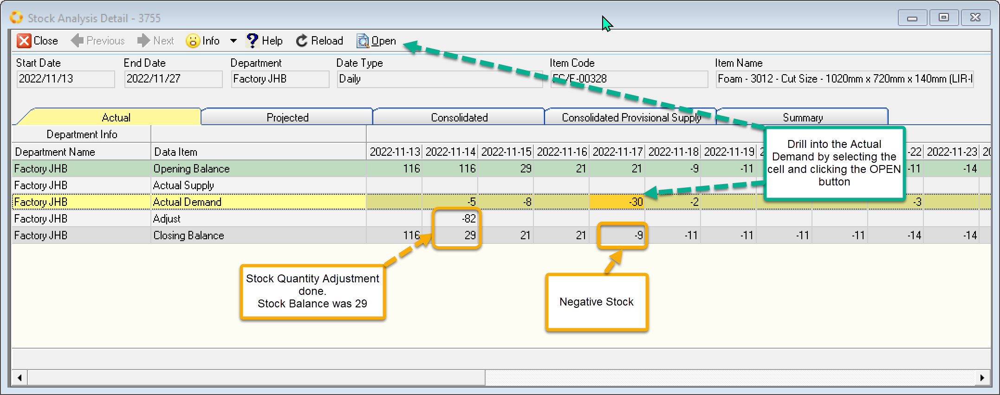
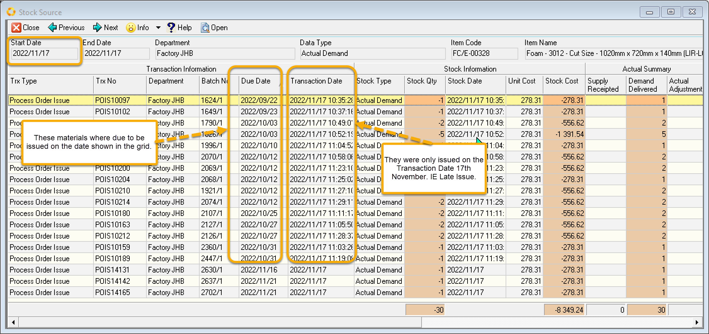
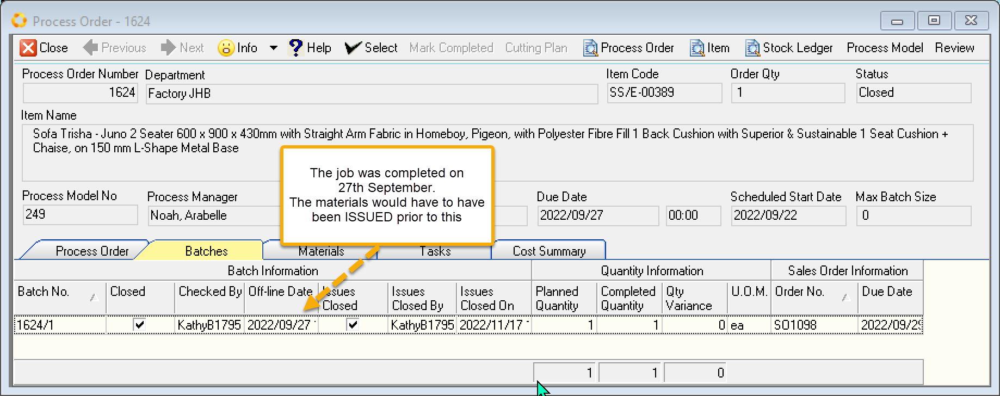
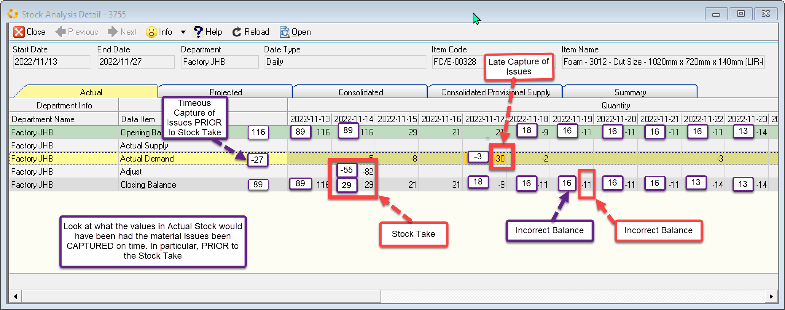

export const HighlightYellow = ({children}) => (
   
    {children}
   
);

Actual stock shows the <HighlightYellow>running stock balance</HighlightYellow> 
over time. Actual stock can never change for a future date. When viewing actual stock <HighlightYellow>look at date ranges in the past</HighlightYellow>.

:::tip
Use this view to identity missing supply and potentially faulty stock values. 
:::

Actual Stock can <HighlightYellow>NEVER be negative</HighlightYellow>. 
However, if your stock is _showing_ negative, you need to identify the reason and correct it.

 

Negative stock is generally caused by

- Failure to Capture/Activate Actual Supply Transaction (Purchase order Receipt, Internal order Receipt, Process Order Mark Complete)
- Late Capture of Actual Demand Transaction AFTER A STOCK TAKE.

## Reason for Negative Stock

Actual Stock should never be negative. Negative stock can occur if
- Actual Supply is NOT captured.
- Actual Demand is captured late after a stock take has adjusted the stock.

### Failure to capture Actual Supply

The example below shows a suspicious gap in the monthly supply.

 

### Late capture of Actual Demand.

Another record shows negative stock. Notice the adjustment made by a Stock Take on 14th November.

The Actual Demand on the 17th pushes the stock into Negative value.

 

Drill through to the detail of this record by selecting the cell and clicking Open. (Or double-clicking the cell)

The details are shown below.

 

The materials were due much earlier than they were actually issued. So, were the materials <HighlightYellow>ISSUED</HighlightYellow> late OR were the issues <HighlightYellow>CAPTURED</HighlightYellow> late?

To determine why the issue date is late, we look at when the finished product was completed.

Taking the first record we see the Process Order number is 1624.

Main Menu \> Operation \> Process Order.

Search for Process Order 1624

 

As Process Order 1624 was completed on 27th September, it follows that the materials were ISSUED BEFORE 
the job completed. We can thus conclude that the Issues were CAPTURED late.

**Late Capture of issues results in**
- incorrect dates for the issue transactions in the G/L. 

**In addition, the <HighlightYellow>Stock-Take PRIOR to the LATE capture</HighlightYellow> of these 
issues results in** 
- incorrect Stock Balance, propagated forward.
- incorrect stock adjustment and the corresponding entry in the G/L.

Sample data below shows the problems associated with late capture **AFTER a stock take**. 
>
>- Opening Balance on 14th November was 116
>- Stock Take on 14th November counted 29 items. (This means that the stock was adjusted by -82 and logged in G/L.)
>- Materials Qty issued on 17th November was 30. (Logged in G/L as 30)
>- Stock Closing Balance on 17th September was -9. This incorrect Balance is propagated forward.

 

The values displayed in purple show us what would have happened had the issued been captured **PRIOR to stock take**.
>
>- Material Issues for September would have had an additional 2. (And added correctly to the G/L for Sept)
>- Material Issues for October would have had an additional 25. (And added correctly to the G/L for Oct)
>- Opening Balance on 14th November would have been 89.
>- Stock Take on 14th November WOULD STILL HAVE counted 29 items, BUT this would have caused an adjustment of only -55. (-55 in G/L)
>- Materials Issued for 17th November would be 3 and shown as such in the G/L
>- Stock Closing Balance 17th September would be 18 and THIS CORRECT Balance propagated forward.

