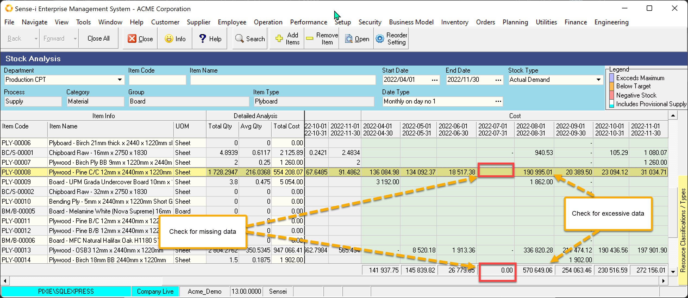
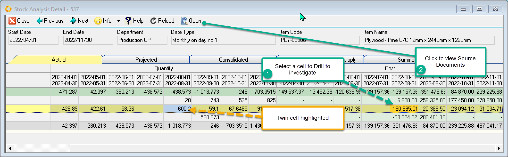
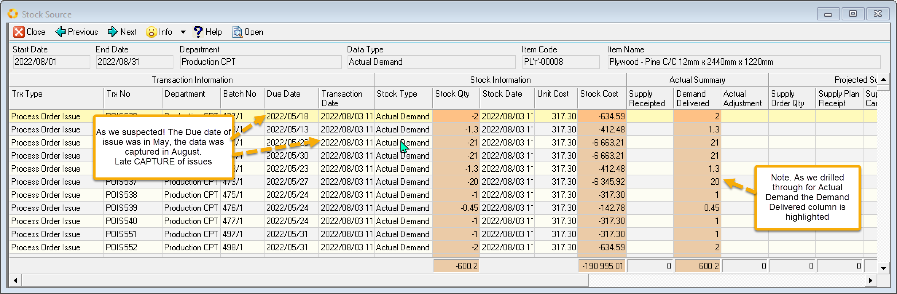

export const HighlightYellow = ({children}) => (
   
    {children}
   
);

Actual Demand shows the <HighlightYellow>Specific Actual Demand for given date periods</HighlightYellow>. 
IE Unlike the Actual Stock view this is **not a running Balance**. As Actual transactions CANNOT occur in the future, choose dates in the past to view data.

:::tip
Use this view to identity your late capture of demand which will affect your 
general ledger and potential corrupt your stock value.   

See **[Late Capture of Actual Demand](./STC-ACT#late-capture-of-actual-demand)**
:::

 

Actual Demand of commonly used materials should show a consistent pattern over time. If the total columns or specific cells show as significantly low OR high values, chances are we have late CAPTURE of demand.

We look at the excessive data following the low or missing data.

- Select the record/row and Click Open to drill through to the detail screen which is shown below.

 

We further drill down to get to the list of source transactions.

1. Select the excess column cell
2. Click Open to drill through to the source documents.

The Source transactions are listed.

Here we see that these materials were due to be issued in May. They were eventually CAPTURED in August.

 

:::note
Even if one is **capturing issues late**, one could choose to **back date** the issues to their correct issue date. 
(As long as the accounting period has not closed for this historical back date and these 
incorrect issues have not yet been extracted into the General Ledger).

This would result in the correct stock.
:::

