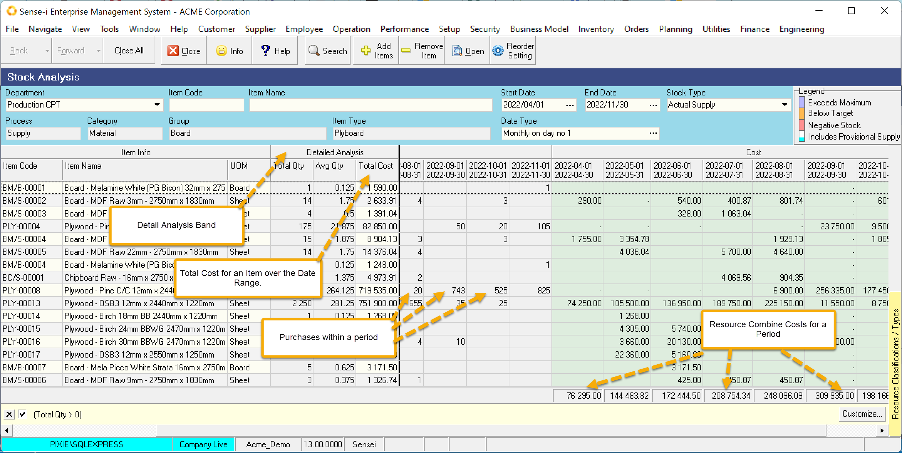
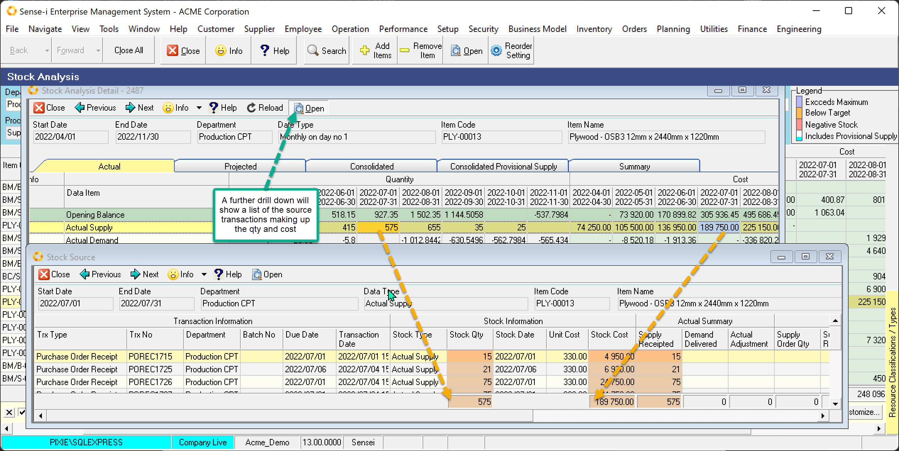
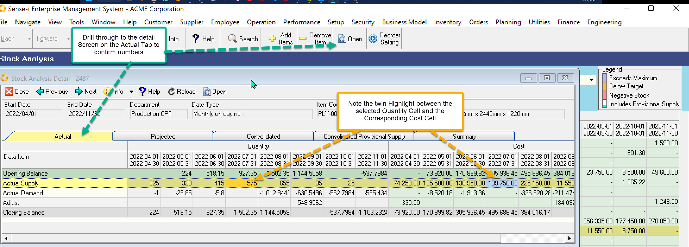

export const HighlightYellow = ({children}) => (
   
    {children}
   
);

Actual Supply view shows the <HighlightYellow>specific supply for given date periods</HighlightYellow>. 
IE Unlike the Actual Stock View this is **not a running Balance**. Actual transactions CANNOT occur in the future, choose dates in the past to view data.

:::tip
Use this view to
- identify your most costly materials and resources over time.
- identify the actual supply frequency, quantity and cost value.
:::

 

The Analysis Band Show the Total Quantity, Average Quantity and Total Cost over the given date range.

You could sort by the Total Cost to find your most expensive materials.

Also use the totals shown at the bottom of the Cost Band to see your costs per period.

- To validate the values in the grid, select a row and Click the Open Button.
- The detailed screen will be displayed. Make sure you are looking at the Actual Stock Tab/Page.

 

The Detailed Grid shows the same data within the context of the Actual Stock view. Select a cell by clicking on it. You will see the corresponding quantity or cost column will be highlighted.

To further validate these numbers, drill down to a list of the originating Source Transactions.

- Click on a cell to select and Click the Open Button

 

These transactions should total to the selected detailed cell value. In addition, the selected cell determines which source columns are highlighted.

