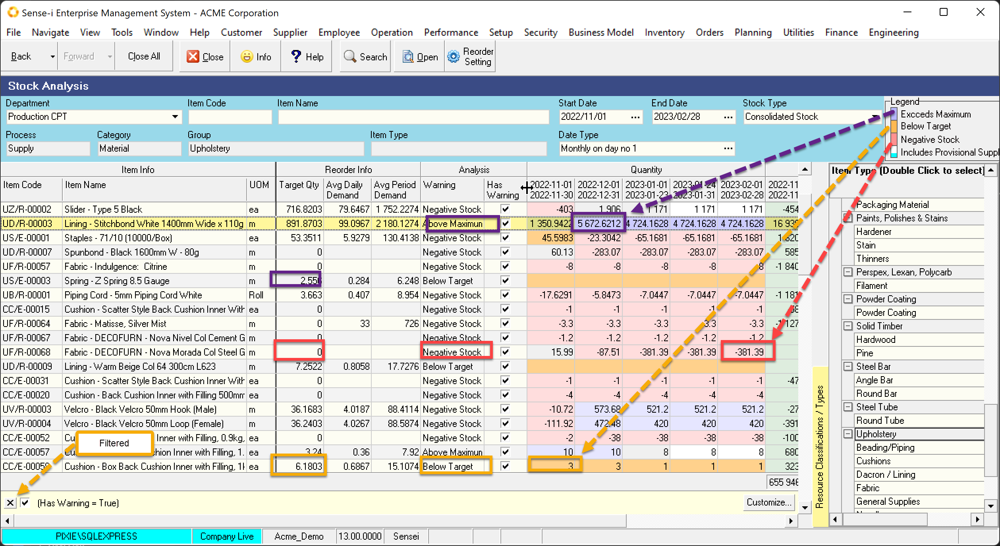
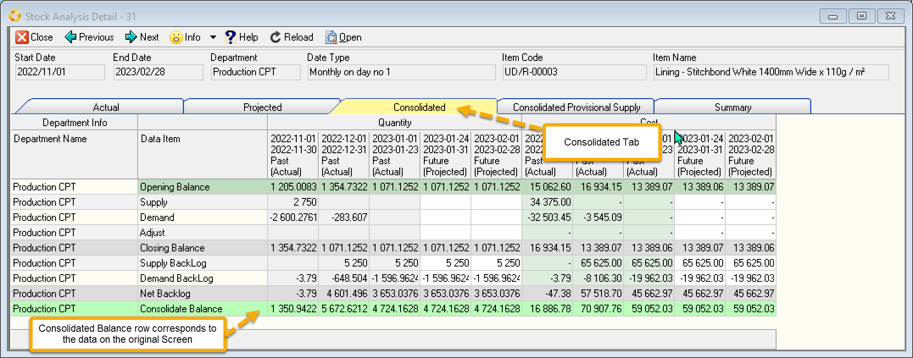

:::tip
The Consolidated Stock View for _future dates_ gives **timeous warnings before the stock runs out** allowing one to proactively order (replenish). Viewed both in the past and future it **alerts us to over-supply** which can affect the cash flow in the business.
:::

 

To detect problems with your stock you could limit the data by filtering to return only records with warnings.

The colour coding gives a visual picture of records with warnings. Three warnings are possible. As a record can conceivable have all 3 states over the full range of dates, the warnings are displayed in the order or urgency shown below.

- Negative Stock (Red)
- Below Target   (Orange)
- Above Maximum  (Purple)

**Negative Stock** is detected if the stock quantity drops below zero. Both **Below Target** and **Above Maximum** states require a **[Stock Target](../docs/STC-TAR.md)** to have been set.

Drill through to the **Detail View** and choose the **Consolidated** Page/Tab to see the breakdown of the data.

 

