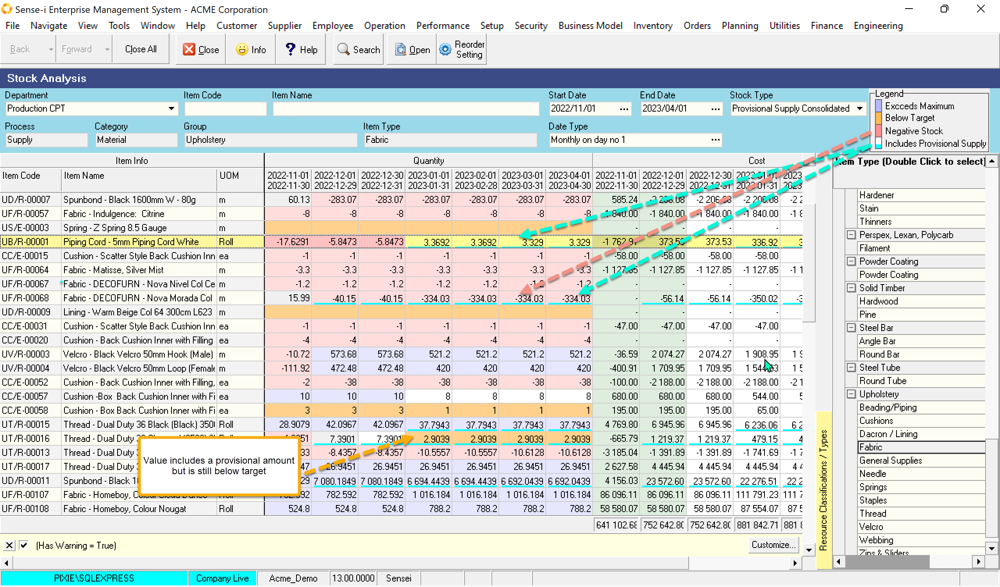
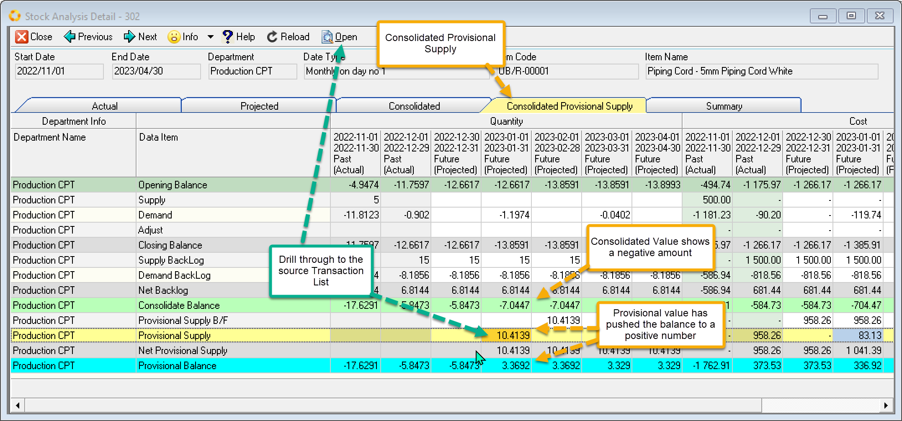
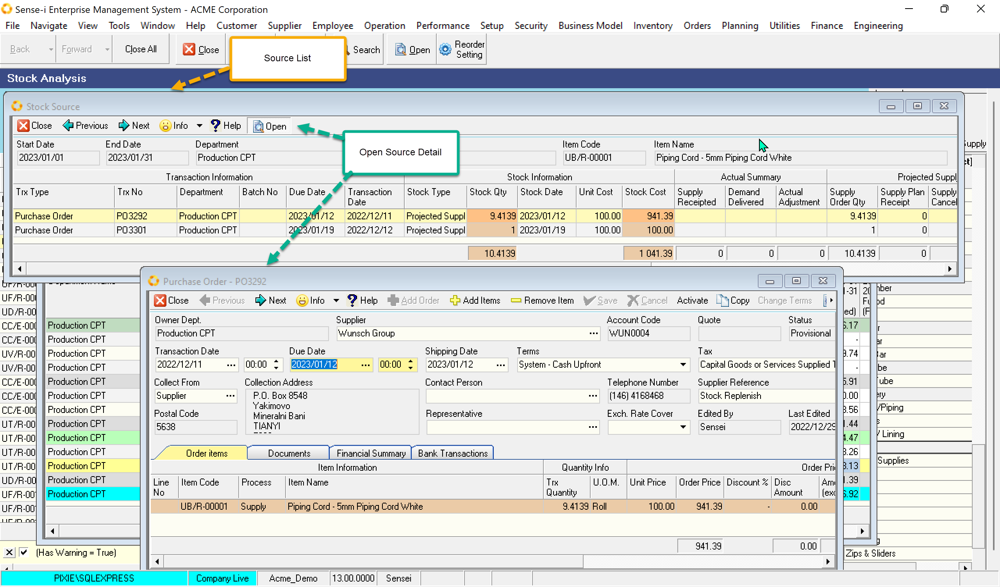

This is arguably the most powerful view of the Stock Analysis. Using the consolidated Stock to proactively order stock we need to be aware of provisional supplies in the pipeline. IE A Purchase order may be being prepared. This view is geared especially for replenishing by stock. It is advantageous to keep a record in the provisional state allowing us to up the order Quantity and gather other items into the order preventing small and piecemeal orders.

The three original colour coding and warnings from the consolidated balance still apply. In this view the value in the grid will be underlined in bright blue if it includes provisional data.

Drill through to the Detail and select the corresponding Page. **Consolidated Provisional Supply**

Select a cell in the _Provisional Supply_ row and the Click Open button to drill to the Source List. From this screen you can further drill through to the actual order. 

Once the order is open you could alter the Due Date, change the quantity or activate the order.

