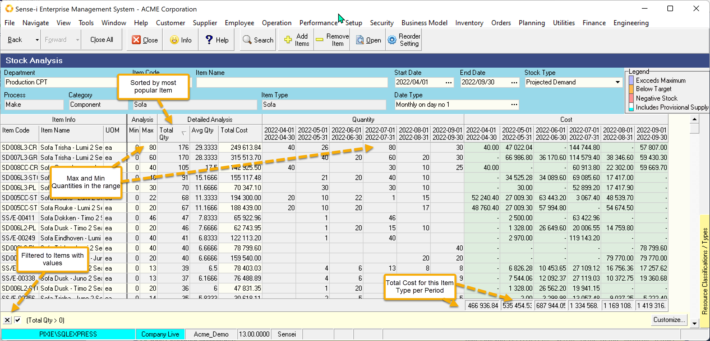

:::tip
Use the Projected Demand over time to: 
- Identify which items (finished goods and raw materials) 
are **most frequently used**.
- See the **cost of these items and the monthly trends**.
- See the **average quantity** over a range of periods.
:::

 

From the Analysis and Detailed Analysis Bands we can see the minimum, 
maximum, average and total Quantities, and the Total Cost across the full range.

The screen above is showing finished goods (sofas) but applies also to raw materials. 
The demand for raw materials can assist with future cash flow planning.

This view is used for [Setting the Average Daily demand](./STC-SAV).
