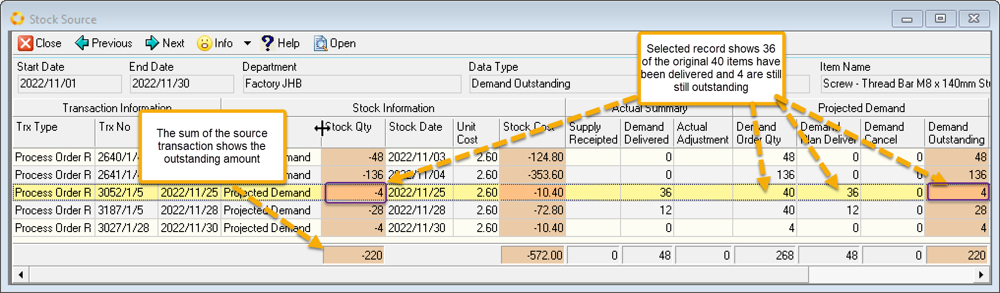
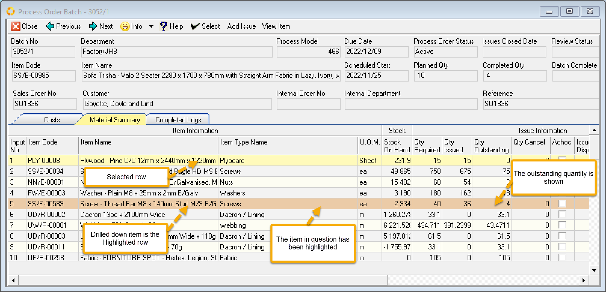

:::tip
Use this view to hone in on **late issues and/or late capture of issue**. Internal orders and 
sales **orders not yet delivered** but due for delivery.
:::

 

There are many ways to filter the grid. Screen above shows we have have a filter to show only records with a warning.

Selecting a record and clicking open will drill through to the Detailed screen.

Selecting a cell and drilling down further to the Source List reveals the screen below which is displaying the data for November.

 

The Stock Quantity sums to the outstanding demand. We further drill down to the Transaction by selecting a row and Clicking Open.

 

:::note
When the transaction screen opens the item you have drilled down to will be highlighted in orange.
This is different from the current/selected row in the grid which is shown in pale yellow.
::: 

