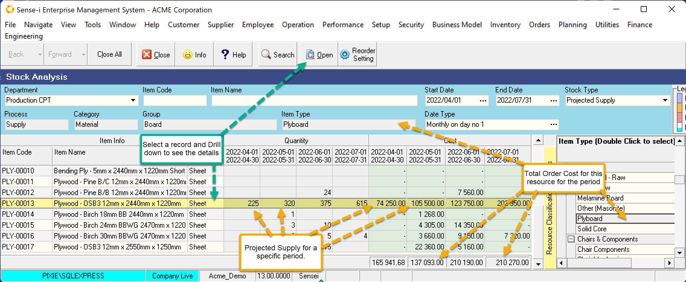
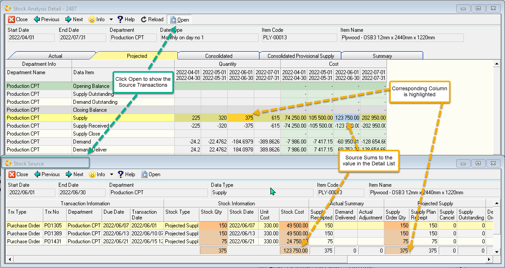

export const HighlightYellow = ({children}) => (
   
    {children}
   
);

Projected Supply shows you the sum of <HighlightYellow>specific supply</HighlightYellow> for a given period.

:::note
This is NOT a running balance.    
It shows the quantities and costs for any projected supply orders (regardless of whether they are still outstanding).
:::

 

Drill down to the details screen by selecting a row and clicking Open.

Looking at the **Projected Tab** we see the data corresponds to the _Supply_ row. 
In addition, the detail screen shows the values which offset this supply, namely supply received and supply closed.

 

:::note
A selected cell highlights in orange. The corresponding cost cell is highlighted in blue. 
:::

Selecting a cell and drilling down further will open a screen showing a list of the source transactions. 
The quantities and costs on the source screen will sum up to the selected cell in the detail screen.