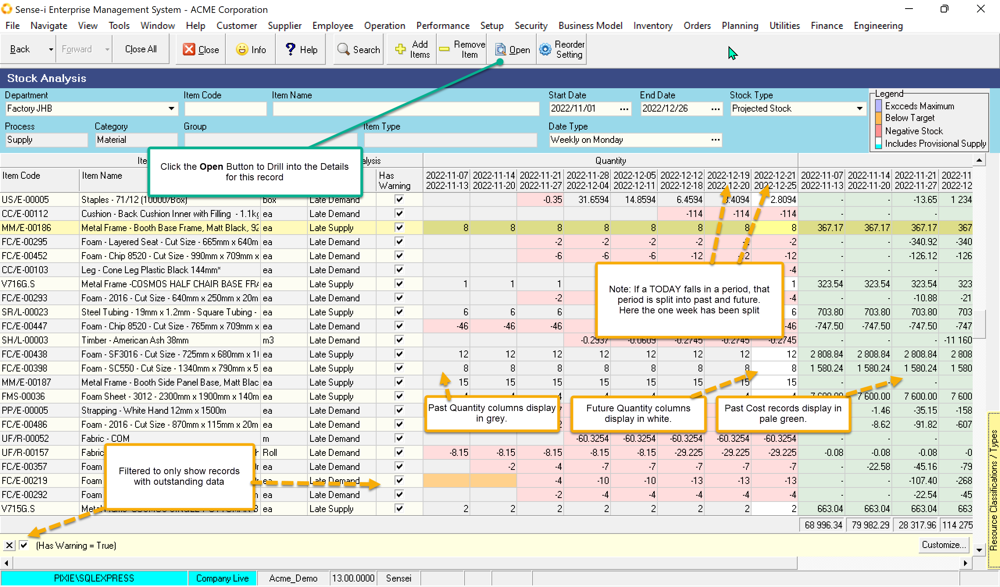
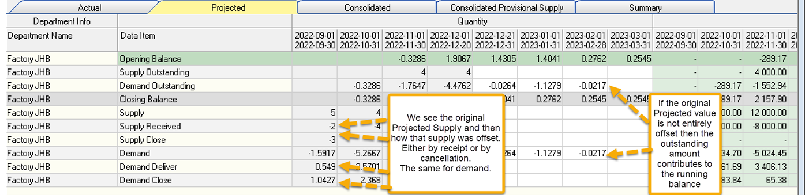

export const HighlightYellow = ({children}) => (
   
    {children}
   
);

Projected Stock displays the <HighlightYellow>running balance for Projected Transactions</HighlightYellow>.

Projected transactions convert to Actual transactions when the order is delivered, fulfilled or cancelled.
For this reason, the further back in time we look, the more likely we are to have NO data. 
Historical projected values (past dates) show **Late Projected Stock**. 
Future projected values show **Expected Stock**.

In the screen below we filter the grid to show only those records with warnings. 
Warnings indicate outstanding supply and demand.

 

:::note

The standard (non-alert) colour of the Period columns.

- Grey - shows past Quantity values.
- Green - shows past Cost values.
- White - indicates future Quantity and Cost periods
:::

Drill through to the details by selecting a row and clicking the open button. 
Select the **Projected Tab** to see not only the breakdown of the 
outstanding closing balance, but the breakdown of the projected supply and demand.

Original supply is offset by Receipt and/or Cancellation. Any remaining value is the outstanding supply.

Original demand is offset by Delivery and/or Cancellation. Any remaining value is the outstanding demand.

The combined outstanding values of demand and supply gives us the projected outstanding balance. As this 
this a running balance, this is carried forward to the next period.

 

