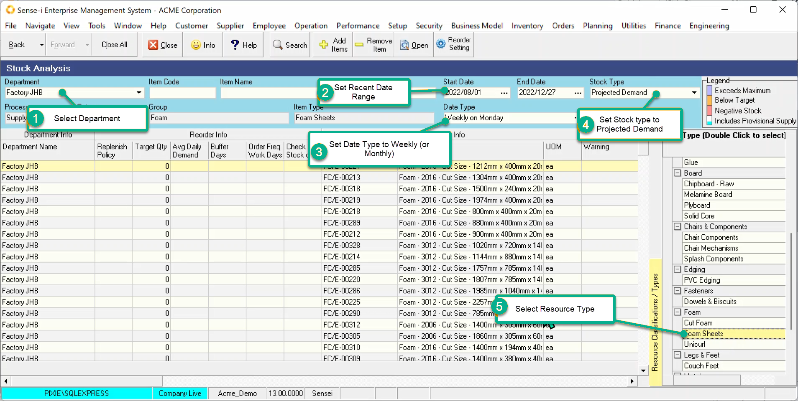
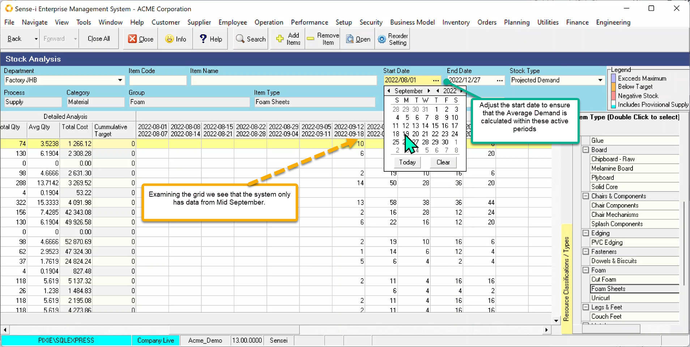
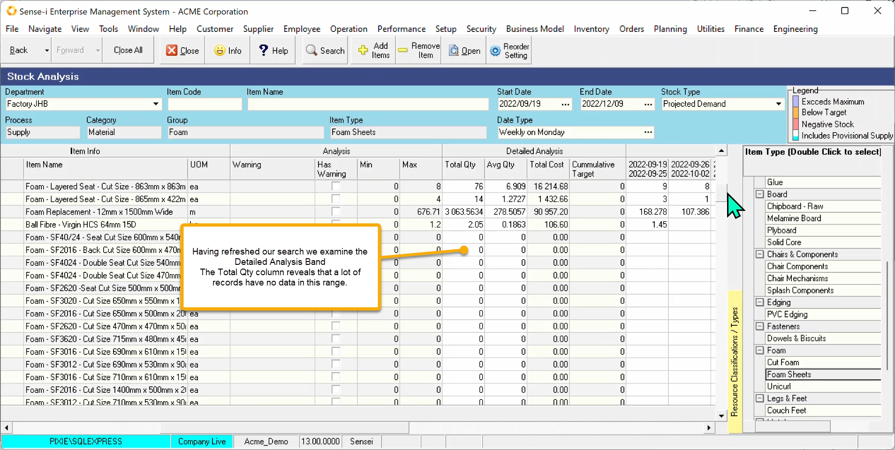
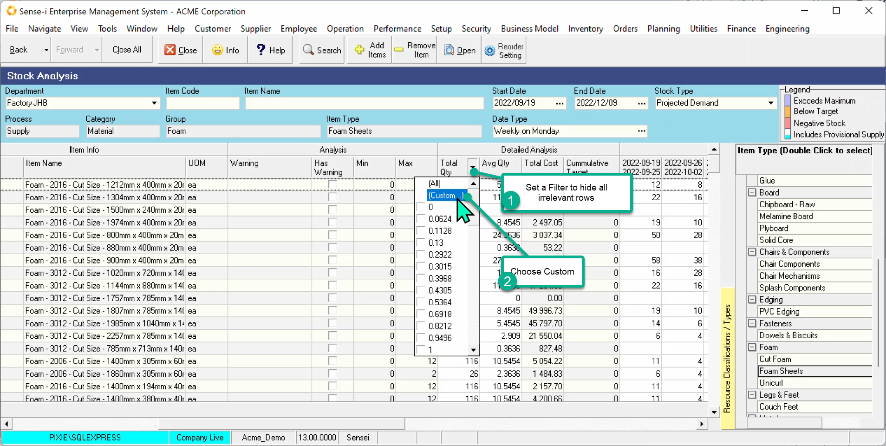
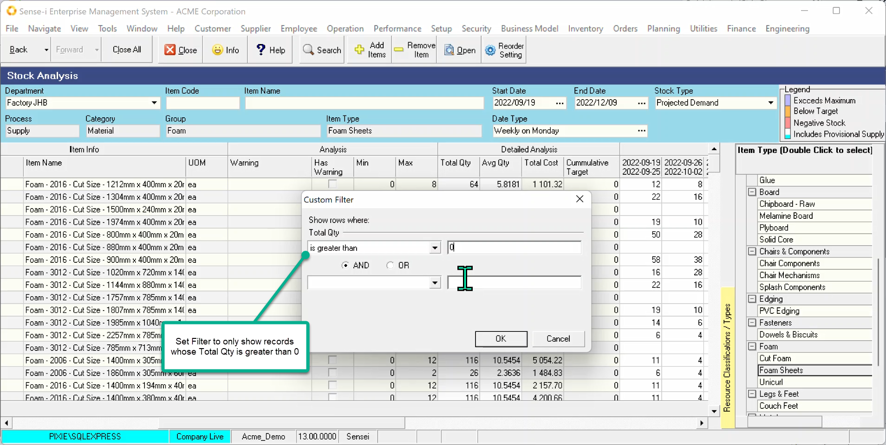
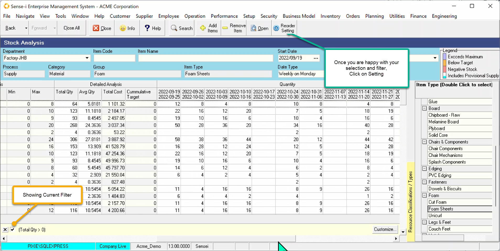
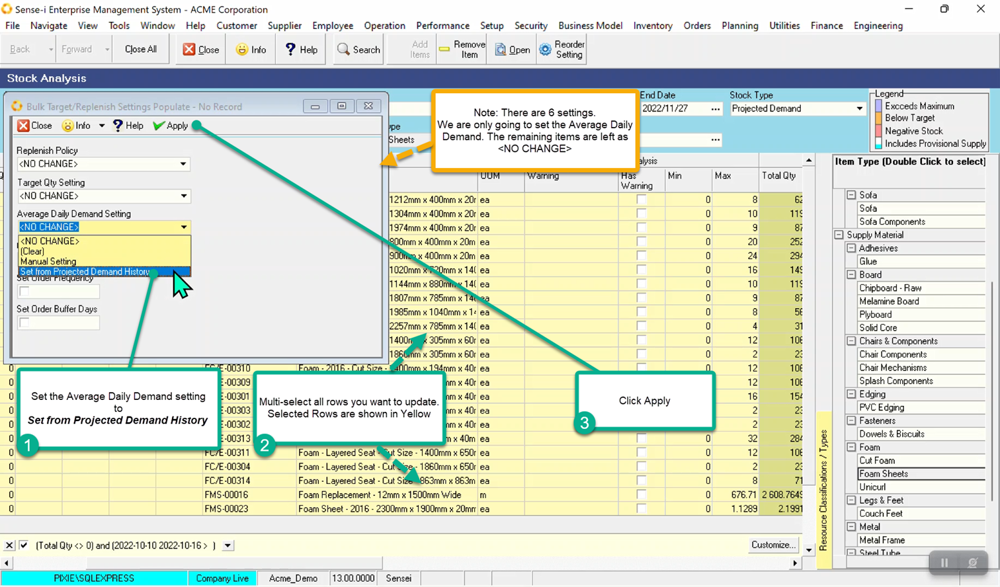
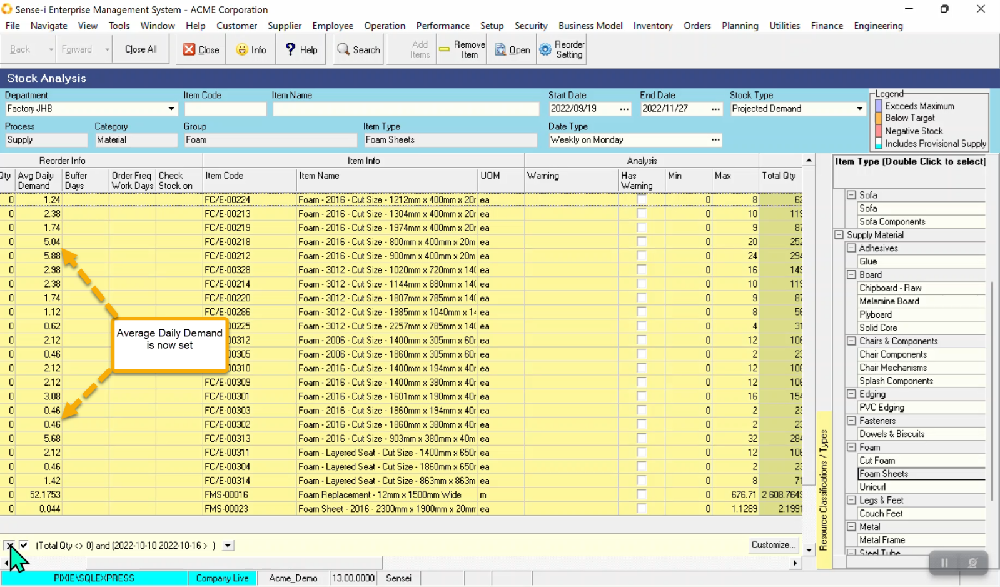

From the main menu, navigate to Inventory / Stock Analysis.

1. Select the Department

2. Set Recent Date Range.   
In order to set average daily demand we should take the projected demand data from a recent period which we know has reliable up-to-date data.

3. Set the Date Type.   
In order to span a couple of weeks or months change the date type to increase the span.

4. Set the Stock Type to **Projected Demand**.

5. Select the Resource type of interest.

Finally Press the Search button to return the data.

## Refine date range.

Examine the data and adjust the date range accordingly.

On examining the data, we can see no data for the first couple of weeks. Using this data range will skew the average daily demand results.

No data or low data can occur under the following conditions.

- New department
- New stock item recently added to the catalogue
- Unused / rarely used stock item
- Range includes period during which the department was not active (Festive season)

In the example below we have a department that only came on-line in mid September. We need to adjust the start date to the week on or after data appears.

We see also that the end date has encroached into the break between Christmas and new year.

Having adjusted both the start and end date, refresh the search by clicking on the Search button.

## Exclude unpopulated rows.

Filter the records to exclude unpopulated rows.

Looking at the data in the _Detailed Analysis_ band we can see the _Total Qty_ and the _Average Qty_.

Records with a Total quantity of zero do NOT have any data in this period and so we should exclude these records.

Set the Filter by Clicking the down arrow on the Total Qty Column. Choose Custom

Create a filter to include only records with a total quantity greater than zero. (Or another other filter or criteria that you choose.)

The screenshot below shows the current filter at the bottom left-hand side of the screen. Add any additional filter you wish.

## Set the Daily Demand

Now you are ready to set your average demand.

Note: All other reorder settings could be set at the same time too.

Click on the Reorder Setting button to open the pop-up Bulk Setting screen shown below.

1. Click the dropdown arrow on _Average Daily Demand Settings_ and choose _Set from projected Demand_
2. Multi-select the records in the grid
3. Click Apply.

The Average Daily demand is now set.

