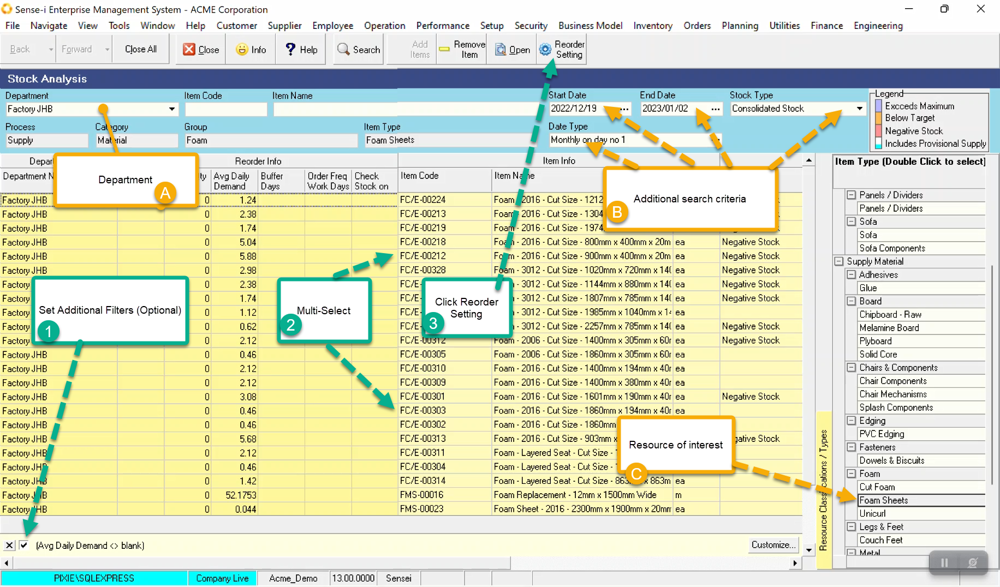
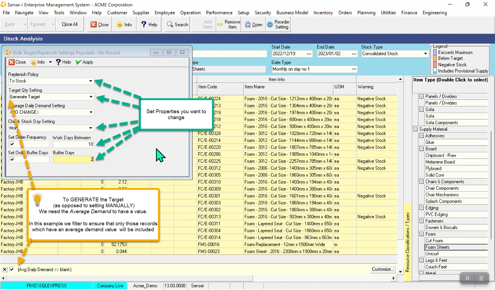

Reorder information is set from the Stock Analysis screen. It is specific to each stock item for each department.

:::note
Reorder information can be **set in bulk**.
:::

Navigate to the Stock analysis screen. Main Menu \> Inventory \> Stock Analysis.

Prepare Search Criteria

- (A) Choose the Department (or all)
- (B) Populate Stock Type, Date Type and Date Range.
- (C) Select the resource you want to view/ change.

Click Search Button to return data.

The existing settings will show in the _Reorder Info_ Band

1. Filter, if needed
2. Multi-select.
3. Click on Reorder Settings to open pop-up Bulk setter.

- Change those settings you wish to. Leaving the others as <NO CHANGE\>
- Click on the Apply Button

:::tip
If you choose to Generate the Target (as opposed to setting it manually)
we need a value for average daily demand.
:::

:::note
Setting the _Average Daily demand by_ _ **Projected demand history** _ requires the projected demand, date range selecting and subsequent filtering be used. The remaining settings are not fed by the underlying values in the grid and can be set at anytime with no regard for stock type or date setting.
:::

