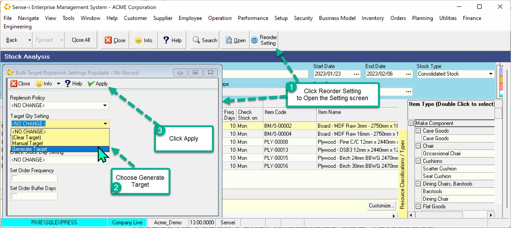
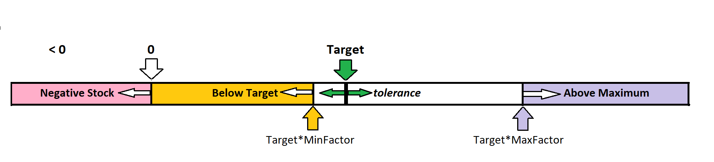
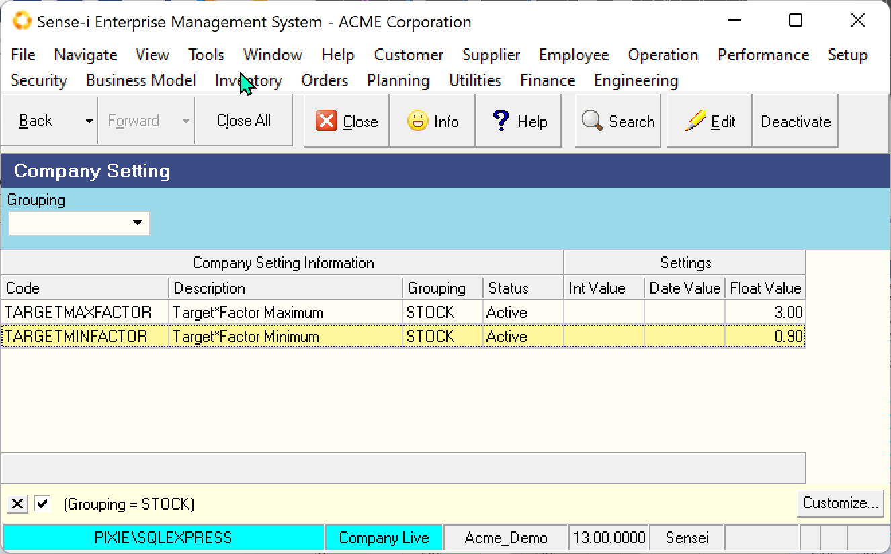

## Generating the Target Quantity

If you choose to generate the Target quantities, it is based on the formula given above.

**Target = (Average Daily Demand) \* (Reorder Frequency days + Buffer days)**

It follows that the values used to determine the Target have been set prior to (or at the same time as) generating the target.

- Average Daily Demand
- Reorder Frequency
- Buffer days

From the stock analysis screen:

1. Click the Reorder Setting Button.   
The Reorder Setting screen is displayed.

2. Select the drop-down on the Target Qty Setting.   
Choose _Generate Target_.

3. Click Apply.

 

## Target vs Stock Level Warnings and Tolerance Factors

If the Stock Level is below zero, we have a Negative Stock Warning.

If the Stock Level is above zero but below target, we have a Below Target Warning.

If Stock level is above Maximum level, we have a Exceeds Maximum Warning.

 

The Target is a specific number but the Below Target and Exceeds Maximum warnings only kick in the tolerance factor is exceeded.

These values are set in the company settings.

 

