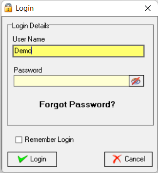
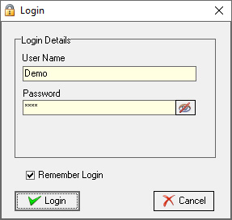
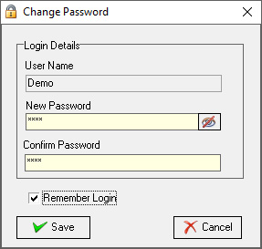
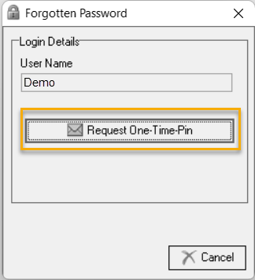
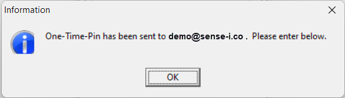
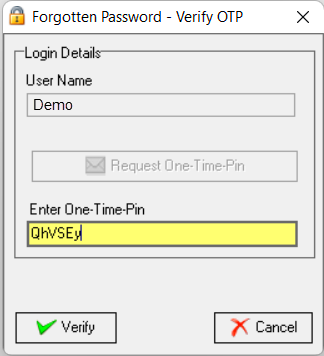
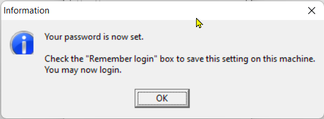

## Procedure Guideline
___  

This procedure describes how to log in to the Sense-i Enterprise Management System and to set your password.

Refer to the **[Install Sense-i Launcher](DOWLOAD)** page for information on downloading and installing the Sense-i Launcher application.

The **Sense-i Launcher** allows you access the **SEMS application** and **connect to the relevant database(s)**.

Refer to the **[Sense-i Launcher](LAUNCH)** page for information on using the Sense-i Launcher application.

1.  Access the **Sense-i Launcher** by clicking on the Sense-i Launcher **desktop shortcut**.

  

The **Sense-i Launcher** application opens.

   

2.  Select the connection to the relevant database from the **drop-down field** under **SEMS Connection**.  

3.  Click the [ Connect ] button.

The **Login** screen is displayed.  

 

4.  Enter your **User Name** and **Password**.  

5.  Click the [ Login ] button.

### First-time Log in

:::note  

When logging in for the first time, your Password will automatically be reset and a new password needs to be registered. 

:::

 

6.  Click the [ Ok ] button.

The **Set Password** screen is displayed.

 
 
7.  Enter and Confirm your new password.

8. Select **[ Save ]**.

 

9.  Click the **[ Ok ]** button on the Information box confirming your password has been set. 

:::tip  

Activate the Remember Login check box (optional).

This option is recommended if you are the only one using a specific computer which only you have access to.
This option automatically saves your User Name and Password allowing you to simply select [ Login ] on subsequent SEMS application access.

:::

10. Click the [ Login ] button.  

	
### Change Password

This section describes how you would change your password.

Log in as per steps 1 - 5 above.

 

1.  Select **Tools** from the main navigation bar.

2.  Select **Change Password** in the drop-down menu.

The **Change Password** screen is displayed.

 
 
3.  Type your new password in the **New Password** field,

4.  Then press the tab key and re-type the new password in the **Confirm Password** field.

5.  Select **[ Save ]**.

:::important  

If you opted not to select the **Remember Login** checkbox, it is essential to memorise your new password.

:::  

### Forgot Password  

These are the steps to follow if you've forgotten your Login Password;

1.  Click on **Forgot Password?"**  
 
  

The **Forgotten Password** dialogue box is displayed.  

  

2.  Click on the [ Request One-Time-Pin ] button.  

  

The SEMS system will send you an email with your OTP.  This to the email address as captured in the SEMS application - in this example **\demo@sense-i.co** as displayed in the information dialogue box.

:::note  
If your User Name has not been linked to an email address in the SEMS application, the system will generate a dialogue box asking you to contact your **SEMS System Administrator**, who will then supply you with a manual **One-Time-Pin** (OTP).  

  

Click the [ OK ] button to close the dialogue box.  
:::

3. Copy and paste the OTP from the email / or type it directly into the **Enter One-Time-Pin** field. 

  

4.  Then select the **[ Verify ]** button option.  

:::important  
The OTP is valid for a certain time only.

If the One-Time-Pin has expired, you would need to request a new OTP.  

  

:::

Once verified, the system will display an Information dialogue box stating that the OTP is accepted.  

  

5.  Click on the **[ OK ]** button.

The **Set Password** screen is displayed.

 
 
6.  Enter and Confirm your new password.

7. Select **[ Save ]**.

 

8.  Click the **[ Ok ]** button on the Information box confirming your password has been set. 

:::tip  

Activate the Remember Login check box (optional).

This option is recommended if you are the only one using a specific computer which only you have access to.
This option automatically saves your User Name and Password allowing you to simply select [ Login ] on subsequent SEMS application access.

:::

9. Click the [ Login ] button.  

### Log out

There are 3 methods to exit and close the SEMS application;

1.  Select **File** from the main navigation bar, and select **Log Out** from the drop-down menu.  
  
 

2.  Select **File** from the main navigation bar, and select **Exit** from the drop-down menu.  
  

  

3.  Select the **Exit** button at the top right corner of the SEMS application screen.  
  

**This is the end of this procedure.**
