## Procedure Guideline
___  

### Introduction to the Sense-i System

#### Using the Screens to **Search** for and **Update** information.

This procedure describes the components and terminology you need to know
to make effective use of all help materials and standard operating
procedures that accompany the Sense-i Enterprise Management System.

#### Introduction 

The SEM System has been developed as a centralised system that enables
employees throughout the company to view up-to-date information. This
is an important point to remember because it helps to understand how
the system works. Unlike a normal, PC-based computer program where the
software and the information are both located on the computer on your
desk, the SEM System is known as a Client-Server system. The computer
program used to enter and view information is based on each user's
Personal Computer, and the software and actual information is stored
on a central computer, known as the Server.  

This means that at any point, there may be several, or indeed tens or
hundreds of users adding and viewing information at the same time that
you are also working on the system.  

This affects the SEM program in two ways, and if you understand these,
then understanding the system becomes that much easier.  

The first effect that a Client-Server system has on the user is that
people may be entering information that you need to use. In order to
prevent users from entering duplicate information, for example two
users each entering the same Customer Information, the system presents
a list of information that already exists in the system, and before
you add new information to the system, you need to review the
information in the List Screen and check to see whether another user
may have already added the information you wish to use.  

The second effect of a Client-Server system is that the system does
not want to cause users to wait un-necessarily for answers to
questions. In order prevent many users from all requesting complete
sets of information, and thereby slowing the system down for all
users, the system has Search Criteria at the top of each list screen
that enable you to reduce the number of records the system will
display in a report. Using the Search Criteria wisely enables you to
narrow the list of information that is presented by the system and
keeps the system working quickly for all the users. The way in which
you interact with the information in the system is through the screens
and the menu items, fields and buttons on each screen. As you begin to
use the system and gain experience, you will notice that the way the
screens work is designed to help you find information easily and keep
the system working quickly for all users. Exactly how the system does
this will become clear as we look at the following screen examples.  

## The Five Main Screen Elements  

There are five key elements or sections to the screens on the system.  
These are...  

1.  The Main Menu;  

2.  The Main Form;  

3.  The Page Bar or Navigation Menu;  

4.  The Form Bar and its buttons;  

5.  The Forward, Backward, Print and Close All button bar.  

The screen image below shows where each of these five sections exist
on the system.  

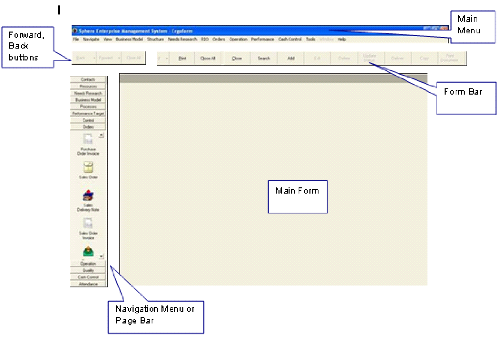   

The **MAIN MENU** is the list of functions that runs horizontally
along the top of the screen.  

The **PAGE BAR** or Quick Navigation Menu runs vertically along the
left of the screen and lists functions used often in the system.  

The **MAIN FORM** is a blank, light grey screen when all forms are
closed. As you click on a button or menu item the system opens the
form associated with the function in the Main Form section of the
screen. All information is entered in Forms and all reports are
presented in the Main Form space.  

The **FORM BAR** is blank when all forms are closed. The system
displays a series of buttons in the Form Bar that are related to the
form that you are using. This makes it easy to use the system because
you only ever have access to features that are relevant to the form
you are using at the time.  

The **Forward, Back, Print and Close All** buttons allow you to move
between open forms.  

## How The Screens Operate 

When you click on a function, either in the Navigation Menu or on the
Main Menu, the system will always first display a **LIST SCREEN**.  

The **LIST SCREEN** shows you what information has already been
captured in the system by yourself and other users. This helps because
it shows people what information is available, and if used correctly,
prevents people from entering the same information more than once.  

The LIST SCREEN lists all the information in the system for the
function you have chosen. So, if you have clicked on the Customer
Profile button, the system will open a FORM called MAINTAIN CUSTOMER
PROFILE and display all Customer records that match the SEARCH
CRITERIA on the form.  

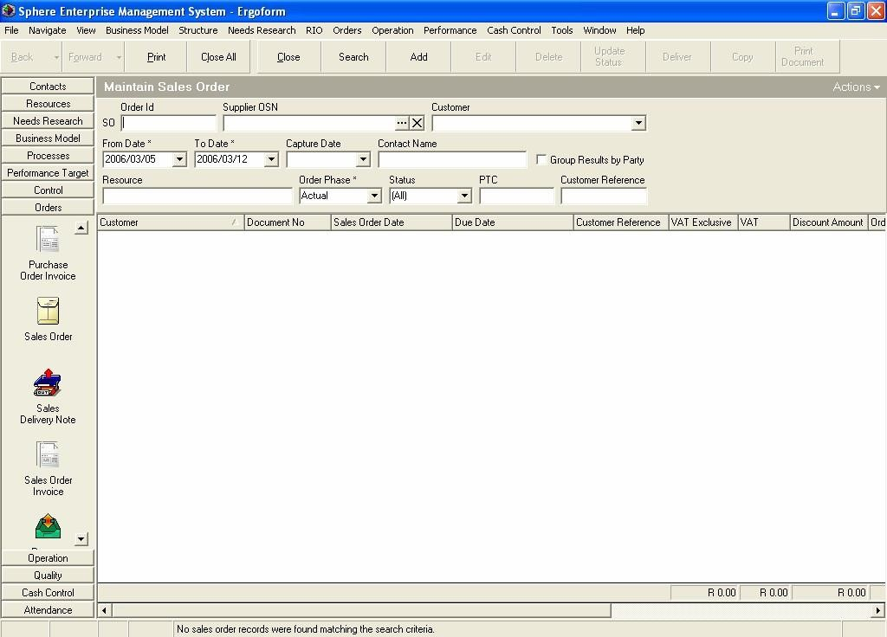   

You will notice that each LIST SCREEN consists of two different
sections. The top section of each LIST SCREEN is called the SEARCH
CRITERIA PANEL.  

This section of the form displays several boxes called **Fields** into
which you can type or choose specific information. (For example a
Customer Name, or a date range from one date to another date.) The
software program uses the words and options you have entered into the
fields on the SEARCH CRITERIA PANEL to find all RECORDS or
TRANSACTIONS that are stored on the server and then display this
information in the GRID on the LIST SCREEN.  

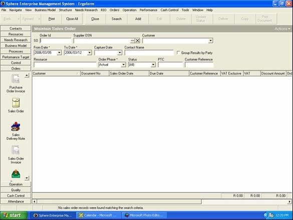   

### THE LIST GRID PANEL.  

On closer examination, you will notice that FIELDS contain information
and options that relate to the specific form or function you are
using.  

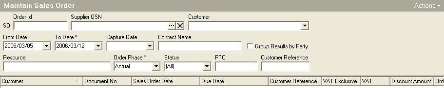   

You will also notice that the system displays a set of buttons
immediately above the grey bar on which the name of the form is
listed. This is called the Form Bar. These are the functions that
relate to the open form.  

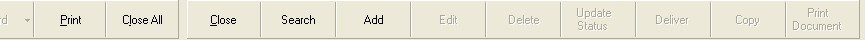   

### Using The System To Find Information 

1.  Click on the Customer Bar in the Page Bar or Navigation Menu.  

2.  Then click on the Customer icon on the Navigation Menu.  

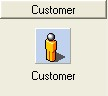   

3.  Notice how the system opens a screen titled Maintain Customer
    Profile. This is the normal LIST SCREEN for viewing and updating
    Customer information in the system.  

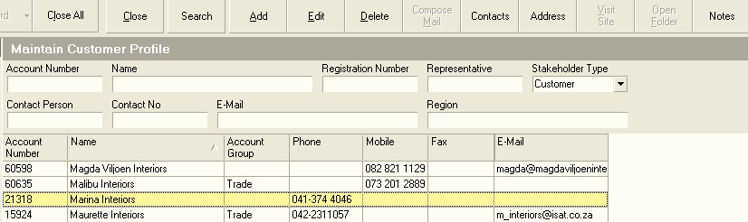   

4.  Enter information in the Search Criteria for the Maintain Customer
Profile screen. For example, enter a Name or a portion of a Name in
the Name field.  

5.  Then click on the Search Button on the Form Bar and then...  

6.  Notice how the system updates the list of Customer Profiles on the
screen to show only those Customers that match the name you have
entered.  

7.  Remove the letters typed into the Customer Name field and type in
the name of either a Suburb, City, Province or Country in the Region
field. Click the Search button again. Notice how the information on
the screen has changed to display only those customer records whose
address details match the Region you entered in the Search panel.  

So, to briefly recap, the when you **click on a function**, the
**system provides a list screen** that displays all the information
already in the system. To prevent displays lists of thousands of
records, the system FILTERS the information to display on RELEVANT
INFORMATION. You **enter SEARCH CRITERIA** on a LIST SCREEN to select
what information you consider to be relevant. The shorter lists make
it easier for you to find the exact information you need and also,
keeps the server working faster for all of the other users on the
system.  

### Using The System To Update Information 

1.  There are only three things that you can do on any computer system.  

You can ADD new information.  

You can change or EDIT existing information.  

And you can DELETE existing information.  

2.  Click on the ADD Button on the Maintain Customer Profile Form Bar.  

3.  When you click on the ADD or EDIT Buttons on the form bar you will
notice that the computer system opens a new screen.  

If you clicked on the ADD Button, the system opens a BLANK FORM into
which you can enter new information.  

If you chose the EDIT Button, the system opens the same form but with
the information of the existing record that you chose to EDIT.  

If you chose the DELETE Button, the system will ask you if you are
sure if you wish to delete an existing records from the database.  

When adding information you will notice that each form that you open
contains specific information that must be completed. These are called
Fields.  

Completing any of these forms is straight forward. There are only two
ways you can enter information.

The first is that **you can type information into a field** that
allows this. For example, the Name field or the Phone Number field on
the Add Customer Profile Form.  

The second way to enter information into a Form is to **choose
information from a list of information already in the system.** When
you do this, the system displays the LIST SCREEN from which you then
select the information you wish to use. For example, on the Customer
Profile Form you need to SELECT Terms that apply to the Customer's
Account.  

Completing a form is simply a matter of working through each field on
the form step-bystep and entering information using these Entry
Methods.

### Completing a Form 

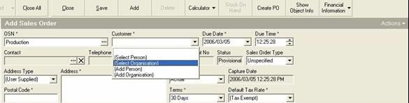   

Whenever you click on a field that requires you to choose or SELECT
information that already exists in the system, the system will display
LIST SCREEN, as described earlier.  

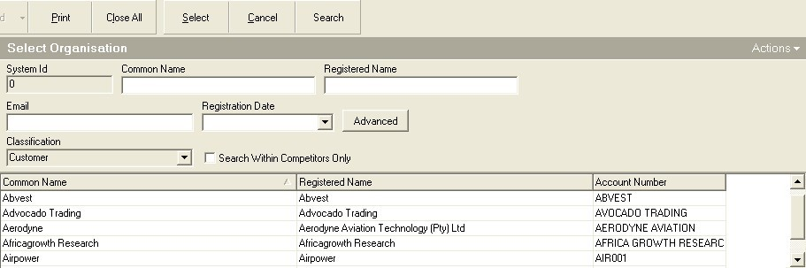   

When you need to select information the
system displays the available information is a LIST GRID.  

And you will remember that each LIST SCREEN consists of a SEARCH
CRITERIA PANEL and the LIST GRID.  

So you can search for specific information in the system in exactly
the same way that you did in the first example of the LIST SCREEN we
described above.  

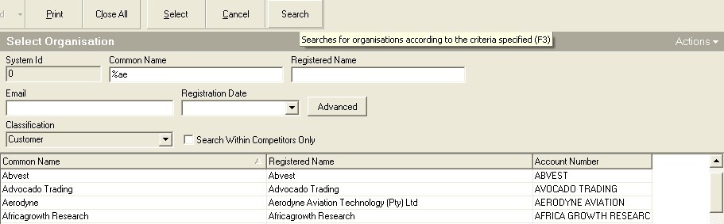   

You can search for information without being exact about what records
or transactions you want the program to find. To do this type the %
sign before you type a partial or complete word. So to find all
customers that have the letters AE next to each other, type the symbol
% and the AE. For this example, type %AE in the Common Name field on
the SEARCH CRITERIA PANEL.  

Then click the SEARCH Button on the Form Bar.  

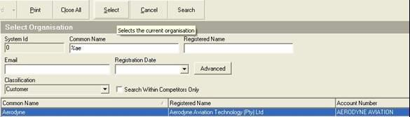   

To select information, you will need to click on the record in the
LIST GRID that you want to use and then...  

Click the SELECT Button on the Form Bar.  

The system will return you to the ADD FORM, in this case the Add Sales
Order form, and will display the information you have SELECTED in the
relevant field.  

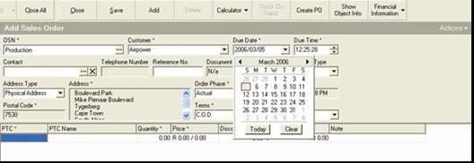   

## Recap 

The system is that simple to use. You simply complete the blank form
you have chosen by clicking on a field. The system will then open a
LIST SCREEN and you SELECT the information you need from this screen,
CLICK the SELECT Button on the FORM Bar, and the system will return
you to the form you are completing and display the SELECTED
INFORMATION in the Form. Where you need to type information is a
specific field, you simply use the keyboard to enter the appropriate
information on the required space on the form. It is that easy.  

1.  CHOOSE A FUNCTION. For example, Sales Orders.  

2.  CLICK ON THE FUNCTION IN THE MENU OR NAVIGATION BAR.  

3.  THE SYSTEM OPENS A **LIST SCREEN**.  

4.  YOU ENTER INFORMATION IN THE **SEARCH CRITERIA PANEL**.  

5.  YOU CLICK THE **SEARCH BUTTON**.  

6.  THE SYSTEM FINDS THE MATCHING INFORMATION.  

7.  YOU CAN CHOOSE TO **EDIT OR DELETE EXISTING INFORMATION**.  

8.  YOU CAN CHOOSE TO **ADD NEW INFORMATION**.  

9.  THE SYSTEM **OPENS A BLANK FORM**.  

10. YOU **CLICK ON A FIELD**.  

11. THE SYSTEM OPENS A **LIST SCREEN**.  

12. YOU ENTER INFORMATION IN THE SEARCH CRITERIA PANEL.  

13. YOU **CLICK THE SEARCH BUTTON**.  

14. YOU SELECT THE CORRECT INFORMATION.  

15. YOU **CLICK THE SELECT BUTTON**.  

16. THE SYSTEM RETURNS YOU TO THE BLANK FORM.  

17. YOU REPEAT STEPS 10 TO 16 UNTIL THE FORM IS COMPLETED.  

18. YOU **CLICK SAVE**.  

19. THE SYSTEM RETURNS YOU TO STEP 3.  

The entire system works in this way. So once you have mastered these
simple steps, using the system will be that much easier and you will
not have to worry about how the remaining functions work in the
system. You will be free to focus you energy and attention instead on
understanding what the function does from a business perspective and
concentrate on entering the correct information and making the correct
decisions. This is what is important in making any business and team
function successfully.  

**This is the end of the Basic Introduction to the SEMS User
Interface.**  

