## Procedure Guideline
___  

This procedure describes how you can configure the information in the
various list screens in the Sense-I system to suit your personal
preferences and the needs of each task you perform.

:::note  
"To live through an impossible situation, you don't need the reflexes
of a Grand Prix driver, the muscles of a Hercules, or the mind of an
Einstein.*

**You simply need to know what to do."**

*The Book of Survival, by Anthony Greenbank*  
:::  

## Working With Lists in Sense-i

### Introduction

Managing any business is an extraordinarily complex process, one that
often causes high stress even among experienced managers. Without access
to accurate and reliable information, and without access to a system to
keep track of what is happening throughout the entire Order Management
Cycle, it is impossible to manage a business effectively.  

A second issue is that even with access to accurate and reliable
information, too much information can lead to information overload and
this is equally an obstacle to being able to manage a business
effectively and a cause of confusion and high stress.  

However, with access to the right information and the right systems it
becomes possible to be an extremely effective and efficient manager. The
key to being able to do this is to;  

a)  have access to accurate and reliable information, and  

b)  to be able to arrange, group and sort the information to help you
quick narrow in on and focus on the important decisions and tasks
that must be completed.  

Depending on where we are in the structure of any business and what our
core area of responsibility is we will be focusing on one of the eight
key areas of business.  

a.  Developing and launching a New Product (Product Market Validation)  

b.  Managing the process of fulfilling customer orders (Operations &
Order Fulfilment)  

c.  Creating relationships with new customers (Business Development)  

d.  Servicing existing customers and securing orders (Sales)  

e.  Generating leads for new business (Marketing)  

f.  Increasing production range (Product and Range Development)  

g.  Expanding to new areas (Geographic Expansion)  

While the details for managing each of these areas changes, the overall
techniques for managing is almost identical and involves using reports
and lists to track the activities that need to be completed and keep the
members in your team focused on the day's activities and on preparing
for the activities for the next few days.  

When working with information about the business there are two key ideas
or concepts we need to keep in mind simultaneously. The one is related
to the TASK ("Who and What") and the other one is related to PERFORMANCE
("When and the Measure.")  

Whenever you think about any business or organisational problem the
information you want to look at will be for one of two primary purposes.
We will either want to;  

a.  Understand what is happening and how well things are going for a
specific task, or;  

b.  Decide what to do next, and who should do it and when.  

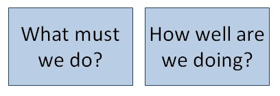   

While results are crucially important to any business, without
fulfilling the orders we receive from our customers reliable and on
time, the business will not have any results to measure. So we need to
make sure that we effectively complete each of the tasks for which we
are responsible in the overall chain activities that must be performed
to keep customers happy.  

So the first skill we need to develop when it come to managing our work,
the first thing we need to "know what to do", is the process of managing
the flow and progress of orders in the company.  

To this effectively using the Sense-i System becomes that much easier if
you know;  

a.  What reports to use and  

b.  How to arrange and focus on the information in each report.  

To develop an understanding of what is happening and what must be done
we have to train our minds to ask questions constantly.  

Without asking questions, our minds cannot develop any insight into or
understanding of reality. And when we take decisions without
understanding what is happening and what must be done all we do is
contribute to chaos and stress in other people's lives and cause
problems for our team, the company and our customers.  

So knowing what questions to ask is the first priority, and only once
you know what questions to ask should you be looking at the information
in the report. Also, once you know what questions to ask you will have a
sense of how to group and arrange the information in each report to give
you the answers that you need.  

This document is focused on how you use the reports in the Sense-i
Enterprise Management System to effectively manage the Operations of the
business so that all orders from customers and processed effectively and
delivered correctly and on time.  

The screens in Sense-i provide us with information that helps us make
the decisions we need to make. There are three things we need to be able
to do in any report. These are;  

a) Group Information  

b)  Filter Information  

c)  Hide Non-Relevant Information  

## Grouping Information 

When making decisions about what information you need to work with, it
helps to understand something called "ENTITIES."  

An **"ENTITY"** is an OBJECT THAT EXISTS IN THE REAL WORLD.
Domains relate to things such as;

### PARTY / PERSON OR COMPANY  

-   Customer  

-   Supplier  

-   Employee  

-   Department  

### RESOURCES / PHYSICAL OBJECTS OR SERVICES

-   Item, e.g. a **Product**, **Material** or **Machine**.

### TRANSACTIONS 

-   Quote  

-   Order  

-   Delivery Note  

-   Job Card  

-   Receipt  

-   Invoice and so on.  

The system displays all information related to each entity in an
Information Band in the grid.  

In the spreadsheets or grids that the system displays on each screen,
the system creates a "Wide Column Heading" or "Band" that spans several detail columns. Each Band has the name of the Entity displayed so that you know what the information in the columns is about.  

And then within Band the system displays a set of columns that contain
information about the "Entity" represented by the "Band" in which the columns exist.  
For example, the Entity of Customer has four columns, Customer Group,
Customer Code, Customer Name and Representative Name.  

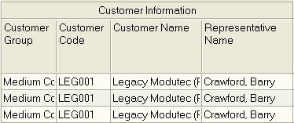   

These columns help you answer questions about a customer that you might
want to know.  

For example, the columns display information that relates to each
"Customer" that answer questions such as;  

-   "Which Group do they belong to?",  

-   "What is their Account Code?",  

-   "What is their Name?",  

-   "Who is the Sales Rep who handles this customer?".  

You will notice that underneath the "Customer Information Band" there
are columns that contain information that answer each of these
questions.  

Similarly, the system creates a band for the Item Information.  

In a similar way, information about another "Business Object" called
"Item" is also represented in a Band called "Item Information" with
columns containing detail underneath the band.  

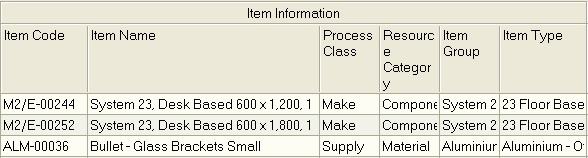   

This allows you to answer questions and find information about each Item
(Product, Material or Machine) such as;  

-   "What Is The Product Code For The Item?"  

-   "What Is The Item Name?"  

-   "What Process Makes The Item?"  

-   "To Which Stock Category Does The Item Belong?"  

-   "To Which Stock Group Does The Item Belong?"  

-   "To Which Stock Type Does The Item Belong?"  

In exactly the same way the system displays information about addresses
in a band with the caption Address Information.  

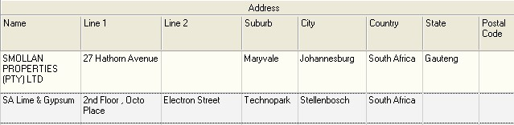   

Each of these Entities allow you to quickly and easily find and group
information using the Enable Group function.  

To group information in the grid, simply right click the mouse in the
grid and the program will display a small popup menu.  

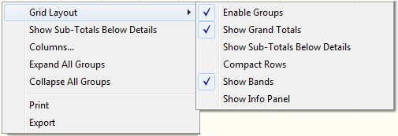   

Click the Grid Layout option and then click the Enable Groups option.  

When you do this the program will display a grey bar above the grid into
which you can drag any column heading to arrange the information on your
screen.  

Before we look at an example of how to group the information, we need to
look at two more Entities or Bands. The first is the entity of Time or
in the system called Period Information.  

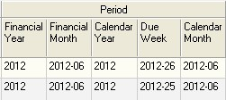   

The second is the Entity of Order Information. And a final example, of
an "Entity" called "Order". The information about an "Order" are displayed in columns underneath the "Order Information Band."  

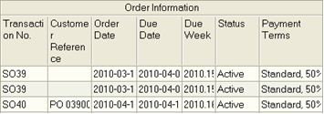   

Here you can see the system displays information such as the;  

-   "Order Number"  

-   "Customer Order Number / Reference"  

-   "Order Date"  

-   "Due Date" and so on.  

The Grouping function then allows you to effectively sort the
information in the grid so that you can concentrate and focus on dealing
with what is most important.  

When you are looking at reports to decide what must be processed next,
it is most useful to first group by Calendar Month, then by Due Week. To
arrange the report in this way, simply drag the Calendar Month column up
into the grey group by bar and then drag the Due Week underneath it.
When you have done this you should see the following on the screen;  

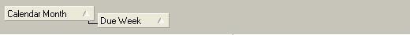   

Then, depending on how you are going to prioritize and follow-up on the
information the report, you can either group by some combination of;  

-   Sales Rep  

-   Customer or Supplier  

-   Address  

-   Department  

And then finally by  

-   Order Number.  

You might then end up with a grouping of your report as follows:

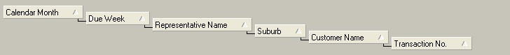   

Such a report would tell you the following...  

What orders are due to be delivered in each month and week, for each
rep, in each suburb for each Customer?  

The program will collapse all the detail so that you can then focus in
on one transaction at a time.  

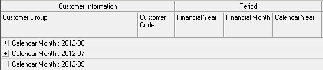   

To zoom in on the details you simply need to click the + sign next to
each record to see the details.  

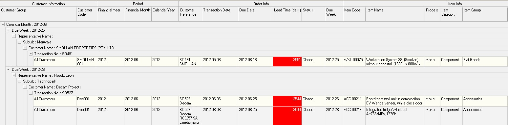   

So, as a general rule, when you are looking at reports to decide what
must be processed next, it is most useful to first group by Calendar
Month, then by Due Week.  

### Hiding Non-relevant Information 

Sometimes the information on the screen is not relevant to the task we
are performing. The system allows us to hide any information that is not
relevant to what we are doing.  

To hide information that is not relevant to what we are trying to do, we
can do this in two ways... we can either hide an entire band if you
don't need to see ANY OF THE INFORMATION related to the band you want to
hide, you can right click on the Band itself and choose "Hide".

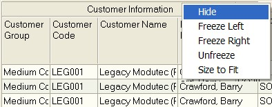   

The system will then hide the band and all the columns related to the
entity represented by the band. In this case, the Customer Information
will be hidden.  

The second way to hide information is to keep the band showing and hide
specific columns only.  

To do this, right click in the worksheet and then choose Columns.  

   

The program will display a screen that allows you to hide (or if they
are already hidden, to display) specific columns.  

   

To hide any column simply click on the box to the left of the column
name. The checkbox will be blank if the column is hidden.  

To show a column in the grid, click the checkbox so that the tick is
displayed.  

Once you have selected the columns you wish to view, click the Save As
button and then enter the name of your configured report in the Custom
Name field.  

   

The program will ask you if you want to save the report as a default.  

   

Choose yes if the layout you have created is the layout you want to see
each time you open the report.  

The program keeps a list of each of the custom reports you have created
in the database and you can at any time choose to swap from one report
to another.  

To swap between the different report layouts, open the Custom View
screen and click the List Custom Views button.  

   

To change between reports simply click on the name of the report you
wish to view and click the Load button.  

### Filter Information  

Even after you have grouped the information in the report so that you
can view the transactions by priority, and hidden information you do not
need to see, you might still find the list contains too much
information.  

You can use the Quick Filter option to further filter information in the
report.  

Let's say that you only want to see orders that are more than 2 days
late.  

Click on the TOP RIGHT CORNER of the column heading that contains the
information you wish to filter by, for example Lead Time.  

The program will display a list of unique values that are in the grid
and you can then check on the ones you wish to see.  

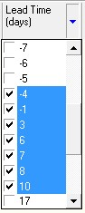   

The program will display the values by which you have filtered the
information in the grid at the bottom of the screen.  

   

You can click on the drop down arrow to swap between any of the filtered
views you have created.  

And you can click the Customize button to open a screen in which you can
type more complex search filters.  

### TAKING ACTION

Once you have filtered and arranged the information in the report you
need to take action to move the items in the order to the next step in
the process.  

You can do this in one of two ways.  

If you are processing the transaction without having to take any action
away from your computer, each Outstanding Orders List screen has a
button at the top of the screen that will automatically open and
populate the next transaction you need to create with the information
from the record you have in focus. A record in focus will appear in
yellow.  

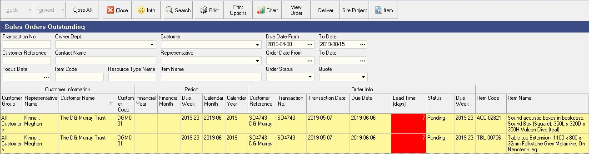   

Or, if you are relying on someone else in the team to take action before
you can create the next transaction in the sequence, then you can Print
a list that they can use as an instruction of what they need to do,
record what they have done and then return the list to you to capture.  

To do that click the Print button.  

The program will display a customised follow up list with specific
instructions that the person who is responsible for performing the task
must follow.  

   

Remember, that in order for the company to be successful, we all need to
monitor what needs to be done in our area and take the necessary steps
to ensure that each order is processed on time by the end of each
working day.  

Using the Sense-i System in the way described in this document will make
this an easy and efficient action to do.  

**This is the end of the Basic Introduction to the SEMS User
Interface.**  
