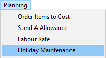
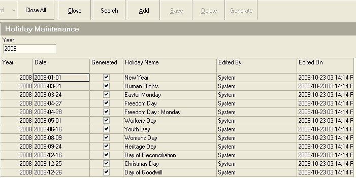
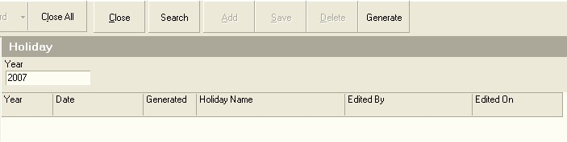

## Procedure Guideline
___  

### Maintain Working Calendars  

1.  Click **Planning** on the Main Menu.  

2.  Then click the **Calendar Maintenance** item on the drop-down menu.  

  

The system will open a screen titled **Maintain Calendar**. This screen
lists all of the various working calendars that have been defined for
your company. It is normal for some companies to have separate
calendars for different departments and divisions within the company.
Factory calendars for example often differ from calendars that apply
to the retail outlets of the same company.  

  

3.  To add a new calendar to the company's database, click the **Add**
    button on the form bar.  

The system will add a new blank row to the bottom of your list of
calendars.  

4.  Enter a name to identify the Calendar you are about to create in the
    **Calendar Name** field.  

5.  If the Calendar you are creating is to be the common calendar used
    most in the company, check the **Default** option.  

6.  If you wish to adjust the actual clock in times for Employees who
    arrive late for work, then set the **Round Log Time to Nearest** rule to
    the preferred option.  

  

7.  Specify the day on which the week starts. This is used for
    calculating totals for payroll.  

  

8.  Once you have entered the information needed to create a new Working
    Calendar, click the **Save** button.  

You will now need to define the details of the working time periods
within this Calendar.  

9.  Click the **Time Details** button on the form bar.  

The system will open a window called **Calendar Detail**. This window
enables you to enter detailed information for each day on the calendar by
creating periods, assigning a name, start time and end time for each
period.  

In addition, for each period you create you need to specify
whether the period is a productive period and whether the period is
paid or not.  

  

10. To create a new period, click the **Add** button.

The system will insert a blank row immediately below the row on which
the cursor was positioned when you clicked the Add button.  

So, if the cursor was on row 1 and you clicked the Add button, a blank
row will be created in row 2. If the cursor was on row 5, a blank row
would be created on row 6.  

  

11. Enter a name to describe and identify the period in the
    **Calendar Detail Name** field.  

12. Enter the **Start Time** for the period you are adding to the Calendar.  

:::note  
If the new period follows on from a previous period, your Start Time should be the same as the End Time of the previous period.  
:::  

13. Enter the **End Time** for the period.  

14. If you expect Employees who are assigned to this period to do
    productive work during the period, set the **Productive** check on. On
    the other hand, if the period is reserved for preparing for the day,
    cleaning up, breaks or lunch, then leave the Productive column
    unchecked.  

15. If you pay Employees for the time they are at the company during
    this period then set the **Paid** field to on by checking the box in the
    Paid column. If not, then leave the column unchecked.  

16. If you have flexible starting times, then you need to set a
    **Session No** for the **Starting Time** for the day and the same Session No for the
    **End Time** for the day.  

17. Repeat steps 10 to 16 for each period you wish to add to the
    Calendar.  

18. Then, click the **Save** button.  

To save you time, you can copy the details from one day of the week
the to another day and then either edit the details to note the
differences in periods for the day (if for example you Friday work day
ends early) or you can leave them unchanged.  

19. To do this, click the **Copy** button.  

20. The system will open a window titled **Calendar Copy to Days**.  
    
    The day in which you are working will be disabled (greyed out). This
    indicates that the system will use the details of the disabled day
    to copy to the days you select.  

  

21.  Check the days to which you wish to copy the details of the selected
    day.  

22.  Click the **Ok** button.  

23.  Once you have completed defining the Working Calendars, click the
    **Close** button twice to return to the starting screen in the system.  
___

### Maintain Holiday Calendars  

1.  Select the **Planning** option on the Main Menu.  

2.  Then click the **Holiday Maintenance** on the drop-down menu.  

  

The system will open a screen titled **Maintain Holidays**.  

  

This screen lists all of the defined holiday periods for the company.  

  

3.  You can automatically populate the Holiday Calendar using the
    information for the country in which your company is based entering
    the Year number in the Year field and then clicking on the Generate
    button.  

The system will generate entries for each of the official Holidays
based on the rules defined.  

4.  To Add you own Holiday, (for example Annual Company Shut Down days),
    click the **Add** button on the form bar.  

The system will insert a blank row into the grid.  

5.  Select the **Date** you wish to apply to the Holiday you are about to
    create.  

6.  Enter a **Name** for the Holiday.  

7.  Click the **Save** button.  

8.  To remove a Holiday from the list, click on the row displaying the
    day you wish to remove and then click the **Delete** button.  

**This is the end of this procedure.**  
