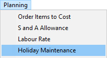
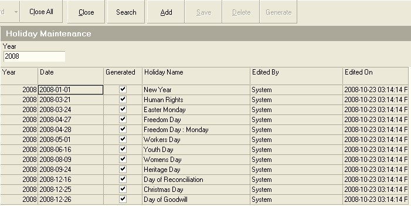
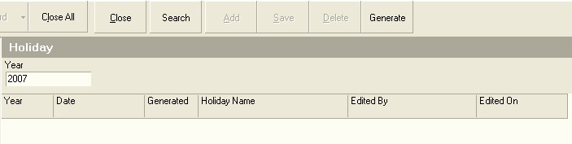

## Procedure Guideline
___  

1.  Select the **Planning** option on the Main Menu.  

2.  Then click the **Holiday Maintenance** on the drop-down menu.  

  

The system will open a screen titled **Maintain Holidays**.  

  

This screen lists all of the defined holiday periods for the company.  

  

3.  You can automatically populate the Holiday Calendar using the
    information for the country in which your company is based entering
    the Year number in the Year field and then clicking on the Generate
    button.  

The system will generate entries for each of the official Holidays
based on the rules defined.  

4.  To Add you own Holiday, (for example Annual Company Shut Down days),
    click the **Add** button on the form bar.  

The system will insert a blank row into the grid.  

5.  Select the **Date** you wish to apply to the Holiday you are about to
    create.  

6.  Enter a **Name** for the Holiday.  

7.  Click the **Save** button.

8.  To remove a Holiday from the list, click on the row displaying the
    day you wish to remove and then click the Delete button.

**This is the end of this procedure.**
