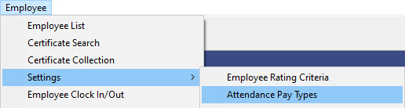
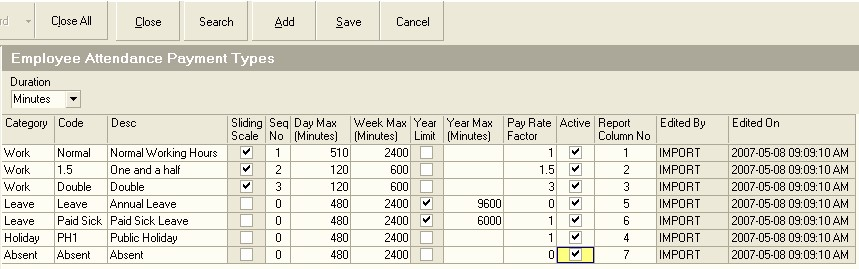
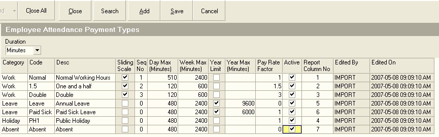

## Procedure Guideline
___  

1.  Select **Employee** on the Main Menu.  

2.  Click **Settings** on the drop-down menu.  

  

3.  Click **Attendance Pay Types** from the Right Pop-Up Menu.  

The system will open a screen titled **Employee Attendance Payment Types**.  
 
This screen lists the "types" or "categories" to which time and
attendance totals are assigned and these are types are used as part of
calculating the employee Payslip in terms of paid leave, overtime
rates and so on.  

  

You can either edit the Attendance Pay Types that are created by the
system when you install the program, or you can add new Attendance Pay
Types.  

4.  To edit an existing Attendance Pay Type, simply begin typing in the
    row containing the information you wish to change.  

5.  To add a new pay type, click the **Add** button on the form bar.  

  

**Define The Details For Each Attendance Pay Type As Follows:**  

6.  Assign the Attendance Pay Type to a Category. The valid Pay Type
    Categories are as follows:  

-   Work  

-   Leave  

-   Holiday  

-   Absent  

**Work** is used to group all attendance time where the employees is
expected to be at work and involved in either productive activities,
or housekeeping, general admin, tea or lunch. In other words, the Work
category is used to signify that the employee has arrived at Work.  

**Leave** is used to group all times when the employee is on
recognized leave, that is either Annual Leave, Sick Leave or
Compassionate Leave.  

**Holiday** is used to group all statutory public holidays. It should
not be used for reporting Annual Leave or Sick Leave as this is
covered by the Leave category.  

The **Absent** category is used to group all time that the employee
was absent from work, usually this is without authorization is unpaid,
whether it is Absent-Without-Leave or Unpaid Sick Leave.  

7.  Assign a Code to each Attendance Pay Type. This is printed on the
    various Time and Attendance Reports.  

8.  Assign a Name that best describes the Attendance Pay Type. For
    example, Normal Rate Working Hours, Overtime Working Hours at 1.5,
    Overtime at 2 and so on.  

9.  Mark whether the Attendance Pay Type is a sliding scale item or not.
    If you mark an Attendance Pay Type as a sliding scale, then the
    system will sum the number of minutes or hours for which the
    employee was at work until the Daily Maximum Limit is reached.  
    
    Any attendance time above the limit will then be included in the next
    Attendance Pay Type.  
    
    For example, if you have three Attendance Pay
    Types, Normal Time, Time-and-a-half, Double Time and the limits for
    Normal Time is 8 hours, Time-and-a-half is 2 hours and Double Time a
    further 2 hours and the employee is at work for 12 hours, then the
    system will use the sliding scale to assign to the first 8 hours to
    Normal Time, the next 2 hours to Time-and-a-half and the final 2
    hours to Double Time.  

10. Enter a Sequence Number to instruct the system how to apply the
    sliding scale rule. In other words, the system will assign any
    additional time above the limit for the Attendance Pay Type with
    Sequence No 1 to the Attendance Pay Type with Sequence No 2.  

11. If you wish to set a Daily Maximum Limit to the number of minutes or
    hours for a specific Attendance Pay Type, then enter this value in
    the Day Max column.  

12. You can also set a Weekly Maximum Limit in the Week Max column. This
    ensures that is an employee works over time on one day in the pay
    week, but then is absent on another day, the total time at work will
    first be used to fill his Normal Time Target before any Overtime
    amount is calculated.  

13. If there is an annual limit to the time allowed for the Attendance
    Pay Type you are creating, then click the box in the Year Limit
    column. This is used for example to set a limit on the amount of
    time assigned for Annual Leave, Compassionate Leave and Paid Sick
    Leave.  

14. If you set the Annual Limit rule on, then you need to enter the
    number of minutes that is allowed for the Pay Type you are adding in
    the Year Max column.  

15. Enter a Pay Rate factor in the Pay Rate Factor column. This is the
    factor by which the base Labour Rate will be multiplied for the
    Attendance Time calculated for the Attendance Pay Type. For example,
    all the time assigned to the Normal Time Pay Type will be multiplied
    by the Base Labour Rate x 1. For Double Overtime, the sum of
    attendance time in this Pay Type will be multiplied by the Base
    Labour Rate x 2.  

  

16. If the item is to be used in your Time and Attendance Control System
    and your reports, click the box in the Active column.  

17. Finally, decide in which Column on the Time and Attendance Reports
    you want the system to display the Total Hours assigned to the Pay
    Type.  

18. The system displays the name of the user and the date on which the
    Attendance Pay Type was last changed.  

Repeat steps 5 to 16 for each Attendance Pay Type you will be using to
calculate and report the Attendance Times of the employees working in
the company.  

**This is the end of this procedure.**  

