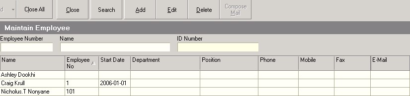
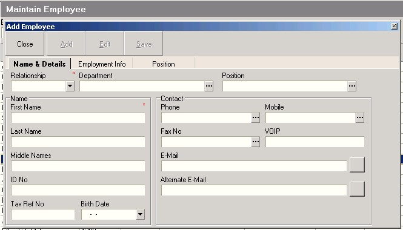
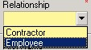
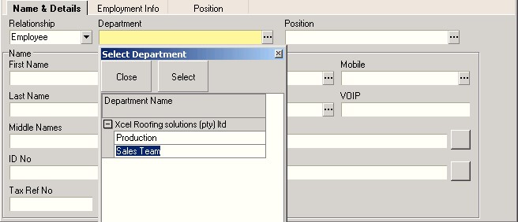
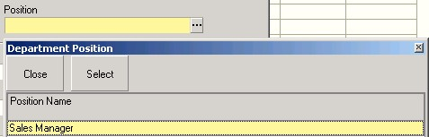
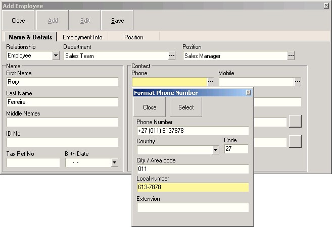
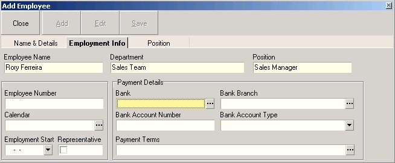
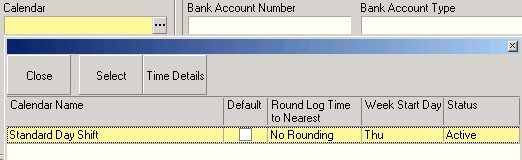
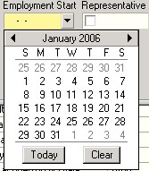
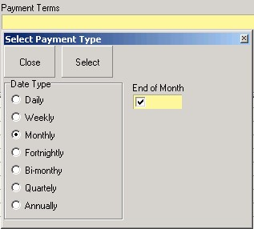

## Procedure Guideline
___

1.  Select **Employee** from the Main Menu.  

2.  Then click **Employee List** from the drop-down menu.  

  

The system will open a screen titled **Employee List**. This screen
lists all of the Employees that have been captured in the system for
your company.  

  

3.  Then click the **Add** button to add a new employee to the system.  

The system will open a screen titled **Employee - No Record**.  

  

4.  You need to define whether the person whose details you are entering
    is an **Employee** or a **Contractor**.  
    Select the correct option from the **Relationship** drop-down list.  

  

5.  Then you need to assign the employee to a department within the
    company. Click on the **three-dot button** in the **Department** field and
    select a department from the list.  
    Click the **Select** button.  

  

6.  Next, you need to assign the Employee to a Position within the
    Department you have chosen.   
    Click on the three-dot button in the
    **Position** field, then click on the position the employee occupies and
    click the **Select** button.  

  

7.  Next, enter the employee's First Name, Last Name and Middle Name in
    the various name fields on this screen.  

8.  Enter the employee's Identity number, Tax number and Ccontact
    details in the appropriate fields.  

  

9.  Enter the Employees contact details such as Phone number, Mobile
    phone and Email details in the appropriate fields.  

10. When you have completed adding the Employee's basic details to the
    system, click the **Save** button.  

11. Then click the **Employment** tab.  

## Add Clock Number, Banking Details, Payment Terms and Link Working Calendars  

The system will display the Employment information screen. This screen
enables you to add the Employee's Clock Number, link Working Calendars, add Employee's banking details & Payment terms to the system.  

  

12. Enter the Employee's Clock Number in the **Employee Number** field.  
    
    :::note  
    You should only enter a NUMERIC value in this field. You should
    not use any letters or symbols. The biometric attendance device can
    only work with a Numeric Employee Clock Number.  
    :::  

13. Click on the **three-dot** button in the **Calendar** field.  

The system will display a list of Working Calendars that have been
defined for the company.  

  

14. Click on the row containing the name of the **Working Calendar** to
    which you wish to link the selected Employee.  

15. Click on the **Select** button.

16. Next, you need to define the employees Employment Start Date. This
    is the date on which they first began working for the company.

17. Then click the **Employment Start Date** field to view a drop down
    calendar and select the correct Starting Date for the Employee.  

  

18.  If the Employee is a **Customer Representative** and handles
    **Sales Quotes and Sales Orders** for the company, then check the
    Is Representative field.  

19.  Select the Employee's Bank by clicking on the three dot button in
    the **Bank** field.  

20.  The system will open a drop down list that enables you to select the
    employee's Bank from a list of defined banks. Click on the Bank at
    which their account is held and click **Select**.  

21.  Click on the three dot button in the **Branch** field. The system will
    display a list of branches for the bank you have selected. Click the
    branch at which the employee's account is held. Click **Select**.  

22.  Enter the Employee's **Bank Account number** in this field.  
     
    If you are not going to record the Employee's details for payroll purposes in
    this system because you are using another system, then simply enter
    the numbers 123456.  

If you are not recording the employee's banking information in the
system, then use a *Default Employee Bank Account* which you can use
instead of the actual bank account.  

23.  Next you need to define when the Employee is paid. Click on the
    three-dot button in the **Payment Terms** field.  
    This is either Daily, Weekly, Fortnightly, Monthly and so on.  

24.  Select the Interval or Cycle at which the Employee is paid.  

25.  Select the Day of the Week or Day of the Month on which payment is
    made to the Employee.  

  

The system will return to the Employment Information screen and
display all the information you have defined for the selected
employee.  

27. Click the **Save** button.  

28. Click the Position History tab to view a record of positions
    previously held by the employee. You can set an end date for any
    position held by the Employee by clicking the End Date and selecting
    a date from the drop down calendar. The employees history will be
    retained although they will no longer be assigned to the position to which
    you have assigned an end date.  

Repeat the steps above for each Employee you wish to add to the
system.  

You have now added all the necessary information to the system to
begin logging the **Employee's Time and Attendance**.  

The next step is to enrol the Employee on the Time and Attendance
Fingerprint Recognition Device.  
See the procedure titled **[Enrolling Employees on the F.R.D.](https://sense-i.co/docs/TAA005)** for more information on how to complete this step.  

The Production Manager also needs to assign the Employee to a set of
Skills for Scheduling purposes.  

**This is the end of this procedure.**  
