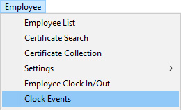
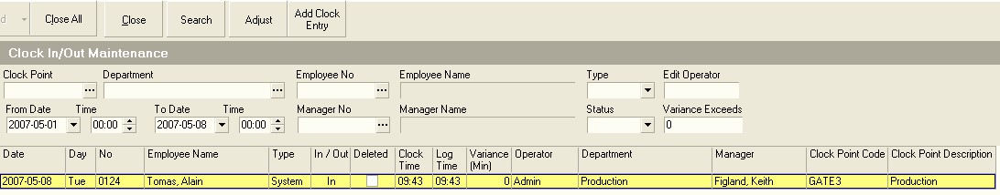
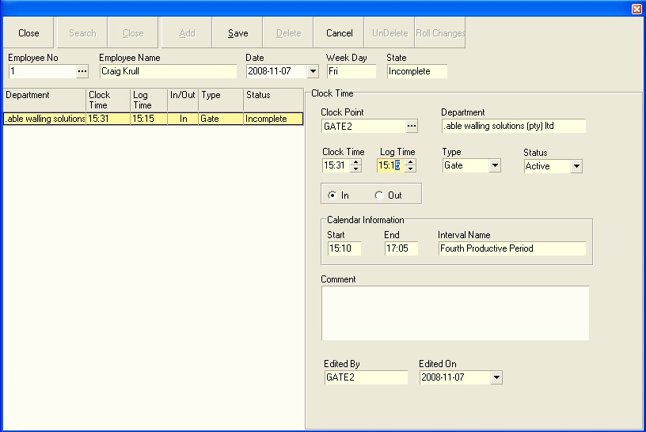
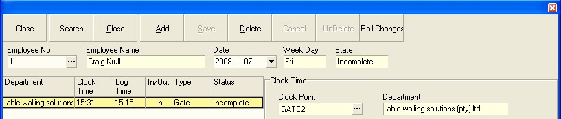
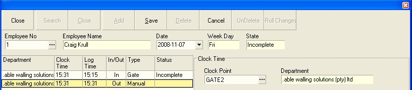
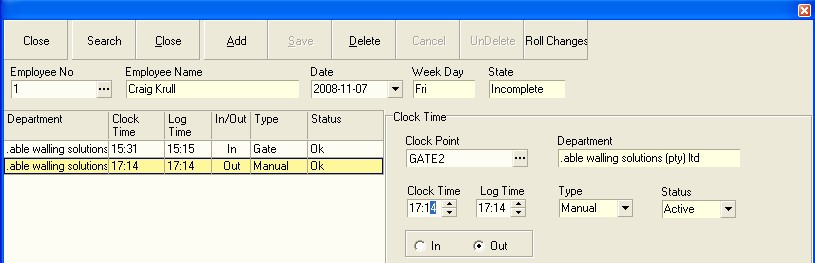

## Procedure Guideline
___

1.  Select **Employee** on the main menu.  

2.  Click **Clock Events** from the drop-down menu.  

  

The system will display a screen titled **Clock In/Out Search**. This
screen lists each of the clock events that have been recorded in the
system.  

  

You will notice that above the list of clock events a number of fields
are displayed. These are **search fields** that you can use to find clock
events that match specific criteria. For example, you could choose to
display all clock events for a **specific department**, or you could
choose to display all clock events **between two dates**.  

3.  Enter the search criteria you wish to use to filter the list of
    clock events in the appropriate search fields.  

4.  Then click the **Search** button the form bar.  

5.  The system will display a list of all Clock Events that match the
    Search Criteria you have entered.  

6.  You will notice in this example that only a single clock event is
    displayed.  

7.  If the Employee has made a mistake and the Clock Entry Time needs to
    be adjusted the system allows you to do this easily. To Adjust a
    Clock Event, click the **Adjust** button on the form bar.  

8.  The system will open the **Clock Manual Adjustment** Screen.  

9.  The system displays the details as follows:  

On the left hand side of the screen the system displays all the Clock
Events for the selected Employee for the selected Date.  

  

10. To change a time you can enter a different time in **Log Time** field.
    You will notice that as you change the Log Time, the Clock Time
    *(that is the time at which the Employee clocked on the Fingerprint
    Recognition Device)* remains unchanged. This is done for audit
    purposes.  

11. If the employee has clocked incorrectly, and you need to change a
    **Clock In Event** to a **Clock Out Event**, then click the **In** or **Out** toggle
    buttons on the screen.  

12. If you need to roll the changes forward click the **Roll Changes**
    button. This would automatically fix any situation where two clock
    events we incorrectly paired. For example, a Clock In, Clock In,
    Clock Out, Clock In would be changed to Clock In, Clock Out, Clock
    In and Clock Out.  

13. Once you have made the necessary changes you need to click the **Save**
    button.  

  

14. You will notice too that the **Status** column will provide some
    indication of any problems that may exist with the Employees Time
    and Attendance records. If for example an Employee does not have a
    complete set of records for the day and some are missing, you can
    click the **Add** button and the system will create the missing record.  

  

15. You need to set the time (in the **Clock Time** field) and
    **Clock Direction** (either In or Out) to ensure the Clock Event you are
    capturing manually is correct.  

  

16.  Click the **Save** button and the system will then resolve any errors
    that are solved by the manual entry. Notice in the example above
    that the status has changed from Incomplete to Ok.  

17.  Continue adding any manual clock entries as required for the
    selected employee, then repeat this procedure for each employee for
    which any errors exist.  

**This is the end of this procedure.**
