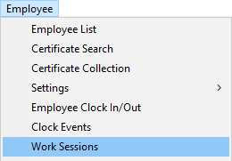
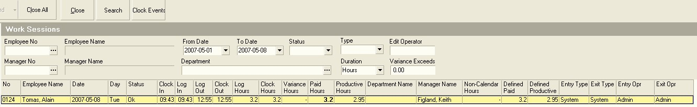
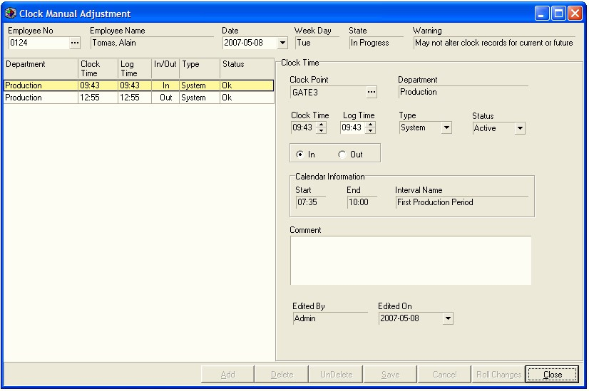

## Procedure Guideline
___

A Work Session is defined as the time between a Clock In and a Clock Out
Event. The sum of the Work Sessions for a particular day makes up the
total time an employee has been at work. To view Work Sessions...  

1.  Select **Employee** on the main menu.  

2.  Then click the **Work Sessions** option on the drop-down menu.  

  

The system will display a screen titled **Work Sessions**. This screen lists
each of the Work Sessions that have been recorded in the system.  

  

You will notice that above the list of Work Sessions a number of fields
are displayed. These are search fields that you can use to find Work
Sessions that match specific criteria. For example, you could choose to
display all Work Sessions for a specific department by selecting the
**Department name** from the drop down list of Departments. Or you could
choose to display all Work Sessions for a **specific Employee**, or for all
the Employees reporting to a **specific Manager** or all Work Sessions
**between two dates**.  

3.  Enter the **search criteria** you wish to use to filter the list of Work
    Sessions in the appropriate search fields and then click the **Search**
    button the form bar.  

The system will display a list of all Work Sessions that match the
Search Criteria you have entered.  

4.  You can view a list of all the Clock Events that make up a
    particular Work Session by clicking the **Clock Events** button on the
    form bar.  

5.  The system will display a screen titled **Clock Manual Adjustment**.  

This screen enables you to view and, where necessary, adjust the clock
events for a particular employee's work session.  

  

6.  Refer to the Procedure Guideline titled
   **[View and Adjust Clock Events](739)** for more information on how to resolve any errors or missing events.  

**This is the end of this procedure.**
