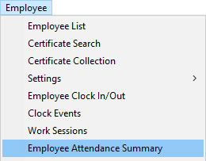
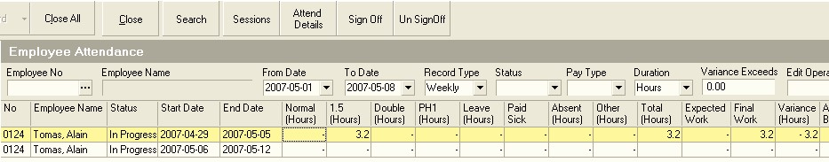
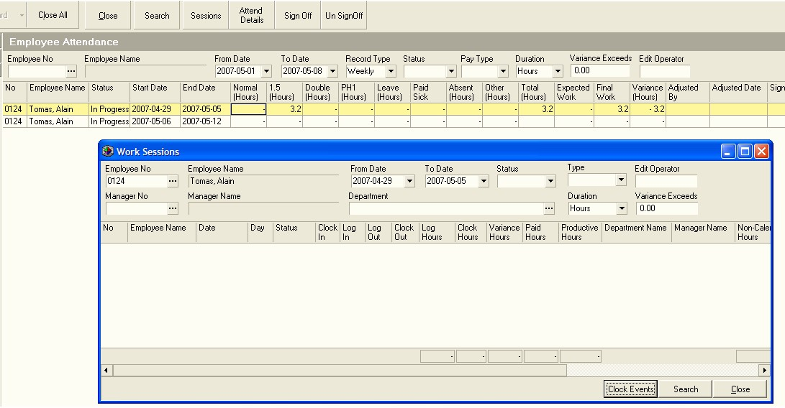
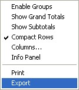

## Procedure Guideline
___

The Attendance Summary Report provides you with the summarized Time
and Attendance figures for a selected set of Employees for a period,
usually weekly or monthly. This report typically is used as the basis
for capturing the number of hours in each Pay Type in the company's
Payroll System.  

The system rounds and calculates the total number of hours in each Pay
Type (for example, Normal Time, Time and A Half, Double Time, Sick
Leave and so on), based on the rules you have defined in the Calendar.  

1.  Select **Employee** on the Main Menu.  

2.  Click **Employee Attendance Summary** on the drop-down menu.  

  

The system will display a screen titled **Employee Attendance**. This
screen lists the total hours worked for the various employees in the
company.  

  

3.  You can view the details of how the hours were calculated for each
    Pay Type by clicking the **Sessions** button. This will open the
    **Work Sessions** screen.  
    For more information on Work Sessions refer to the
    Procedure Guideline **["View Work Sessions"](740)**.

The system displays a list of all work sessions in the Work Sessions
window.  

:::note

You can drill down to individual **Clock Events**
linked to each session if you need to.  

:::

  

4.  Once you are satisfied that the number of hours logged for the week
    is correct for an employee, click on their record in the grid and
    then click the **Sign Off** button.  

5.  If you wish to reverse a Sign Off, then click on the record and
    click **Un-Sign Off**.  

6.  You can export the hours for each week or month into a Spreadsheet
    program and then use this information to automatically load the Time
    and Attendance information into your payroll program, or you can
    print the list and capture the hours manually.  

  

7.  To use the Export function, **right-click on the grid** and then select the **Export** option on the pop-up menu.

**This is the end of this procedure.**
