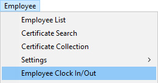
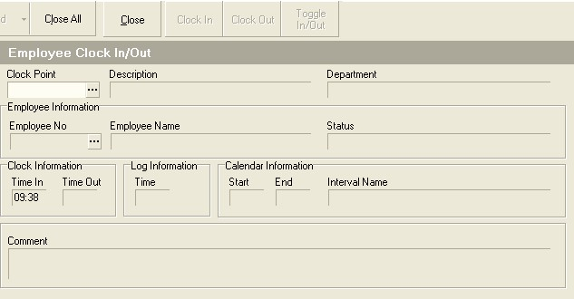
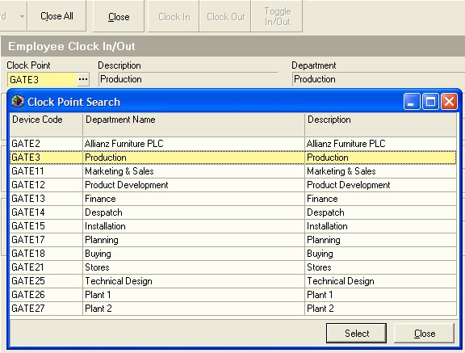
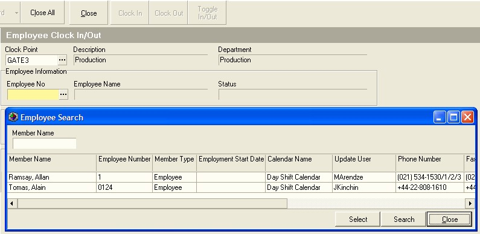
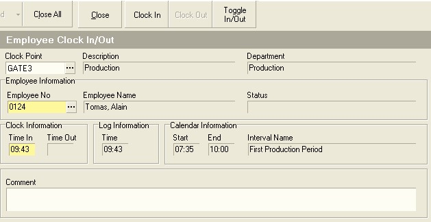

## Procedure Guideline
___

### Add Clock Event  

Once the Calendar Rules have been set-up you can beginning logging Time
and Attendance events. This can be done through an electronic clocking
device linked to Sense-i OR it can be done in Sense-i directly.

To do it in Sense-i...  

1.  Select **Employee** on the Main Menu.  

2.  Click **Employee Clock In/Out** on the drop-down menu.  

  

The system will open a screen titled **Employee Clock In/Out**. This screen
enables you to manually add clock in and clock out records for any
employee in the company's database.  

  

The system requires that you enter or select the clock point for a clock
event.  

3.  Simply select this from the list of clock points that have been
defined for your company. Once you have clicked on the appropriate clock
device, click the **Select** button at the bottom of the screen.  

  

The system requires that you select an employee from the company's
database of employees.  

4.  You can either type the Employee No in the
**Employee No **field and the system will display the name of the Employee
linked to the number you have entered, or you can simply select the name
of the Employee from the **drop-down list**.  

If the list of employees is
very long, you can type a portion of the employee's name in the Employee
Name field, click the search button and the select the appropriate
employee from the list of employees displayed by the system.  

  

Once you have selected the appropriate employee, the system will return
you to the **Employee Clock In/Out** screen.

5.  Enter the time you wish to assign to the Clock Event in the **Time In** or
**Time Out** field.

  

6.  To **save** the entry, click either the **Clock In** or **Clock Out** button on the
form bar.  
    You can switch between the two by clicking the **Toggle In/Out**
button.  

**This is the end of this procedure.**

