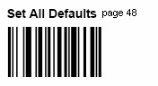
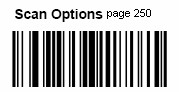
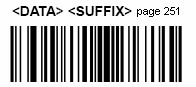
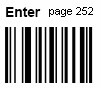

## Step-by-step Guideline
___

In order to implement the Barcode Scanning of Task Tickets, you will
first need to program your Barcode Scanner to pass the correct
sequence of information to the computer at which the scanning will
take place.  

Connect the Barcode Scanner to the USB port of the computer, and then
scan each of the Barcodes printed below in the correct sequence. After
each Barcode has been successfully scanned, the Scanner should produce
a "beep" sound.  

1.  Set All Defaults.  

  

2.  Scan Options.  

  

3.  \<Data\> \<Suffix\>

  

4.  Send Tab Key.  

  

5.  Enter.  

  

**This is the end of the procedure**
