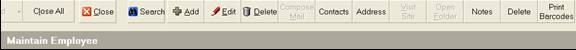
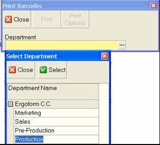
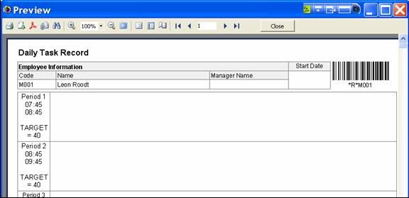

## Step-by-step Guideline
___

This procedure describes how you can print a set of Daily Task Record
sheet to give to each operator in the factory. The Daily Task Record
sheet is printed on a separate page for each operator and contains a
barcode that is used by the system to identify the operator. Each
sheet consists of a set of rows that define the working periods in the
day.  

As the supervisor of a team gives an operator a Task Barcode Sticker
to indicate the task has been successfully completed, the operator
must then stick the Task Barcode Sticker in the time period when the
task was completed.  

At the end of each day, or at specific times during the day, the Task
Barcode Stickers are scanned into the system to record what tasks have
been completed. This information is used to track progress on a job
and to calculate the productivity of each operator and team.  

To print the **Daily Task Record** sheets on which to record the day's
production you need to perform the following steps...  

1.  Select **Employee** from the Main Menu.  

2.  Then click **Employee List** from the drop-down menu.  

  

The system will open a screen titled **Employee List**. This screen
lists all of the Employees that have been captured in the system for
your company.  

  

3.  Click the **Print Barcode** Button on the right hand side of the Form
    Bar.  

The system will open the **Print Barcodes** window. You will need to
select a specific Department from the Department lookup field.

4.  Click the **Department** field, then

5.  Click on the **name of the Department** that contains the employees for
    whom you wish to print Daily Task Record sheets and then

6.  Click the **Select** button.

  

The system will display the name of the department you have chosen in
the Department Field and will enable the Print button.  

7.  Click the **Print** button.

The system will display the **Daily Task Records** for each operator in
the selected Department in a **Print Preview** screen.

  

You can use the **Print options** dialog screen to select specific page
numbers if you wish or you can simply choose to print
Daily Task Records for each employee.

8.  To Print the Daily Task Record sheets, click the **Print** button on the
    Print Preview screen.

The system will then print Daily Task Records for Barcode scanning for
each of the selected employees.

9.  Retrieve the Daily Task Record sheets from the printer and hand
    these to the supervisors who need to give them to each member of
    their team.

**This is the end of the procedure**
