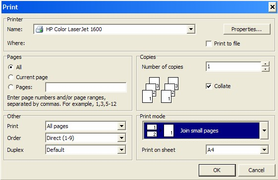

## Step-by-step Guideline
___

This procedure describes how you can print a set of Task Barcode
Sticker that display the Job Number/Sales Order Number, the Task Name,
the Item and Planned Task Duration.  

The supervisor of a team will give each operator a Task Barcode
Sticker to indicate the task has been successfully completed. The
operator will then stick the Task Barcode Sticker onto their Daily
Task Record in the time period when the task was completed.  

At the end of each day, or at specific times during the day, the Task
Barcode Stickers are scanned into the system to record what tasks have
been completed. This information is used to track progress on a job
and to calculate the productivity of each operator and team.  

To print the **Task Barcode Sticker** sheets on which to record the
day's production you need to perform the following steps...  

1.  Select **Operation** on the Main Menu.  

2.  Click the **Print Operation Tickets** option on the drop-down menu.  
	
  

The system will open a screen titled **Print Operation Tickets**. This
screen lists all of the open Process Orders (i.e. Jobs) that have been
captured in the Sense-i system.  

You can search for specific Process Orders using the **Search Criteria**
at the top of the screen, or you can sort and filter the information
using the Auto-filter options available in the Column Labels.  
	
  

3.  Click on each row for which you wish to print Operation Tickets.  

You can hold down the control key on your keyboard while you do this
to select nonadjacent process orders or you can click on a specific
process order, hold down the shift key and then click a second process
order and the system will select both the first and second process
orders you have clicked on as well as every process order that appears
between these two.  

4.  You will notice that as you click on a process order in the list the
system marks the row in yellow.  

  

5.  Click on the **Operation Tickets** option from the drop-down menu.  

The system will display the **Task Barcode Stickers** for each of the
Tasks that have been created for the one or more Process Orders you
selected in step 3 above.  

  

6.  Click the **Print** Icon on the Print Preview screen.  

The system will open the Print options dialog.  

7.  If you are printing the Task Barcodes as stickers, you should select
    **Join Small Pages** option in the **Print Mode** field.  

8.  Then click the **OK** button on the Print dialog.  

  

The system will then print Task Barcode Stickers for all the
Uncompleted Tasks for the selected Process Orders.  

9.  Retrieve the Task Barcode Stickers from the printer and hand these
    to the supervisors who need to give them to each member of their
    team as tasks are completed.  

**This is the end of the procedure**
