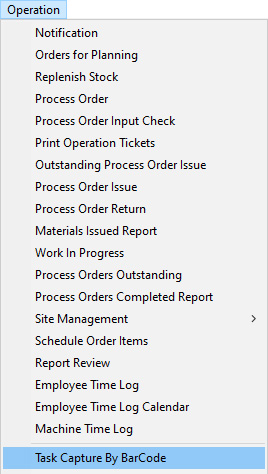
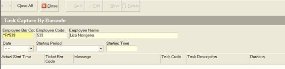
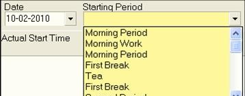
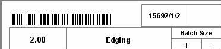
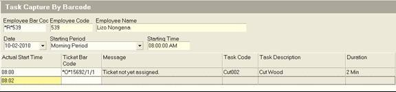
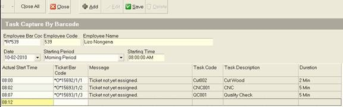
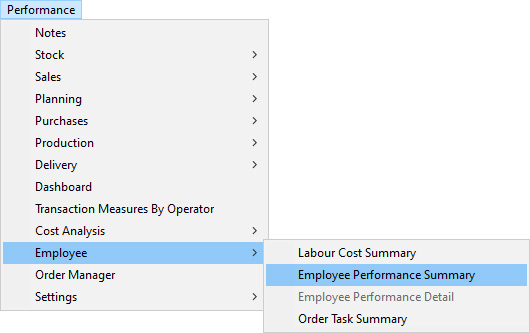

## Step-by-step Guideline
___

This procedure describes how you scan the Task Barcode Stickers that
are affixed to the Daily Task Records that should be handed in by each
operator in a department.  

By scanning the Task Barcode Stickers the system records what tasks
have been completed and you can then use this information through
various reports to quickly and easily to track progress on a job and
to calculate the productivity of each operator and team.  

To scan completed **Task Barcode Stickers** to record the day's
production and update order progress you need to perform the following
steps...  

1.  Select **Operation** on the Main Menu.  

2.  Click the **Task Capture By Barcode** option on the drop-down menu.  

  

The system opens the **Task Capture by Barcode** screen.  

  

3.  First, scan the **Employee's Barcode** as it appears on the Top Right of
    the Daily Task Record.  

You will notice the scanner reads the employee's clock number and
inserts it (with a \*R\* prefix to identify this is the right
information) in the **Employee Barcode** field.  

The system looks up the Employee assigned to this number and displays
their clock number and name in the fields on the top of this screen.  

4.  If the date appears as a Barcode on the Daily Task Record you can
    scan the date or you can select the date on which the tasks were
    completed from the drop down calendar in the **Date** field.  

5.  Then select the period in which the tasks were completed. These
    should, but do not have to, correspond to the period as it appears
    on the Daily Task Record.  

  

Once you have scanned and entered the correct header information, the
system enables the **Add** button.  

6.  Click the **Add** button on the Form Bar.  

The system will insert a blank row in the spreadsheet section of this
screen.  

7.  Scan the **first Task Barcode** that appears on the Employee's Daily
    Task Record.  

  

The system will insert the task number in the spreadsheet and then
lookup and display the details of this task in the **Message**, **Task Code**,
the **Task Description** and the **Task Duration** columns.  

  

8.  You will notice that as you scan each additional Task Barcode, the
    system inserts the information pertaining to each task in the grid
    and sets the starting time for the next task as the end time of the
    previous task + the duration of the task scanned.  

  

Continue scanning the Task Barcodes until all the stickers on the
Employee's Daily Task Record have been scanned, then click the **Save**
button at the top of the form.  

9.  Repeat the above steps for the next Employee's Daily Task Record.  

10. When you have scanned all the Task Barcode Stickers for the selected
    Employee click the **Save** button.  

Repeat steps 3 to 10 until you have scanned all Task Barcode Stickers
for all the Employees in the department.  

When you are done, you should review the **Employee Performance Summary** and Detail Reports under the **Performance** option on the main menu.  

  

**This is the end of the procedure**
