## Procedure Guideline  
___

Many companies need to modify existing products they sell slightly in order to meet the needs of their Customers to ensure the company secures new Sales Orders. In such cases it would be better to use Template Process Models rather than creating new Process Models from scratch for each variation sold.  

The Sense-i system enables you to copy all or any specific details from an existing Process Model to create a new one. The advantage of this function is that there are fewer Process Models in the system, which makes it easier to Search, but more importantly, copying an existing Process Model will save time and will allow you to process orders more quickly.  

This procedure describes the steps involved in using the Copy Process Model function.  

1. Click on the Processes bar function in the Page Menu.  

2. Then click the Process Model icon.  
	
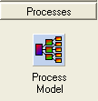  

The system will open a screen titled "Maintain Process Model." This screen lists all of the Process Models that have been defined in the system. You should narrow the list down so that the system displays a short list of possible Process Models that would be useful to use as the base one for copying.  

Note: If you can create a set of Template Process Models then this is a good practice. These become your Master Process Models which you then copy and use to create the specific Process Models needed to make the various Products sold to the company's Customers. If you do this, then you should start the name of these Process Models with the word "Template.  

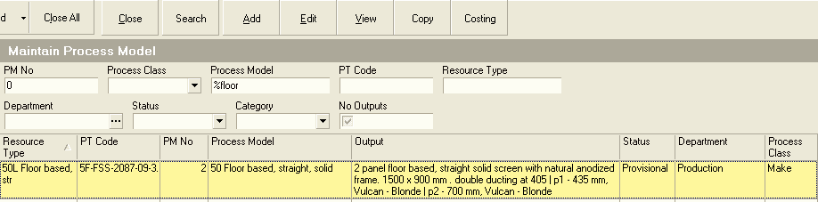  

3. To search for a set of Process Models that you can use as Templates for the new Process Model, type the % symbol and part of their name in the Process Model field.  

Ideally, if you had named all your Template Proces Models starting with the word "TEMPLATE" then you could search for these by typing %TEMPLATE.  

4. Click the Search button on the Form Bar.  

The system will display the names of all the Process Models in the system that contain the words you entered in step 3 above.  

5. Click on the row that contains the name of the Process Model you wish to use as the Template you are going to copy.  

6. Click the Copy button on the Form Bar.  

The system will display all screen called Copy Process Model. This screen enables you to enter the name for the new Process Model you are creating and to select which aspects of the existing Process Model you wish to copy to create the New Process Model.  

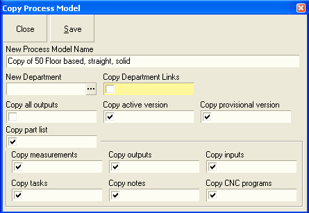  

7. First you need to a name for the new Process Model. If you are creating a Process Model for specific Sales Order or Project, then you can start the name with the Sales Order Number, followed by a brief description of all the Products that you will link to it.  

Type the new name in the New Process Model Name field.  

8. Before you copy the process model you also need to select the information that you wish to copy by checking the appropriate fields. If the field displays a check symbol, then the system will copy this information to the new Process Model.  

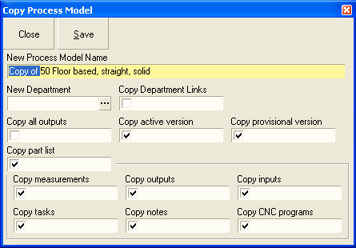  

9. Then, before you save, highlight the entire new name, right click the mouse button and select Copy.  

10. Then click the Save button.  

The system will create a new Process Model with the new name you have specified and copy the selected details from the existing Process Model into the new Process Model.  

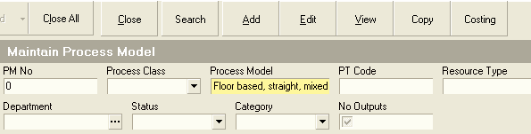  

11. Place the cursor in the Process Model field, right click the mouse and select Paste. The name you copied in step 7 above will be pasted into the Process Model field.  

12. Click the Search button.  

The system will display the copied Process Model with the new Name in the list.  

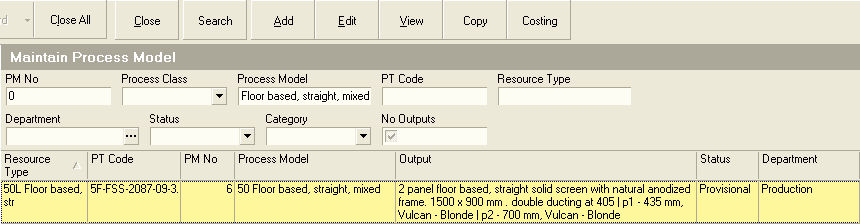  

13. Click on the row containing the name of the new Process Model you have created with the copy function. 

14. Click the Edit button.  

The system will display the tabbed sheets containing the information for the new Process.  

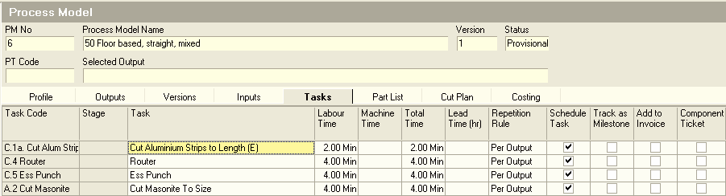  

15. Click on the Tasks tab to check that you are satisfied that the correct tasks have been copied.  

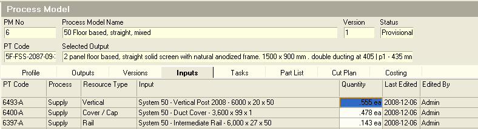  

16. Click on the Inputs tab to check that you are satisfied that the correct Inputs have been copied to your new Process Model.  

17. Click on the Part List tab to check that you are satisfied that the correct Part List have been copied to your new Process Model. *(You can remove Parts and Import Parts from other Process Models using the Import Part List procedure.)*  

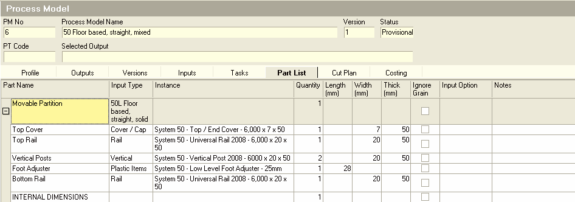  

You will notice that the details of the Part List has been copied, but that once the Outputs linked to this Process Model have been removed, some of the measurements in this Process Model will be blank. These measurements will be recalculated when you link this Process Model to the new Products.  

18. To remove any Outputs that were linked in the Copy function, click the Outputs Tab and then click on each row containing the names of the Outputs you wish to remove from the new Process Model.  

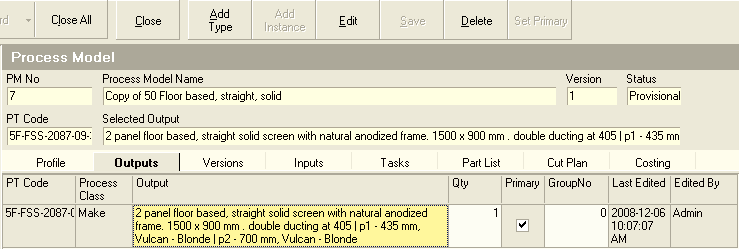  

19. To remove an output, click on the row containing the name of the Output you wish to remove and then click the Delete button.  

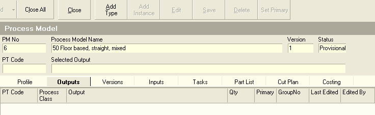  

Now, if you have not yet added the new products for which you are creating this Process Model you need to do so now.  

*(If you need to create new Products for the Sales Order you are processing, then use the Procedure titled "PRC-008 -- Add Product Profile.")*  

20. Once the Products have been added to the Customer Catalogue, then you need to link them to the new Process Model you are creating.  

*(You can refer to the Procedure titled "PMD-002 -- Add Process Model Output for more detail on how to perform this step.)*  

21. Once you have created a new Product and linked it as an Output to this Process Model, click the Part List Tab.  

The system will display the details of the Part List.  

  

22. You need to link the new product you have linked to the Process Model to the Part List. To do this, click on the top row in the Instance Column and select the new Product from the list of available Products.  

23. Depending on certain settings, the system will either display the dimensions of the Product you are linking to the Part List in the Length, Width and Thickness fields on the top row, or you will need to enter these dimensions by typing the values into these fields.  

24. Once you have done so, click the Recalc button on the Form Bar.  

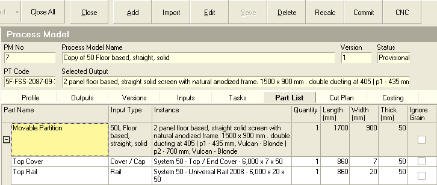  

You will notice the system will calculate the sizes of all the parts and components that are included in the Part List  

25. Then click the Commit button to update the Input Quantities and Material Cost prices.  

Repeat steps 18 to 23 for each of the Product Variations that you wish to link to this Process Model.  

Note: That you do not need to copy a Process Model for each Product Variation on an order. If the Products follow the same sequence of tasks in the factory and the structure or architecture of the Part List for these Product Variations is substantially the same, then you can link the copied Process Model to all of these Product Variations.  
You can do this even if some of the Materials are different from one Product Variation to another.  

Once you have created all the Product Variations, linked them to your copies Process Model and updated the Part Lists, it is time for you to review the Process Model Costing information for each Product.  

It is also a good idea to test the completeness and accuracy of your Part List by running the Cut Plan function for each input listed.  
This will quickly show you any of the dimensions you have entered are significantly inaccurate.  

**This is the end of this procedure.**
