## Introduction  
___

Many companies need to modify existing products they sell slightly in order to meet the needs of their Customers to ensure the company secures new Sales Orders.  
In such cases it would be better to use **Template Process Models** rather than creating new Process Models from scratch for each variation sold.  

The Sense-i system enables you to copy all or any specific details from an existing Process Model to create a new one.  

The advantage of this function is that there are fewer Process Models in the system, which makes it easier to Search, but more importantly, copying an existing Process Model will save time and will allow you to process orders more quickly.  

This procedure describes the steps involved in using the **Copy Process Model** function.  

## Procedure Guideline  

### Navigate to Process Model List  

1. Click on the **Engineering** button in the Main Navigation menu.  

2. Click on the **Process Model** option in the Drop-down menu. 	

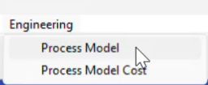  

The system will display the **Maintain Process Model** list screen.  

<!-- This screen lists all of the Process Models that have been captured in the Sense-i System.   -->

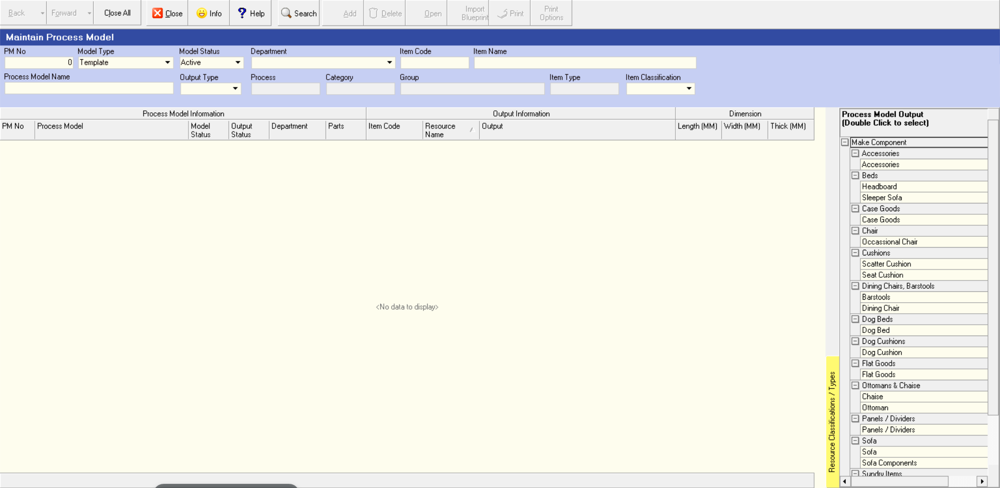  

### Search for Process Models

You can search for specific Process Models by entering information in the various **Search Fields** listed at the top of the screen.  

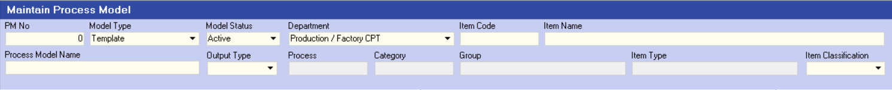  

:::important  
Choose an option from each of these drop-down lists:  
1.  **Model Type**,  
2.  **Model Status**, and  
3.  **Department**.  

4.  You can then use the **Resource Classification / Types** tree on the right-hand side of the screen, by double-clicking on the **Group** and/or **Item Type** that best describes the Item you are searching for.   

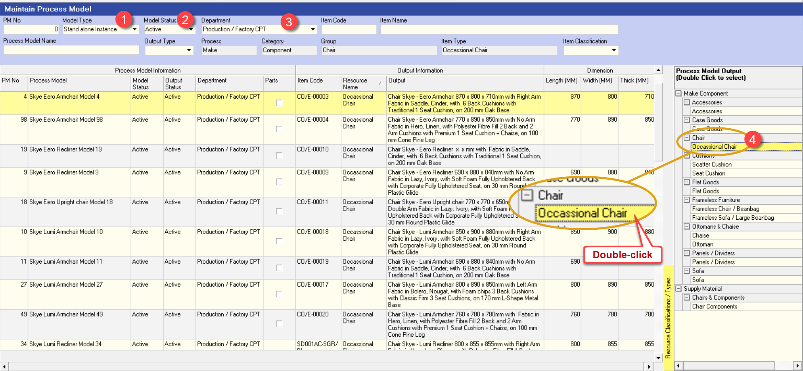  

:::  

The system will display a list of all the Process Models that match the Search Criteria you have entered.  

You could narrow the list down even further so that the system displays a short list of possible Process Models that would be useful to use as the base one for copying.  

5.  To search for a set of Process Models that you can use as Templates for the new Process Model, type the **% symbol** and **part of the name** in the Process Model field.  

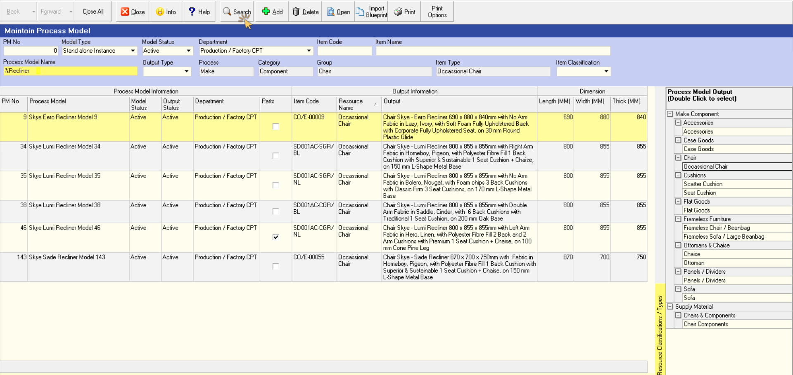  

6.  Click the **Search** button on the Action Bar.  

The system will display the names of all the Process Models in the system that contain the words you entered in step 5 above.  

5.  Click on the row that contains the name of the Process Model you wish to use as the Template you are going to copy.  

6.  Click the **Open** button on the form Action Bar.  

The system will display the **Process Model - ##** screen with the different TAB sheets.  

7.  Click on the **Output** TAB.  

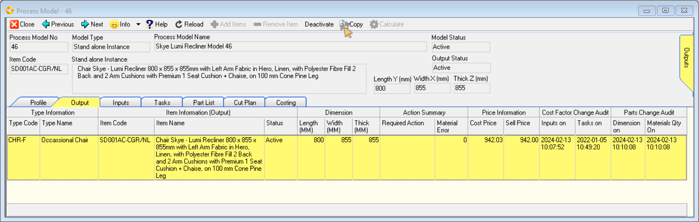  

### Copy Process Model  

1.  Select the row that contains the output Item, and then click the **Copy** button on the form Action Bar.  

The system will display a screen called **Copy Process Model**.  

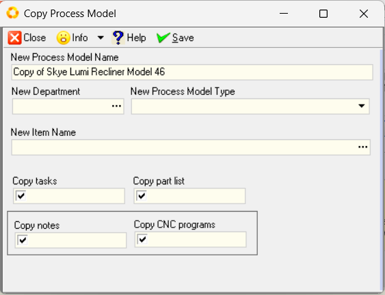  

This screen enables you to enter the **Name** for the new Process Model you are creating and to select which aspects of the existing Process Model you wish to copy to create the New Process Model.  

:::note  
If you can create a **set of Template Process Models** then these become your **Master Process Models** which you then copy and use to create the specific Process Model(s) needed to make the various Products sold to the company's Customers.  

If you do this, it is recommended that you should start the name of these Process Models with the word **"TEMPLATE"**.  
:::  

First you need to enter a name for the new Process Model.  

:::tip  
If you are creating a Process Model for specific Sales Order or Project, then you can start the name with the Sales Order Number, followed by a brief description of all the Products that you will link to it.  
:::  

2.  Type the new name in the **New Process Model Name** field.  

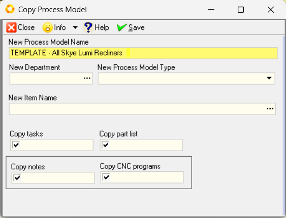  

3.  Click on the three-dot button in the **New Department** field, and select the Department that owns the Process Model.  

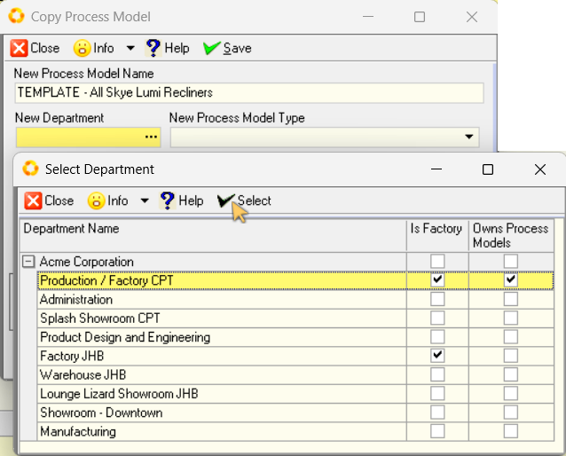  

4.  Select the New Process Model Type from the drop-down list in the **New Process Model Type** field.  

:::note  
If you chose **Template** as the new **Process Model Type**, you can leave the **New Item Name** field blank.  
:::   

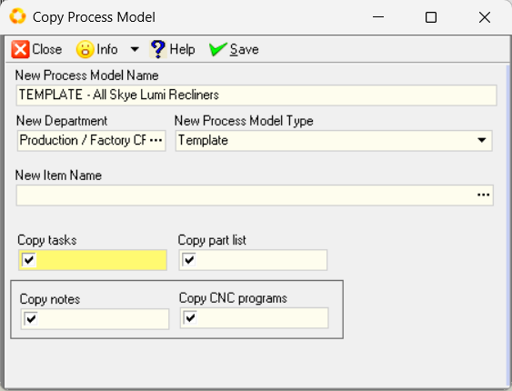  

5.  You also need to select the information that you wish to copy by checking the appropriate fields in the **Copy tasks**, **Part list**, **Notes** and **CNC Programs** check-box fields.  

If the field displays a check symbol, then the system will copy this information to the new Process Model.  

:::tip  
Before you save, highlight the entire new name, **right-click** the mouse button and select **Copy**.  

_This will assist you with the search for the new Process Model during the subsequent steps._  
:::  

6. Then click the **Save** button.  

An Information dialogue box will display informing you that the process Model has been copied.  

:::important  
Make a note of the new Process Model number.  This will enable you to efficiently search for the new Process Model during the next steps.  
:::  

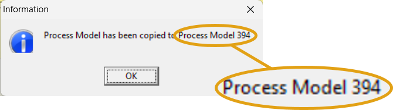  

7.  Click the **OK** button.

The system will create a new Process Model with the new name you have specified and copy the selected details from the existing Process Model into the new Process Model.  

8.  Click the **Close** button to return to the Maintain Process Model screen.  

### Search for & Open the New Process Model  

1.  Place the cursor in the **PM No** field, then type in the number that you noted above.  

2.  Click the **Search** button.  

The system will display the copied Process Model with the new _Process Model Name_ in the list.  

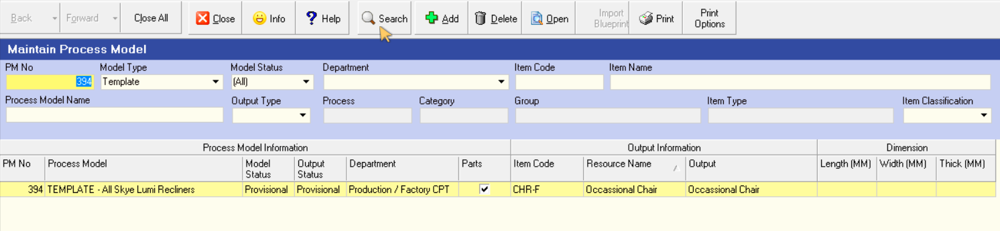  

:::tip  
An alternative Search method would be to place the cursor in the **Process Model Name** field, **right-click** the mouse and select **Paste**.  

The name you copied above will be pasted into the Process Model Name field.

Click the **Search** button.  

Ideally, if you name all your **Template Process Models** starting with the word "TEMPLATE" then you could search for these by typing **%TEMPLATE**.  
:::  

3.  Click on the row containing the name of the new Process Model you have created with the copy function. 

4.  Click the **Open** button.  

The system will display the **Process Model - ###** screen with TAB sheets containing the information for the new Process.  

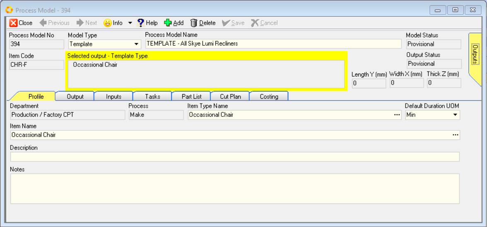  

5.  Click on the **Inputs** tab to check that you are satisfied that the correct Inputs have been copied to your new Process Model.  

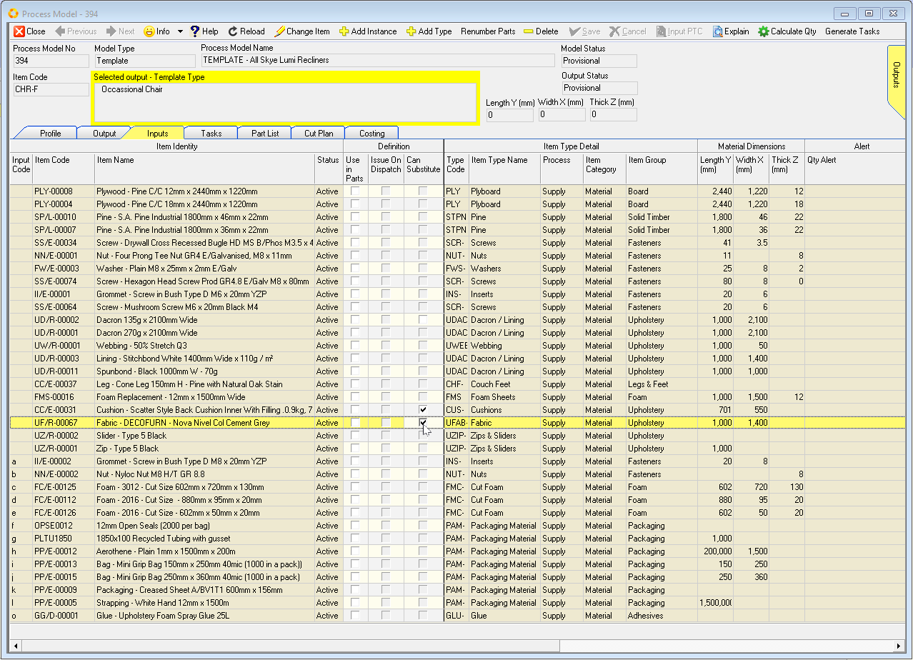  

6.  Click on the **Tasks** TAB to check that you are satisfied that the correct tasks have been copied.  

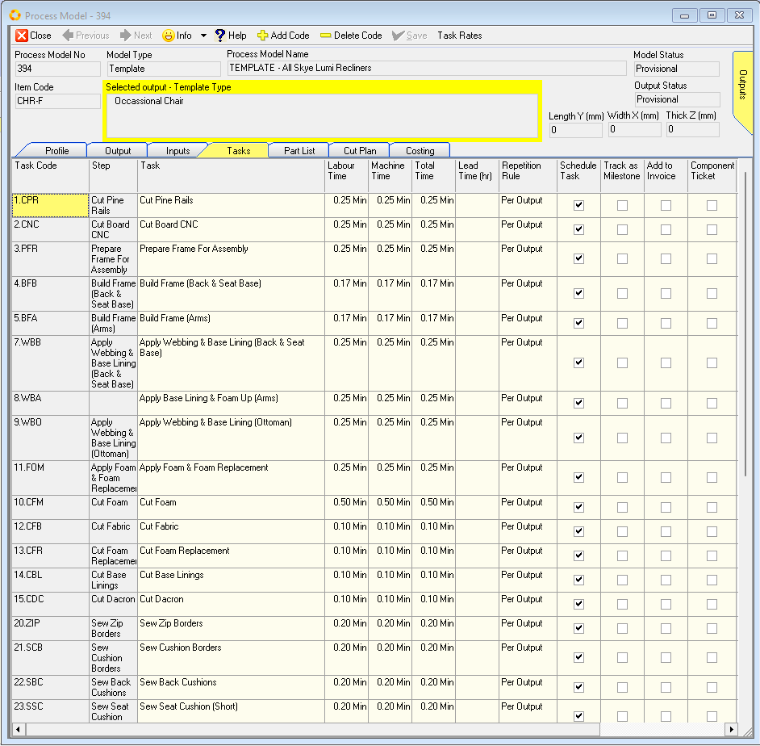  

7.  Click on the **Part List** tab to check that you are satisfied that the correct Part List have been copied to your new Process Model.  

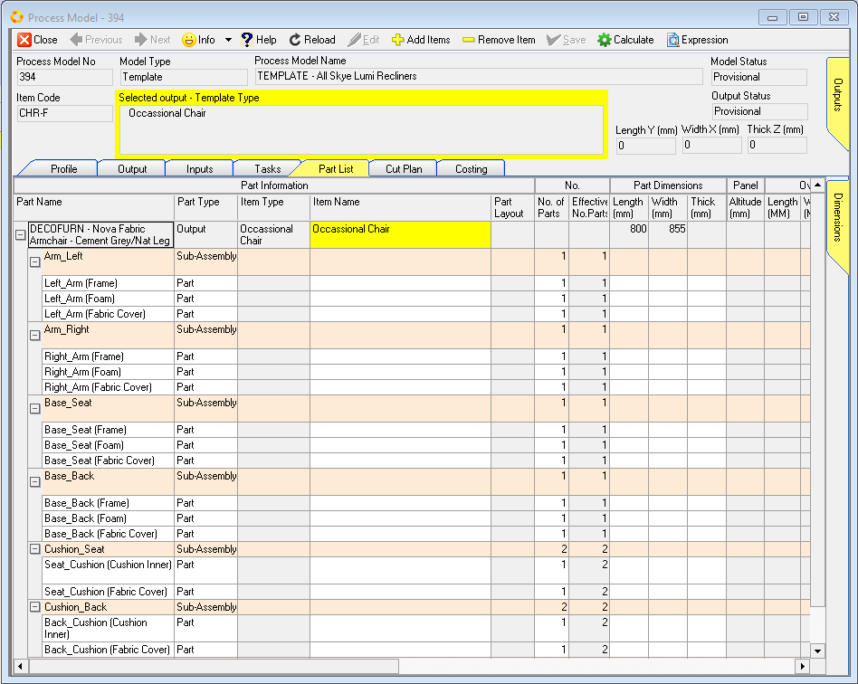  

You will notice that the details of the Part List has been copied, but that once the Outputs linked to this Process Model have been removed, some of the measurements in this Process Model will be blank. These measurements will be recalculated when you link this Process Model to the new Products.  

8.  To remove any Outputs that were linked in the Copy function, click the **Outputs** Tab and then click on each row containing the names of the Outputs you wish to remove from the new Process Model.  

9.  To remove an output, click on the row containing the name of the Output you wish to remove and then click the **Remove Item** button.  

Now, if you have not yet added the new products for which you are creating this Process Model you need to do so now.  

:::note  
If you need to create new Products for the Sales Order you are processing, then refer the document titled **["Product Catalogue (Product Costing Process)"](https://sense-i.co/docs/PCPCAT)**.  
:::  

10. Once the Products have been added to the Customer Catalogue, then you need to link them to the new Process Model you are creating.  

11. Once you have created a new Product and linked it as an **Output** to this Process Model, click the **Part List** TAB.  

The system will display the details of the Part List.  

  

12. You need to link the new product you have linked to the Process Model to the Part List. To do this, click on the top row in the **Instance Column** and select the new Product from the list of available Products.  

13. Depending on certain settings, the system will either display the dimensions of the Product you are linking to the Part List in the **Length**, **Width** and **Thickness** fields on the top row, or you will need to enter these dimensions by typing the values into these fields.  

14. Once you have done so, click the **Recalc** button on the form Action Bar.  

  

You will notice the system will calculate the sizes of all the parts and components that are included in the Part List.  

15. Then click the **Commit** button to update the Input Quantities and Material Cost prices.  

Repeat the steps above for each of the **Product Variations** that you wish to link to this Process Model.  

:::note  
You do not need to copy a Process Model for each Product Variation on an order.  

If the Products follow the same sequence of tasks in the factory and the structure or architecture of the Part List for these Product Variations is substantially the same, then you can link the copied Process Model to all of these Product Variations.  

You can do this even if some of the Materials are different from one Product Variation to another.  
:::  

Once you have **created** all the **Product Variations**, linked them to your new Process Model and **updated** the **Part Lists**, it is time for you to review the **Process Model Costing** information for each Product.  

It is also a good idea to test the completeness and accuracy of your Part List by running the **Cut Plan** function for each input listed.  

This will quickly show you any of the dimensions you have entered are significantly inaccurate.  

**This is the end of this procedure.**
