## Introduction  
___

In Sense-i Task Codes are records that define the various tasks (also called “activities”, “steps” or “operations”) that are performed in your business to make and deliver a customer’s product.  

The list of tasks you define in the system should contain every task or operation you want to monitor and measure and can extend as far across your value chain as decide.  They could include the tasks needed to complete delivery, installation and servicing processes, and could even include activities such as receiving, preparing and issuing materials to the production process.  

## Navigate to, and Search for Task Codes  

1.  Click **Business Model** on the main navigation menu.  

2.  Click **Organisation Design** from the drop-down menu.  

3.  Click **Task Codes** from the side menu.

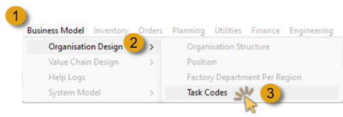  

The program will open a screen titled **Task Codes**.  

This screen lists all the tasks codes that have been defined in your Sense-i Database.  

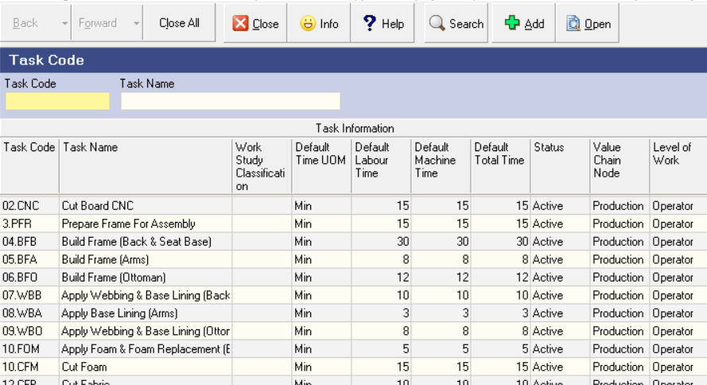  

To search for **one specific**, or **a range of task codes**:  

4.  Position the mouse cursor and click in the **Task Name** field in the search panel.  

5.  Type the **"%" symbol**, followed by a partial **task code name**, followed by another **"%" symbol**, and then  

6.  Click the **Search** button in the form Action bar.  

The system will then return the full list of task codes that contain the text you typed in the Task Name field.  

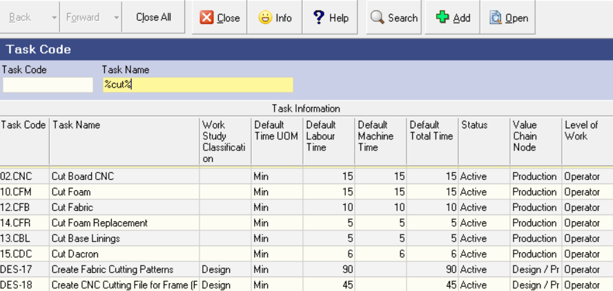  

## Add Task  

The following steps are to be followed when adding a new Task:  

1.  Click the **Add** button on the Action bar.  

The **Add New Task Code** screen is displayed.  

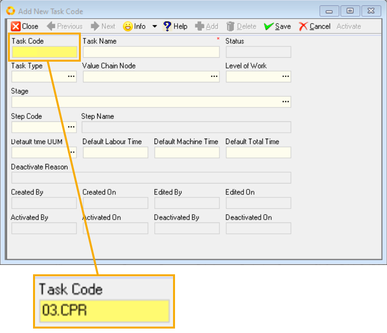  

2.  Enter a **Task Code** that is applicable to the task name.  

:::important  
Task Codes are used in certain labels that are too small to show the full Task Name.  

Usually, you should enter a number to indicate in what sequence the tasks occur in your production process, followed by three or four letters as a clue to the task name.  
:::  

3.  Enter the name of the Task or operation in the **Task Name** field.  

As a further option, you can classify Task Codes by Task Type.  

### Definition - Task Types  

This would be a **grouping of Task Codes** that help you more easily find and group Tasks in a long list of Task Codes.  

As an example, you may use a three-letter code to indicate the **Value Chain Node** (for example, Sales, Production, Delivery, Installation) and then the **Department** or area in the Value Chain Node (for example **Frame building** in **Production**) to group the task codes.

If you do this then all the Tasks performed in the **Production – Framing** area could be easily grouped together.  

To assign a Task to a Task Type,  

4.  Click on the three-dot button in the **Task Type** field.  

The system will display the **Select Task Type** list screen.

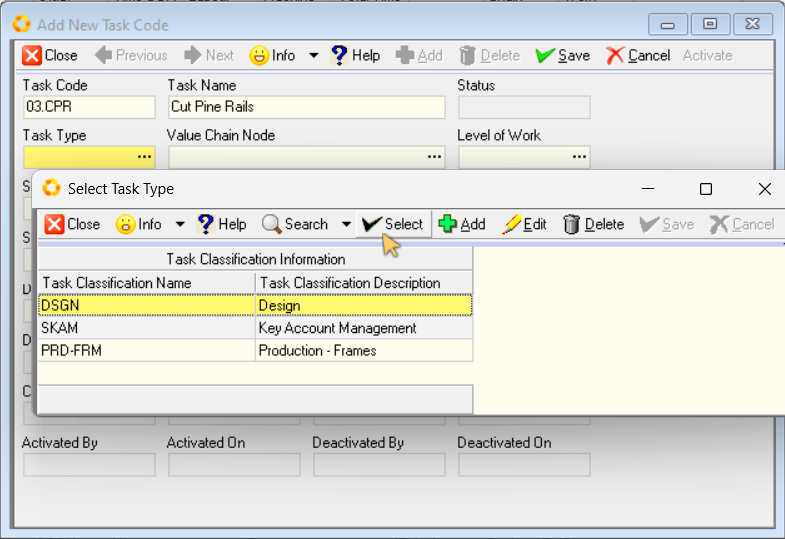  

5.  Click on the **Task Type** you wish to assign to the Task Code and then click the **Select** button.  

The system will close the Select Task Type screen and display the Task Type you have chosen in the Task Type field.  

By assigning each Task Code to a Task Type, you can use the **Enable Groups** function in the grid to easily group the Task Codes in your company.  This will help you to more easily classify, sort and work with your data.  

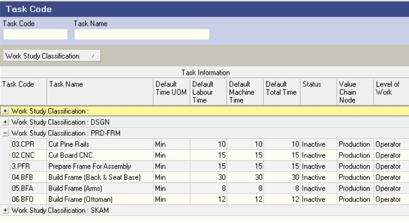  

For more information on how to use the features in the grids to work with your data, see the relevant section in the document titled **["Customising Information Display"](https://sense-i.co/docs/LST004#grouping-information)**.  

Next, you can optionally classify Task Codes by Value Chain Node.  

### Definition - Value Chain Nodes

Value Chain Nodes are the main areas of your business, such as **Product Design**, **Marketing & Sales**, **Production**, **Finance** and so on.  

Using Value Chain Nodes to group tasks and functions helps you to easily find information related to these specific areas of your company.  

For more information about Value Chain Nodes you can click on the following links to access detailed information about Value Chain Nodes.  

-   **Understanding the Customer Facing Value Chain.**
-   **Understanding the Internal Support Value Chain.**
-   **Co-ordinating Your Value Chain.**  

To assign a Value Chain Node to a Task:  

6.  Click on the three-dot button in the **Value Chain Node** field.  

The system will display the **Select Value Chain Node** list screen.

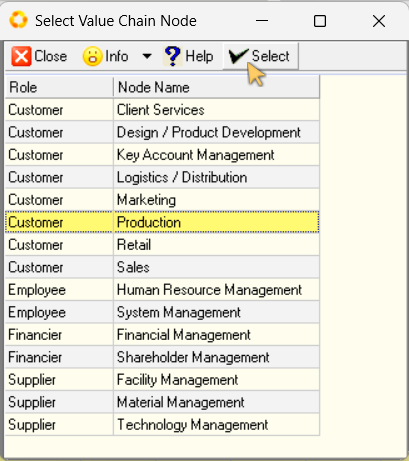  

7.  Click on the Value Chain Node you wish to assign to the Task Code and then click the **Select** button.  

The system will close the Select Task Type screen and display the Value Chain Node you have chosen in the **Value Chain Node** field.

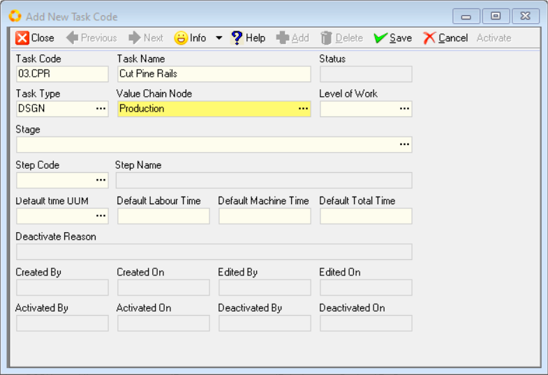  

In the next step, you can optionally choose classify Task Codes by **Level of Work**.  

### Definition - Levels of Work

In Organisational Design using the Sense-i System, all work performed in a company is classified according to the level of complexity.  

Starting from the most simple, to the most complex tasks, the list of Levels of Work consists of:  

-   **Operator** – Operator Tasks are usually the tasks performed at the lowest level in the hierarchy.  They are classified as most simple not because all tasks are simple, but because they are performed usually in one uninterrupted sequence in less than one day.  So, the complexity of thinking about the future doesn’t exist when performing these tasks.  

-   **Team Leader** – Team Leader tasks are one level above the Operator level.  They relate to planning and co-ordinating what needs to be put in place for the Operators to be able to perform their tasks without disruption.  Team Leader tasks normally involve co-ordinating work flow for the current day, and planning one to five days in advance.  

-   **Administration** – Administration level tasks are one level above Team Leader tasks.  These tasks include processing information about products, customers, materials, suppliers, employee and everything related to processing, planning and managing customer’s orders.  As such, the time horizon covered by Administration tasks are anything from one day to several weeks.  

-   **Strategic** – Strategic level tasks are at the highest level in the organisation and include tasks that focus on setting the strategy for the business.  Specifically, this would include making decisions based on the location in which the company will operate, who the customers should be, what products those customers will buy, what materials, machines and facilities the company needs to operate efficiently, who the best suppliers and employees will be, and how to finance the operations of the company.  

To assign Level of Work to a Task Type, click on the three-dot button in the **Level of Work** field.  

The system will display the **Select Level of Work** list screen.  

  

8.  Click on the Level of Work definition that you wish to assign to the Task Code and then click the **Select** button.  

The system will close the Select Level of Work screen and display the Level of Work definition you have chosen in the Level of Work field.  

Next, you can optionally link the Task Code to a Stage.  

### Definition - Stages

Stages are the main areas or departments within a process through which an order flows in your company.  You would use Stages so that you can use the **Capacity Planning** function to estimate when orders can be completed and decide what changes you need to make to the capacity that is available for each stage.  

For more information on Stages, click on the following link:  
**["Define Capacity Planning Stages"](https://sense-i.co/docs/770)**  

To assign a Task to a Stage:  

9.  Click on the three-dot button in the **Stage** field.  

The system will display the **Select Stage** list screen.  

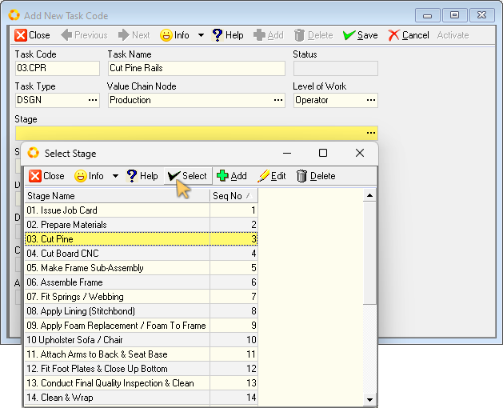  

10. Click on the Stage name that you wish to assign to the Task Code and then click the **Select** button.  

The system will close the Select Stage screen and display the Stage definition you have chosen in the **Stage** field.

Next, you can optionally link the Task Stage to a Step.  

### Definition - Steps

Steps are activities that can be performed in each stage of your Production Process.

STAGES store capacity information while STEPS describe the actions performed in a Stage.

For more information on Steps, refer to the document titled **["Capacity Planning Steps"](https://sense-i.co/docs/771)**  

To assign a Step to a Task Stage:  

11.  Click on the three-dot button in the **Step** field.  

The system will display the **Select Step** list screen.  

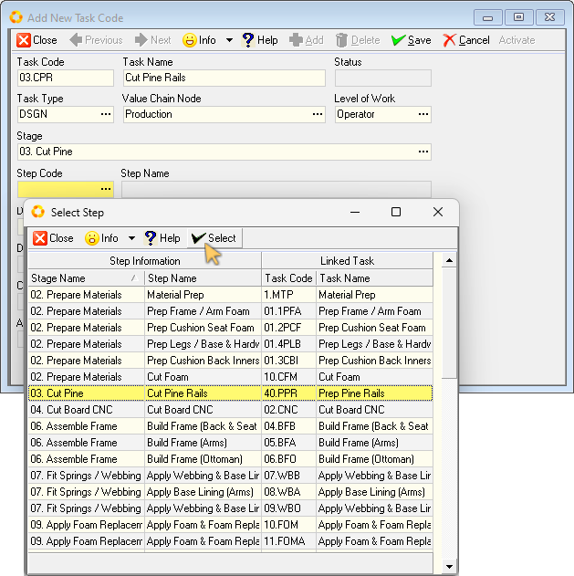  

12. Click on the Step name that you wish to assign to the Task Code and then click the **Select** button.  

The system will close the Select Step screen and display the Step Code and Name  you have chosen in the **Step Code** and **Step Name** fields.

### Time - Task Durations  

13. Select the **Time Unit of Measure** that you wish to use to define **Task Durations**.  

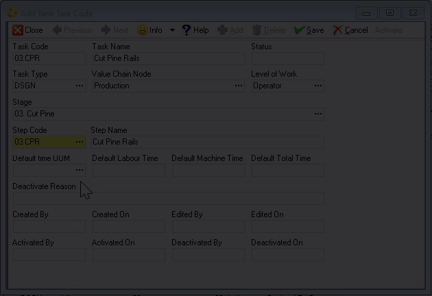  

:::note  
Usually the Time Unit of Measure would be minutes, but it could also be seconds and hours.  We recommend defining all task codes in minutes, unless the tasks are all very quick, happen in seconds, or very long, take several hours.  
:::  

14. Enter the **Default Labour Time**.  This is the time that it would take an operator to complete the task.  

15. Enter the **Default Machine Time**.  

:::important  
If the Default Machine Time is the same as the operator time, for example a drill or a saw, then set this as the same time as the Labour Time, or if you are not scheduling machinery and equipment, then leave this blank.  

If on the other hand, the time in the machine is very different from the time required by the operator, then set this time separately.  It may take an operator 5 minutes to load a set of timber into a press, and then it may take an hour for the press to press the timber before it can be removed.  In cases like this, you should enter 5 minutes for the operator time and 60 minutes for the time in the press.  
:::  

16. Enter the **Default Total Time**.  This is the combination of both the Default Labour and Default Machine times.  

17. Click the **Save** button on the form Action bar to save the Task details to the Sense-i database.  

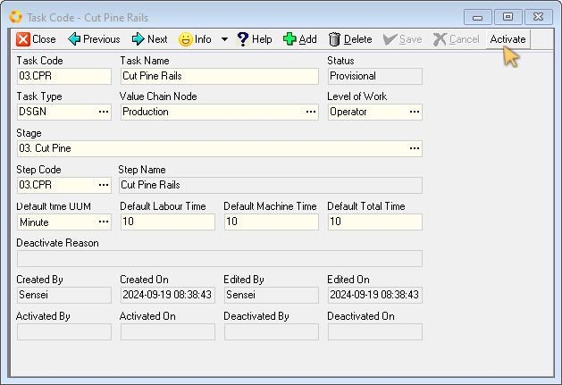  

18. Click the **Activate** button to tag the Task as being in use, and prevent inadvertent changes.  

19. Click the **Close** button to return to the Task Code list screen.  

## Edit an Existing Task  

1.  Click on the record row of the Task you want to edit, then  

2.  Click the **Open** button on the Action bar.  

The system will display the **Task Code Detail** screen as illustrated below.  

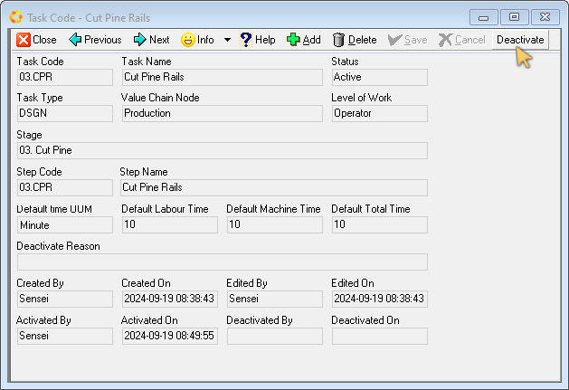  

:::important  
If the Task Code record has a status of Active, that means it is in use and you cannot change the record until you set its status to Inactive.  
:::

To edit an Active Task Code record,  

3.  Click the **Deactivate** button at the top of the form.  

The **Deactivate Task Code** screen is displayed.  

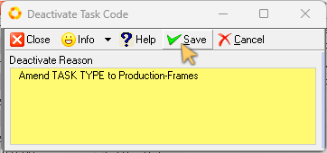  

4.  Enter a reason for deactivating the task code record.  

5.  Click the **Save** button, then  

6.  Click the **Close** button to return to the Task Code Detail screen.  

You will notice that some fields on the form have changed from the grey background colour, _(indicating the field is disabled and you cannot edit it)_, to a white background, indicating that these fields can be edited.  

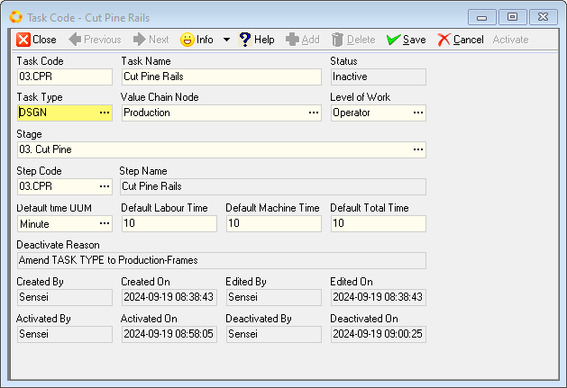  

7.  Click on the field you need to amend, then  

8.  Type in the updated information / value.  

:::tip  
To change information in a field that contains a three-dot button,  
-   Click on the three-dot button, then  
-   Click on the relevant option in the list,  
-   Click the **Select** button.

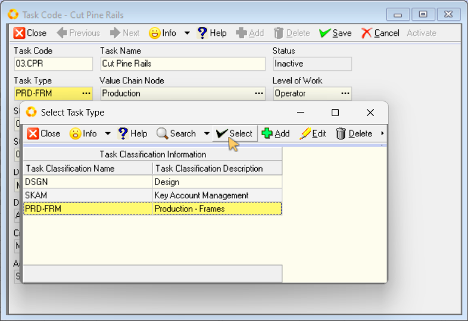  

:::  

Once all the necessary changes have been made,  

9.  Click the **Save** button on the form Action bar.  

10. Click the **Activate** button to tag the task as being in use and to ensure no changes can inadvertently be made.  

___
**This is the end of this procedure.**

