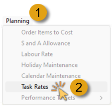

## Introduction  
___

The procedure of defining Task Code Costs should be performed <u>after</u> Task Codes have been defined.  Refer to the document titled **["Define Task Codes"](https://sense-i.co/docs/TSKCDE001)**.  

Next, you need to define the **default rates** that the company will charge **for each of the tasks** that are performed.  

Through a setting at either the **Company Settings** or **Department** function, you can control how the company charges for tasks.  Either they don’t charge for specific tasks and the cost of tasks is built into the Product Price, or they charge for tasks with the price per task determined either at the **Company level**, the **Department level**, the **Task Level** or based on the **Employee** performing the task.  

## Navigate to Task Rates  

To set Task Rates:  

1.  Click **Planning** on the main navigation menu, then  

2.  Click **Task Rates** on the drop-down menu.

  

The system will open the **Maintain Task Rates** screen.  

  

## Search Task Rates by Department  

On initial display, the Maintain Task Rate sceen will not list any data.  

1.  Click the three-dot button in the **Department** field.  

The system will display the **Select Department** list screen.  

  

2.  Click on the **Division** OR **Department** you wish to assign to the Task Rate and then click the **Select** button.  

The system will display the "Time OUM is required." warning dialogue box.  

  

3.  Click the **OK** button to continue.  

The system will display the Department / Division you have chosen in the **Department** field.  

4.  Click on the drop-down arrow in the **Time UOM** _(Unit of Measure)_ field.  

  

5.  Select the appropriate option from the Time UOM list, then  

6.  Click the **Search** button on the Action bar.  

The Maintain Task Rate screen is updated with the list of Tasks and associated rates.  

  

## Enter Task Rates  

1.  Click on the record row for which you need to enter Task Rates.  

2.  Enter the default Labour Cost Per Minute, Machine Cost Per Minute and Overhead Cost Per Minute in the **Labour Rate**, **Machine Rate** and **Overhead Rate** columns.  

  

The system will then sum these three rates you have entered and display the Total Cost Per Hour in the **Total Cost** column.  

3.  Enter a **Markup %** to be applied to the Total Cost for each Task.  

The system will then display the **Total Selling Price** for the Task Code in the **Selling Price** column.  

:::note  
How you company charges for the tasks that are performed by its employees will be largely based on your region and industry.  

Some industries, like vehicle repairs, medicine, advertising and law, will charge at the Employee level based on the actual time taken.  
Other industries, such as manufacturing, will set a fixed price per task and build the cost of the tasks into the final product price.  
:::  

:::important  
For more information on how to calculate the Labour, Machine and Overhead Cost Per Minute, refer to the help document titled **"Calculating Your Labour, Machine and Overhead Costs Per Minute”**.  
:::  

Once you have entered the relevant information on this screen:  

4.  Click the **Save** button, then  

5.  Click the **Close** button.
___
**This is the end of this procedure.**
