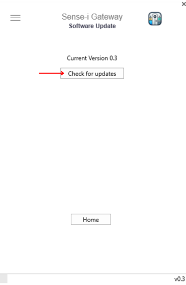

## Update Sense-i Gateway

The following steps will upgrade the Sense-i Gateway software to the latest version;  

Access the **Menu** by selecting the menu icon near the top-left corner of the Sense-i Gateway application.

  

1.	Ensure the **Tools** option is selected.  

  

2.	Select [ **Software Update** ].  

  

The **Software Update** screen is displayed.

3.	Click on the [ **Check for updates** ] button.

  

4.  Click on [ **Upgrade Software** ].

  

The **Gateway Upgrade** dialogue box is displayed.

5.	Click on the [ **Continue** ] button.  

  

6.	The system will download the relevant **_.ZIP_** file, automatically extract the necessary files and install the latest version of the Sense-i Gateway.

When the upgrade has completed, click the **Open** button.  

  

The Sense-i Gateway home screen is displayed, with the Gateway version number in the bottom-right corner.  

  

7. Click **Connect** to open the selected service with the selected API connection.

----