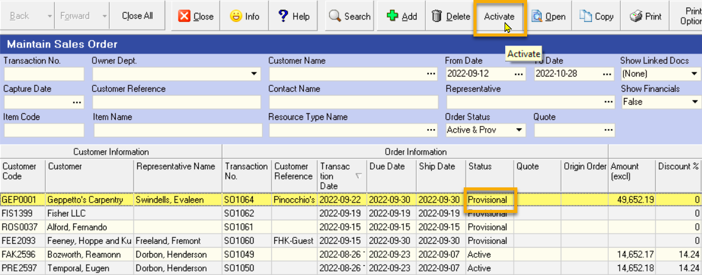
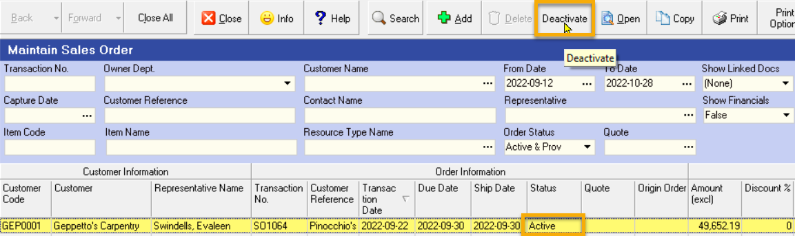

All record information that is captured by users in the Sense-i has a **Status**.  
The first time a record is created and information captured this Status is set as **Provisional**.  

A Provisional record means it is still being entered and not complete, in effect, in _draft_ mode and as a result **"Provisional" records can be modified at any time**.  

Once the details of any piece of information (whether this is a **party** such a customer, supplier, employee, a **resource** such as a material, component, machine or product, or a **transaction** of any sort), the details can be protected from change by setting the status of the record to “**Active**”.  

Active records mean that they are considered as reliable information that anyone else in the company can use.  

**Active records cannot be changed** and this prevents mistakes from being introduced to information that is considered to be complete, accurate and reliable.  

:::note  
However, there is a need in some cases to be able to change a record that has been marked as Active.  

This could be either because the record was activated by mistake before being finally checked, or because reality has changed and information needs to be updated.  
:::  

When a record in Sense-i is still in “provisional” state, the button to control the status of the read has the caption **"Activate"**.

  

:::note  
You can see in the image above, when the record is in **Provisional status**, the Status button at the top of the screen will allow you to mark is as finalised by changing it to **Active**.  
:::  

To change the status of a provisional record to active, click on the record in the list and click the **Activate** button at the top of the screen.  

When a record has been Activated _(but only if no subsequent transactions have been captured against it)_, it is possible to change the status to **Inactive** so that you can **edit the record as necessary**.

  

You can see in the image above, when the record is in Active status, the Status button at the top of the screen will allow you to Deactivate the record so that you can change it, but only if no subsequent transaction has been created.  

To change the status of a active record to provisional or inactive so that you can edit the record, click on the record in the list and click the **Deactivate** button at the top of the screen.  
The program will change the status of the record and you can then make the necessary changes.  

Once you have edited a record, you can set its status to Active again by clicking the **Activate** button at the top of the form.

:::note
Remember that the status of a record can only be changed from **Active**, **Cancelled** or **Closed** if no subsequent 
documents were created from it.
:::

## Status - Purchase Order Example
___  

You will notice that the system lists all Purchase Orders in order of **Supplier Name**.  

To make the list useful for tracking any Outstanding Transactions that are due within a specific period (a period between a **From Date** and a **To Date**) the next one or two weeks.  

:::note  
The exact time span will depend on the average lead time of the
delivery from your suppliers and you can in fact set up several
different time spans for different suppliers.  
:::

The first thing that you will need to do is to remove all Purchase
Orders from the list that have already been delivered.  

Each Purchase Order is assigned one of several statuses.

If the Purchase Order is **Still being drafted** then the Status will be **PROVISIONAL**.

If the Purchase Order is **Finalised and sent to the Supplier** then the Status will be **ACTIVE**.

If the Purchase Order is **Cancelled** then the Status will be **CANCELLED**.

If the Purchase Order is **Delivered in Full** then the Status will be **CLOSED**.
