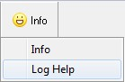
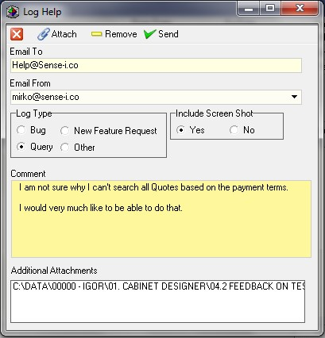
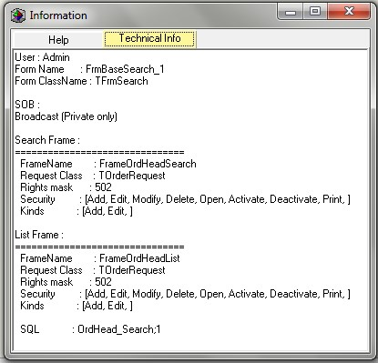
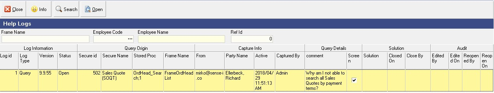
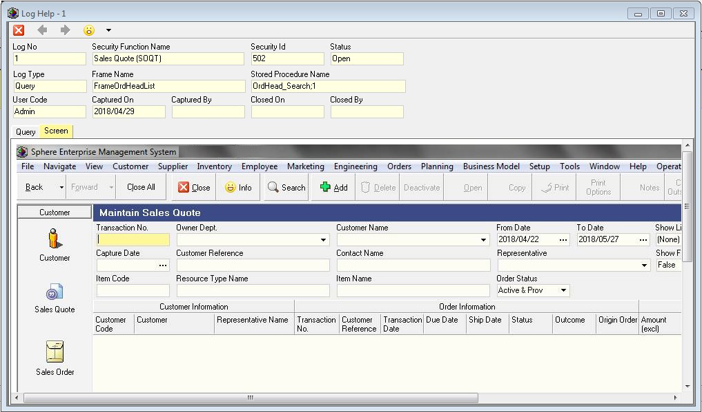

## Procedure Guideline
___  

The Sense-i Enterprise Management System provides you with a feature
to quickly and easily log a request for help, for a new feature or
record that you think might be an issue with a specific function
directly from within every screen in which you are working.  

Whenever you want to log a request for help or report what you think
might be an issue with the way in which a particular function is
working, click the Security Permissions and Help button labelled Info
on the top left corner of every screen.  

A list of two items will drop down. The Info button will provide
technical information about the screen and database for the function
in which you are working and notes about the latest upgrades and
version changes.  

   

The Log Help button will open the Log Help screen.

   

The system displays the email address that has been defined in the
System Administrator module as the default address to which the Help
Request emails will be sent.  

You can also define the details of an online accessible Web Server in
the System Administrator module and all help requests and issues
logged will be transferred via xml to this server directly.  

The screen displays the email assigned to your profile in the Email
From field.  

You need to log the type of record you are creating as either an Issue
or Bug (if you think there is something wrong with the way the system
is working or a calculation), a New Feature Request, (if you want the
system to do something that it currently does not do or to display
information that is currently not displayed on the screen in which you
are working), a Query, (if you don't understand how a specific value
is being calculated or why something works in a specific way) or
Other, for any general feedback notes.  

The system has technical information available on each screen as you
can see in the following image:  

   

The system uses the technical information for the function (including
the names of the screen in the code and the stored procedure names
that pass and retrieve the information on your screen to and from the
server) to add more technical detail to the help request you are
creating. This enables the support and technical development team
assigned to support your company to much more quickly and easily
narrow in on your request and find the right technical information and
source code to run any tests, and where necessary to make modification
that would improve your experience of the system.

You should add as much detail as you can about your query or
suggestion in the Comments field.  

You should at minimum also attach an image of the screen. To do that
click the Yes option under the Include Screen Shot option.  

Ideally, if you are able to repeat the steps you wish to describe, you
should record a video and attach the video to the help request.  

Once you have entered as much information as you are able about your
request click the Save and Send button.  

The system will save a full copy of your request, together with the
technical information in the central database at your company.  

Your system administrator can also review all the help requests logged
by all users of the system at your company and keep track of these so
that they may be effectively managed and resolved.  

At the same time that the system saves your help request, it will send
all the information you have entered on the Log Help screen, together
with all the technical information, including the id of the record on
which you were working, to the central Sense-I Help Management Server.  

The entire system works in this way. So once you have mastered these
simple steps, reporting any issues or queries, or requesting help of
any function anywhere in the system will be that much easier.  

To view a list of all issues and help requests, click the Business
Model button on the main menu and then select the Log Help option.  

The system displays all the technical information about your request
in the Help logs list screen.  

You can search these by Frame Name, Employee Code or System Module.  

   

To view the help request, click on the row for which you wish to view
the details and then click the Open button.  

The system will display the Help Request with two tabs, the first
showing your notes and comments and the second showing the image of
the screen you have attached.  

   

**This is the end of the Log Request For Help & Report Issues.**  
